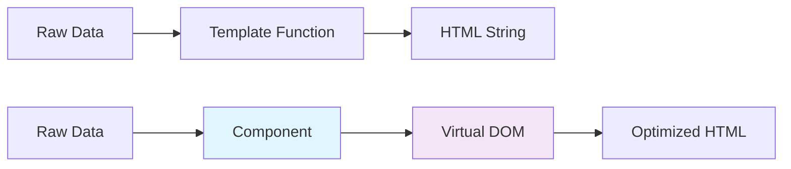
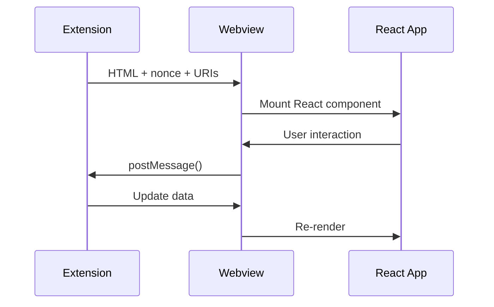
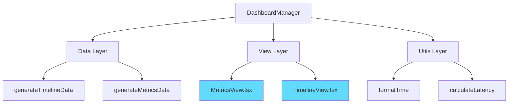
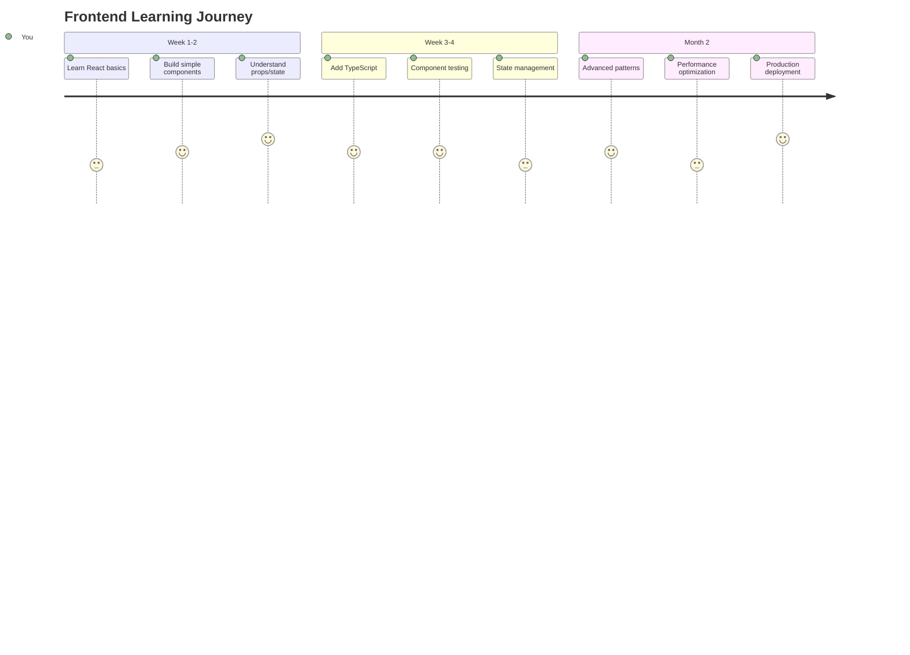

# From Backend to Frontend: Lessons from Building a VS Code Extension Dashboard 🚀

*A LinkedIn Learning-Style Tutorial for Backend Developers Venturing into Frontend*

---

## 🎯 What You'll Learn

By the end of this tutorial, you'll understand:
- ✅ Core frontend concepts through real project examples
- ✅ Why React became our framework of choice
- ✅ VS Code webview integration patterns
- ✅ Component-driven development mindset
- ✅ Common pitfalls and how to avoid them

---

## 📚 Table of Contents

```
├── 01. The Backend Developer's Frontend Journey
├── 02. Understanding the Component Mental Model  
├── 03. React vs. The Alternatives (Decision Framework)
├── 04. VS Code Webview: The Special Frontend Environment
├── 05. From Monolith to Modules (Refactoring Story)
├── 06. Lessons Learned & Best Practices
└── 07. Next Steps & Resources
```

---

## 01. The Backend Developer's Frontend Journey 🗺️

### The Challenge
You're comfortable with APIs, databases, and server architecture. But when someone says "component state" or "virtual DOM," you feel like this:

```
  Backend Dev Frontend Confusion Scale™
  
  😄 ────────────────────── 😰
  APIs    Components    State    Virtual DOM
```

**💡 Key Insight**: Frontend development isn't fundamentally different—it's about data flow, just in a different environment.

### Our Project Context
We built a **Health Watch VS Code Extension** that monitors network connectivity. Think of it as:
- **Backend mindset**: "I need to collect probe data and store it"
- **Frontend mindset**: "I need to show this data beautifully and let users interact with it"

**[📸 SCREENSHOT PLACEHOLDER]**: *Split screen showing terminal logs vs. dashboard UI*

---

## 02. Understanding the Component Mental Model 🧩

### The Traditional Way (What Backend Devs Know)
```
function generateHTML(data) {
    return `<div>${data.name}: ${data.status}</div>`;
}
```

### The Component Way (Frontend Thinking)
```typescript
function ChannelStatus({ name, status, latency }) {
    return (
        <div className={`channel ${status}`}>
            <span>{name}</span>
            <Badge status={status} />
            <Latency value={latency} />
        </div>
    );
}
```

### The Mental Shift



**🎯 Lesson**: Components are like functions, but for UI. They take data (props) and return visual elements.

### Why This Matters (Real Example)
In our Health Watch project, we had this monolithic dashboard generator:
- 2,500+ lines of string concatenation
- Hard to test individual pieces
- Styling changes required hunting through massive files

**After componentization**:
- `<MetricsCard />`, `<ChannelList />`, `<TimelineChart />`
- Each testable in isolation
- Styling scoped and predictable

**[📸 SCREENSHOT PLACEHOLDER]**: *Before/after code structure comparison*

---

## 03. React vs. The Alternatives (Decision Framework) ⚖️

### The Evaluation Matrix We Used

| Framework | Learning Curve | Ecosystem | Bundle Size | VS Code Integration |
|-----------|----------------|-----------|-------------|---------------------|
| **React** | 📈 Medium | 🌟🌟🌟🌟🌟 | 📦 Medium | ✅ Excellent |
| **Vue** | 📉 Easy | 🌟🌟🌟🌟 | 📦 Small | ✅ Good |
| **Svelte** | 📉 Easy | 🌟🌟🌟 | 📦 Tiny | ⚠️ Limited |

### Why React Won (For Us)

```
🏆 React Decision Factors

📚 Ecosystem
├── Chart libraries (for our metrics)
├── Component libraries (Material-UI, Ant Design)
└── Testing utilities (React Testing Library)

🔧 Tooling
├── TypeScript integration (we love types!)
├── Storybook support (component development)
└── DevTools (debugging)

🚀 Migration Path
├── Incremental adoption (start with one view)
├── Large community (Stack Overflow answers)
└── Corporate backing (Facebook/Meta)
```

**💭 Backend Developer Translation**: React is like Spring Boot for frontend—opinionated, well-supported, with a huge ecosystem.

**[📸 STOCK IMAGE PLACEHOLDER]**: *Decision matrix or comparison chart visualization*

---

## 04. VS Code Webview: The Special Frontend Environment 🖥️

### The Unique Challenge
VS Code webviews aren't regular web pages. They're sandboxed environments with special rules:

```
Regular Web Development        VS Code Webview Development
┌─────────────────────┐       ┌─────────────────────────┐
│ <script src="./app.js"> │   │ ❌ Relative paths broken │
│ ✅ Works fine        │       │ ✅ webview.asWebviewUri() │
│                     │       │                         │
│ fetch('/api/data')  │       │ ❌ No external requests │
│ ✅ Works fine        │       │ ✅ postMessage to extension│
└─────────────────────┘       └─────────────────────────┘
```

### Our Solution Pattern



### Key Learnings

**🔐 Content Security Policy (CSP)**
- Every script needs a `nonce` attribute
- No inline event handlers (`onclick="..."`)
- Resources must be explicitly allowed

**📁 Resource Loading**
```typescript
// ❌ Doesn't work
const scriptSrc = "./dist/app.js";

// ✅ Correct way
const scriptUri = webview.asWebviewUri(
    vscode.Uri.joinPath(extensionUri, 'dist', 'app.js')
);
```

**[📸 SCREENSHOT PLACEHOLDER]**: *VS Code webview developer tools showing CSP violations*

---

## 05. From Monolith to Modules (Refactoring Story) 🏗️

### The Before Times
Our original dashboard was a 2,500-line monster:

```
📁 dashboard.ts (2,500 lines)
├── HTML generation
├── CSS generation  
├── Data processing
├── Event handling
└── State management
```

**ASCII Representation**:
```
🏢 MONOLITHIC DASHBOARD
┌─────────────────────────────────────┐
│  ┌─────┐ ┌─────┐ ┌─────┐ ┌─────┐    │
│  │HTML │ │ CSS │ │Data │ │Event│    │
│  │Gen  │ │Gen  │ │Proc │ │Hand │    │
│  └─────┘ └─────┘ └─────┘ └─────┘    │
│           All Mixed Together         │
└─────────────────────────────────────┘
```

### The Refactoring Journey

**Phase 1: Extract Data Logic**
```
📁 src/ui/
├── dashboardData.ts    ← Pure data functions
├── dashboardUtils.ts   ← Formatters & helpers
└── dashboard.ts        ← Orchestration only
```

**Phase 2: Component Extraction**
```
📁 src/ui/views/
├── MetricsView.tsx     ← React component
├── TimelineView.tsx    ← React component
└── OverviewView.tsx    ← React component
```

**Phase 3: The New Architecture**



### The Results

| Before | After |
|--------|-------|
| 🐌 Hard to test | ⚡ Unit tests for each function |
| 🔍 Changes affected everything | 🎯 Isolated component changes |
| 😰 Frontend team afraid to touch | 😊 New devs can contribute |
| 🐛 Bugs cascade across features | 🛡️ Bug isolation |

**[📸 SCREENSHOT PLACEHOLDER]**: *Side-by-side file explorer showing before/after structure*

---

## 06. Lessons Learned & Best Practices 💡

### 🎓 Lesson 1: Start with the Data Flow

**❌ What We Did Wrong First**:
```typescript
// Mixed concerns - data + presentation
function generateMetrics() {
    const data = calculateStats();
    return `<div class="metrics">${data.avg}ms</div>`;
}
```

**✅ What We Learned**:
```typescript
// Separate data from presentation
function calculateStats(): MetricsData { ... }
function MetricsDisplay({ data }: { data: MetricsData }) { ... }
```

### 🎓 Lesson 2: TypeScript is Your Friend

Coming from a typed backend language, we were shocked how much TypeScript helped:

```typescript
interface ChannelData {
    id: string;
    status: 'online' | 'offline' | 'unknown';
    latency?: number;
}

// Now your components are self-documenting!
function ChannelCard({ channel }: { channel: ChannelData }) {
    // TypeScript prevents typos and wrong types
}
```

### 🎓 Lesson 3: State is Just Variables That Change

**Backend thinking**: "State is complex, involves databases and caching"
**Frontend reality**: "State is just data that can change over time"

```typescript
// It's just a variable that triggers re-renders when it changes
const [channels, setChannels] = useState<ChannelData[]>([]);
```

### 🎓 Lesson 4: Testing Components Like Functions

```typescript
// Test like you'd test any function
test('MetricsCard shows correct latency', () => {
    const data = { id: 'test', latency: 150, status: 'online' };
    render(<MetricsCard channel={data} />);
    expect(screen.getByText('150ms')).toBeInTheDocument();
});
```

### 🎓 Lesson 5: Bundle Size Matters (In Webviews)

VS Code webviews load over IPC, so every KB matters:
- Our React bundle: ~45KB (good)
- With chart library: ~180KB (acceptable)
- With everything: ~400KB (too much!)

**Solution**: Lazy loading and code splitting.

**[📸 STOCK IMAGE PLACEHOLDER]**: *Bundle analyzer visualization*

---

## 07. Next Steps & Resources 🚀

### Your Learning Path



### Recommended Resources

**📚 For Backend Devs New to Frontend**:
1. **React Official Tutorial** - Skip the theory, focus on examples
2. **TypeScript Handbook** - You already know types!
3. **VS Code Extension Guide** - Webview specifics

**🛠️ Tools to Start With**:
- Create React App (for learning)
- Vite (for real projects)
- React DevTools (browser extension)
- Storybook (component development)

**📖 Books**:
- "React: Up & Running" (practical, no fluff)
- "Effective TypeScript" (advanced patterns)

### Project Ideas to Practice

1. **Start Simple**: Todo app with local storage
2. **Add Complexity**: Weather dashboard with APIs
3. **Real Challenge**: VS Code extension with webviews

**[📸 SCREENSHOT PLACEHOLDER]**: *Progression of project complexity*

---

## 🎉 Conclusion

### Key Takeaways for Backend Developers

```
Frontend Development ≈ Backend Development + UI Layer

Your existing skills:
✅ Data structures and algorithms
✅ Testing and debugging  
✅ Performance considerations
✅ Code organization

New concepts to learn:
🆕 Component lifecycle
🆕 State management
🆕 Event handling
🆕 CSS and styling
```

### The Bottom Line

Frontend development isn't scary—it's just a different way of thinking about the same problems you already solve. Start with data, build components like functions, and test everything.

**Remember**: Every expert was once a beginner. Your backend experience is an advantage, not a hindrance.

---

*💼 **About the Author**: This tutorial is based on real experiences building the Health Watch VS Code extension, where we successfully migrated from string-based HTML generation to a modern React component architecture.*

**🔗 Connect with me on LinkedIn for more backend-to-frontend tips!**

---

### Image & Screenshot Suggestions

1. **Hero Image**: Split screen developer working on backend code vs. beautiful dashboard
2. **Stock Images**: 
   - Decision matrix/comparison charts
   - Bundle size visualization
   - Learning journey timeline
   - Team collaboration
3. **Screenshots**:
   - VS Code file explorer (before/after refactor)
   - Developer tools showing CSP violations
   - Component testing in action
   - Bundle analyzer output
4. **Diagrams**: All Mermaid diagrams can be rendered as images
5. **ASCII Art**: Can be converted to stylized graphics for LinkedIn

---

*Generated: August 18, 2025 | Health Watch Extension Project*
