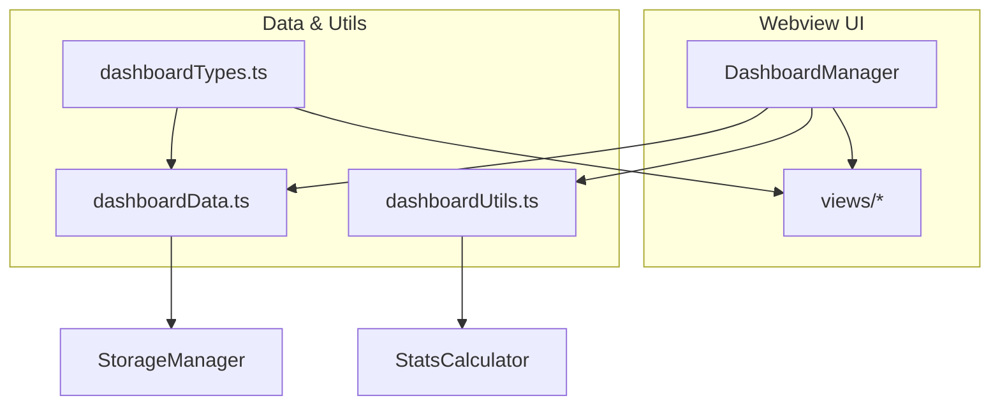

# Dashboard Refactor Analysis Report

**Date:** August 18, 2025  
**File Analyzed:** `src/ui/dashboard.ts`  
**Analysis Type:** Static code analysis using TypeScript language server  
**Total Symbols:** 188 (from previous analysis)  
**Total Class Members:** 47  

## Executive Summary

The `DashboardManager` class in `src/ui/dashboard.ts` is a large, monolithic component responsible for:
- Webview panel lifecycle management
- Data generation for multiple dashboard views
- HTML template rendering
- Auto-refresh scheduling
- Utility formatting functions

This analysis identifies specific functions for extraction into focused modules to improve maintainability, testability, and code organization.

## Function Analysis Table

| Function Name | Current Line | Signature | Return Type | Target Module | Refactor Priority |
|---------------|--------------|-----------|-------------|---------------|-------------------|
| `generateTimelineData` | 2257 | `(channels: any[], days: number)` | `any` | `dashboardData.ts` | High |
| `generateHourlyHeatmapData` | 2287 | `(channels: any[], days: number)` | `any` | `dashboardData.ts` | High |
| `generateIncidentsData` | 2317 | `(channels: any[], days: number)` | `any[]` | `dashboardData.ts` | High |
| `generateMetricsData` | 2371 | `(channels: any[], states: Map<string, any>)` | `any` | `dashboardData.ts` | High |
| `generateDashboardData` | 176 | `()` | `any` | `dashboardData.ts` | Medium |
| `getRecentSamples` | 2128 | `(channels: any[], limit?: number)` | `any[]` | `dashboardData.ts` | Medium |
| `formatRelativeTime` | 2186 | `(timestamp: number)` | `string` | `dashboardUtils.ts` | High |
| `calculateAverageLatency` | 213 | `(channels: any[], states: Map<string, any>)` | `number` | `dashboardUtils.ts` | High |
| `generateQuickStats` | 199 | `(channels: any[], states: Map<string, any>)` | `any` | `dashboardUtils.ts` | Medium |
| `generateOverviewDashboard` | 310 | `(channels: any[], states: Map<string, any>, currentWatch?: any)` | `string` | `views/overviewView.ts` | High |
| `getBaseCSS` | 1865 | `()` | `string` | `dashboardTemplates.ts` | Medium |
| `getBaseScripts` | 1920 | `()` | `string` | `dashboardTemplates.ts` | Medium |

## Proposed Module Structure

### 1. `src/ui/dashboardData.ts` - Pure Data Generation
**Purpose:** Extract all data processing and aggregation logic
- `generateTimelineData` - Creates timeline visualization data
- `generateHourlyHeatmapData` - Creates heatmap visualization data  
- `generateIncidentsData` - Processes incident/outage data
- `generateMetricsData` - Calculates dashboard metrics
- `generateDashboardData` - Orchestrates data collection
- `getRecentSamples` - Filters recent sample data

# Dashboard Refactor Analysis Report

```
	____  _               _ _      _             _
 |  _ \| |__   ___  ___| | | ___(_) ___  _ __ | |_
 | | | | '_ \ / _ \/ __| | |/ _ \ |/ _ \| '_ \| __|
 | |_| | | | |  __/ (__| | |  __/ | (_) | | | | |_
 |____/|_| |_|\___|\___|_|_|\___|_|\___/|_| |_|\__|

```

**Date:** August 18, 2025  
**File Analyzed:** `src/ui/dashboard.ts`  
**Analysis Type:** Static code analysis using TypeScript language server  

---

## Executive summary (visual)

<svg width="600" height="80" xmlns="http://www.w3.org/2000/svg">
	<rect x="4" y="4" width="592" height="72" rx="6" fill="#0f172a" stroke="#94a3b8"/>
	<text x="18" y="30" font-family="monospace" font-size="14" fill="#e2e8f0">DashboardManager</text>
	<text x="18" y="52" font-family="monospace" font-size="12" fill="#cbd5e1">orchestrates data, views, templates and lifecycle</text>
</svg>

The `DashboardManager` currently mixes orchestration, data aggregation, HTML templating and utility logic. The goal of the refactor is to break these concerns into small, typed modules that are easy to test and migrate (to React/Storybook) later.

## Quick function map (selected high-priority targets)

| Function | Line | Signature | Target module |
|---|---:|---|---|
| generateTimelineData | 2257 | (channels, days) => TimelineData | `src/ui/dashboardData.ts` |
| generateHourlyHeatmapData | 2287 | (channels, days) => HeatmapData | `src/ui/dashboardData.ts` |
| generateIncidentsData | 2317 | (channels, days) => Incident[] | `src/ui/dashboardData.ts` |
| generateMetricsData | 2371 | (channels, states) => MetricsSummary | `src/ui/dashboardData.ts` |
| formatRelativeTime | 2186 | (timestamp) => string | `src/ui/dashboardUtils.ts` |
| calculateAverageLatency | 213 | (channels, states) => number | `src/ui/dashboardUtils.ts` |

---

## Module architecture (Mermaid)



> Note: Mermaid diagrams render in many Markdown viewers (VS Code with Mermaid preview or Mermaid plugin).

## Example interfaces (to add in `src/ui/dashboardTypes.ts`)

```ts
// src/ui/dashboardTypes.ts
export interface TimelinePoint { timestamp: number; availability: number; }
export interface TimelineData { channelId: string; points: TimelinePoint[]; }

export interface MetricsSummary {
	channelId: string;
	p95: number;
	avg: number;
	outages: number;
}
```

## Module snippets (how to export/import)

```ts
// src/ui/dashboardData.ts
import { TimelineData, MetricsSummary } from './dashboardTypes';

export function generateTimelineData(channels: any[], days: number): TimelineData[] {
	// ...pure data logic
}

export function generateMetricsData(channels: any[], states: Map<string, any>): MetricsSummary[] {
	// ...pure data logic
}
```

```ts
// src/ui/dashboardUtils.ts
export function formatRelativeTime(ts: number): string { /* ... */ }
export function calculateAverageLatency(...): number { /* ... */ }
```

## Visual accent (ASCII + inline SVG)

```
	[dashboardData] ---> [views/*] ---> [webview]
```

Inline SVG (tiny legend):

<svg width="120" height="40" xmlns="http://www.w3.org/2000/svg" role="img" aria-label="legend">
	<rect x="6" y="6" width="40" height="24" fill="#16a34a" rx="4" />
	<text x="52" y="22" font-family="monospace" font-size="12" fill="#0f172a">online</text>
	<rect x="6" y="6" width="40" height="24" fill-opacity="0" stroke="#ef4444" rx="4" />
</svg>

## Refactor plan (concise)

1. Create `src/ui/dashboardTypes.ts` and add core interfaces.  
2. Extract `dashboardData.ts` with pure functions (timeline/heatmap/incidents/metrics).  
3. Extract `dashboardUtils.ts` for formatters and quick stats.  
4. Make `views/*` pure renderers (data -> HTML or data -> React props).  
5. Add unit tests and Storybook stories for isolated components.

## Quick checklist for the first PR

- [ ] Add `dashboardTypes.ts` and compile-time checks.  
- [ ] Extract `generateTimelineData` into `dashboardData.ts` with unit tests.  
- [ ] Wire `DashboardManager` to import the new function.  

---

Generated: static code analysis & enhancement suggestions.
