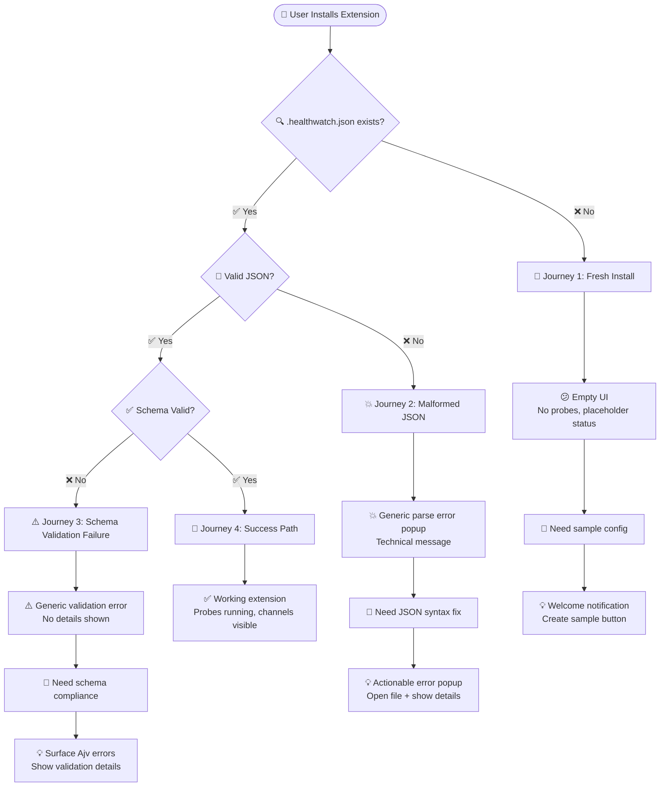
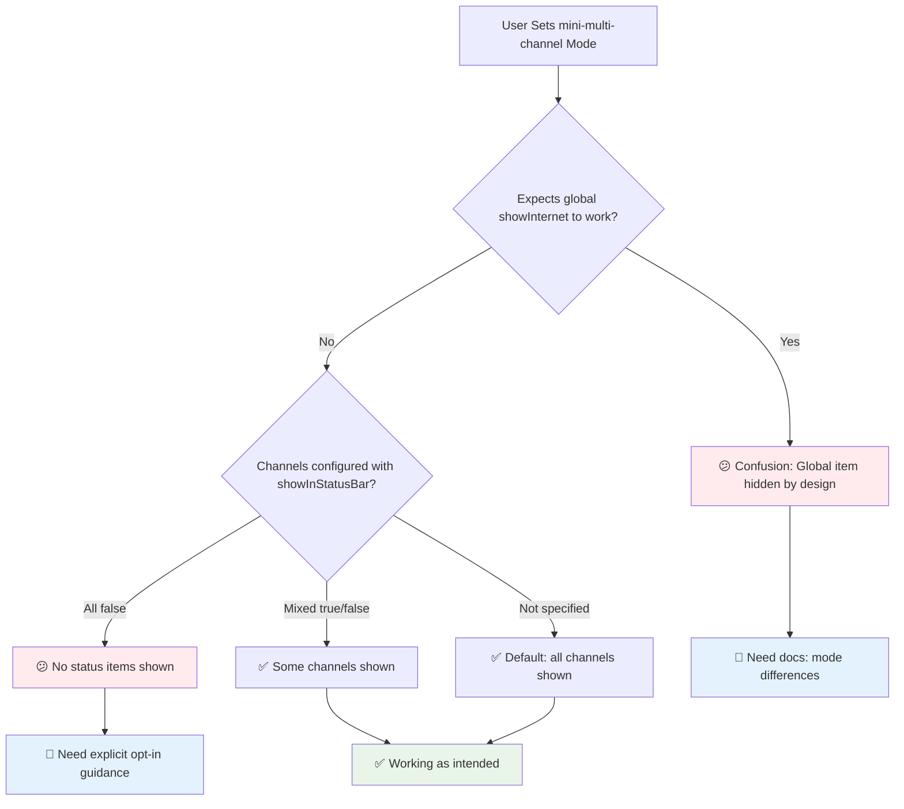
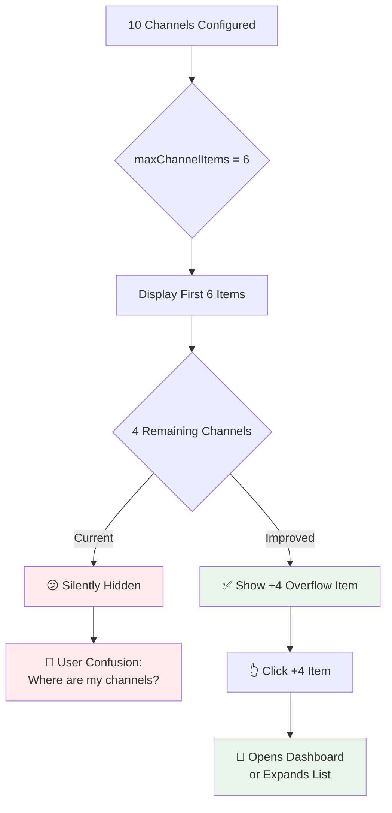
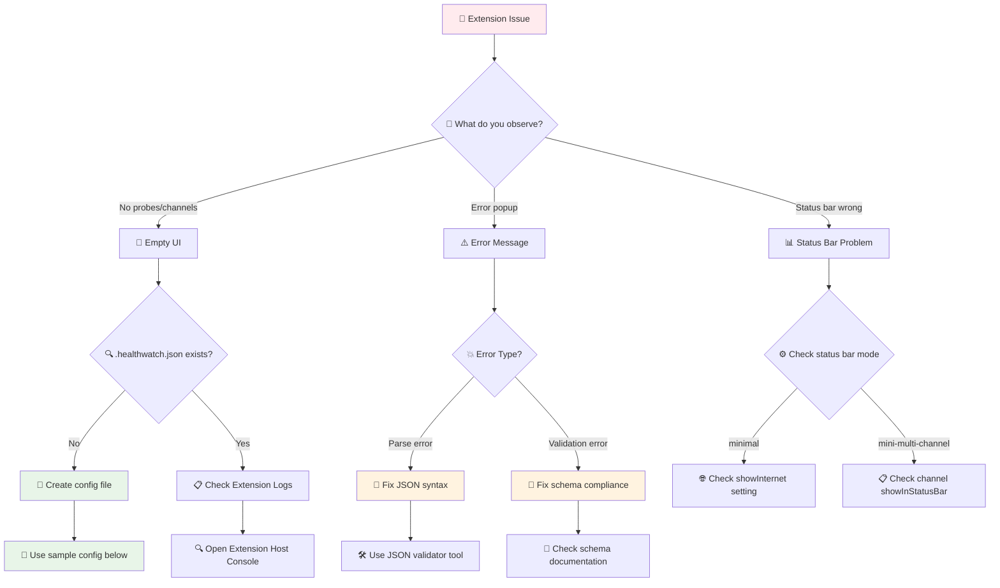
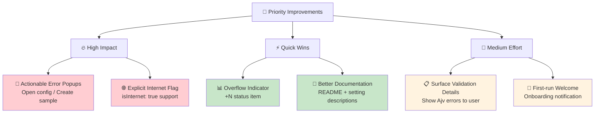

# Health Watch — User Journeys & Setup Report

```
 ╔═══════════════════════════════════════════════════════════════##
 ║                    🏥 HEALTH WATCH                           ║
 ║                  User Journey Analysis                        ║
 ║                                                              ║
 ║  📊 Config Flow  🔧 Setup Issues  📋 Status Bar Modes       ║
 ╚═══════════════════════════════════════════════════════════════╝
```


```
👤 USER JOURNEY FLOWCHART
┌─────────────────────────────────────────────────────────────┐
│                                                             │
│  📦 Install Extension                                       │
│       │                                                     │
│       ▼                                                     │
│  🔍 Check .healthwatch.json                                │
│       │                                                     │
│  ┌────▼────┐  ┌──────────┐  ┌──────────┐  ┌──────────┐    │
│  │ Missing │  │ Malformed│  │ Invalid  │  │   Valid  │    │
│  │  File   │  │   JSON   │  │ Schema   │  │  Config  │    │
│  └────┬────┘  └─────┬────┘  └─────┬────┘  └─────┬────┘    │
│       │             │             │             │         │
│       ▼             ▼             ▼             ▼         │
│  😕 Empty UI   💥 Parse Err  ⚠️ Validation  ✅ Working    │
│                                                             │
└─────────────────────────────────────────────────────────────┘
```



### 1) Fresh install — user hasn't created `.healthwatch.json`


Purpose: capture common user journeys related to configuration, setup, and the new multi-channel status bar model; provide reproducible steps, troubleshooting guidance, and recommended fixes for UX gaps.

Audience: extension authors, maintainers, and documentation writers.

---

## Quick summary

```
┌─ Configuration Sources ─────────────────────────────────────┐
│                                                             │
│  📁 .healthwatch.json     ⚙️  VS Code Settings             │
│  ├─ channels[]            ├─ healthWatch.statusBar.mode     │
│  ├─ defaults              ├─ healthWatch.statusBar.show*    │
│  ├─ guards                ├─ healthWatch.defaults.*         │
│  └─ statusBar (new)       └─ healthWatch.watch.*           │
│                                                             │
│         │                           │                      │
│         └─────────┬─────────────────┘                      │
│                   ▼                                        │
│            ConfigManager.getInstance()                     │
│                   │                                        │
│         ┌─────────▼─────────┐                              │
│         │   Runtime Config   │                              │
│         │  ┌─ getChannels()  │                              │
│         │  ├─ getDefaults()  │                              │
│         │  └─ isEnabled()    │                              │
│         └────────────────────┘                              │
└─────────────────────────────────────────────────────────────┘
```

- The extension reads workspace configuration from `.healthwatch.json` (validated with the bundled JSON Schema).
- VS Code extension settings (in Settings UI / settings.json) control runtime options such as `healthWatch.statusBar.mode` and `healthWatch.statusBar.showInternet`.
- Three status-bar modes:
  - `none` — hide all status items
  - `minimal` — single global "internet" item (respects `healthWatch.statusBar.showInternet`)
  - `mini-multi-channel` — one status item per-channel (per-channel opt-in via `channels[].showInStatusBar` or default opt-in in multi mode)

```mermaid
graph TD
    A[Extension Starts] --> B{.healthwatch.json exists?}
    B -->|No| C[workspaceConfig = null]
    B -->|Yes| D{Valid JSON?}
    D -->|No| E[Show Parse Error]
    D -->|Yes| F{Schema Valid?}
    F -->|No| G[Show Validation Error]
    F -->|Yes| H[Load Config Successfully]
    
    C --> I[getChannels() returns []]
    E --> I
    G --> I
    H --> J[getChannels() returns channels[]]
    
    I --> K[No Probes Scheduled]
    J --> L[Schedule Channel Probes]
    
    K --> M[Status Bar: 'Not Configured']
    L --> N{Status Bar Mode?}
    N -->|none| O[Hide All Items]
    N -->|minimal| P[Show Global Internet Item]
    N -->|mini-multi-channel| Q[Show Per-Channel Items]
```

---

## Current "internet" channel detection (how the extension decides which channel is "internet")

```
🔍 Internet Channel Detection Algorithm
┌─────────────────────────────────────────────────────────────┐
│  Priority 1: Keyword Match in HTTP(S) URLs                 │
│  ┌─────────────────────────────────────────────────────┐   │
│  │ Keywords: internet, public, google, cloudflare,    │   │
│  │          8.8.8.8, 1.1.1.1, connectivity           │   │
│  │                                                     │   │
│  │ Example: "https://www.google.com" ✅ matches        │   │
│  │          "https://internal.company.com" ❌          │   │
│  └─────────────────────────────────────────────────────┘   │
│                           │                                 │
│                    No Match? ▼                             │
│  ┌─────────────────────────────────────────────────────┐   │
│  │ Priority 2: Public HTTP(S) Endpoints               │   │
│  │ (URLs NOT containing localhost or 127.0.0.1)       │   │
│  └─────────────────────────────────────────────────────┘   │
│                           │                                 │
│                    No Match? ▼                             │
│  ┌─────────────────────────────────────────────────────┐   │
│  │ Priority 3: First Channel (any type)               │   │
│  │ Final fallback if nothing else qualifies           │   │
│  └─────────────────────────────────────────────────────┘   │
└─────────────────────────────────────────────────────────────┘

⚠️  LIMITATIONS:
├─ Only checks http/https channel types
├─ Ignores tcp, dns, script channels  
├─ String-based matching (case insensitive)
└─ No explicit "isInternet" flag support
```

- Priority check (current implementation):
  1. Search `http(s)` channels whose URL contains a keyword (lowercased match) from a small builtin list: `internet, public, google, cloudflare, 8.8.8.8, 1.1.1.1, connectivity`.
  2. Fallback: first `http(s)` channel whose URL does *not* include `localhost` or `127.0.0.1`.
  3. Final fallback: the first configured channel (if any).
- Notes: `tcp`, `dns`, and `script` channel types are ignored by this detector. This is a heuristic and may misidentify or miss internet channels.

---

## User journeys

### 1) Fresh install — user hasn’t created `.healthwatch.json`
What happens:
- `ConfigManager` finds no workspace `.healthwatch.json` and `workspaceConfig` remains null.
- `getChannels()` returns an empty array; no probes are scheduled.
- Status bar: in `minimal` mode you see a placeholder like "Internet: Not configured"; in `mini-multi-channel` you see no per-channel items.

Expected friction for users:
- No probes / no channels visible — users may assume extension is broken.

Recommended quick fixes (docs + UX):
- Display a one-time welcome notification with a link/button to create a sample `.healthwatch.json` or open docs.
- Provide a sample file at `.healthwatch.json.sample` that users can copy.

Quick repro steps (dev/test):
```powershell
# Ensure no .healthwatch.json in workspace
Remove-Item -Path .\.healthwatch.json -ErrorAction SilentlyContinue
# Build and open extension host
npm run compile
# Press F5 in VS Code to launch Extension Development Host and observe status bar
```

---

### 2) Malformed JSON (syntax error) in `.healthwatch.json`
What happens:
- `loadWorkspaceConfig()` catches the `JSON.parse` exception and shows an error: `Failed to load .healthwatch.json: <error>`.
- `workspaceConfig` remains unchanged (typically null) and the extension falls back to defaults.
- UX: user receives a raw parse error popup which can be technical and not actionable.

Recommended fixes:
- Show an actionable error popup with buttons: `Open .healthwatch.json` and `Create sample`.
- Optionally open an output channel that contains the parse error and file path.

---

### 3) Schema validation failure (invalid fields/value types)
What happens:
- `Ajv` validation runs; if invalid, `validateConfig()` returns false and the extension logs detailed Ajv errors to the extension console.
- User sees a generic popup: `Invalid .healthwatch.json configuration`.
- `workspaceConfig` is not set; extension runs with defaults.

Recommended UX improvements:
- Surface a small, useful subset of Ajv errors to the user in the popup or provide a `Show details` button that opens an OutputChannel with full errors.
- Provide a `Fix sample` button that writes a minimal valid config.

---

### 4) Misconfigured per-channel `showInStatusBar` or multi-mode surprises



```
📊 STATUS BAR MODE COMPARISON
┌─────────────────────────────────────────────────────────────┐
│                        MODE: none                          │
│  ┌─────────────────────────────────────────────────────┐   │
│  │  Status Bar: [ (empty) ]                           │   │
│  │  Result: All Health Watch items hidden             │   │
│  └─────────────────────────────────────────────────────┘   │
│                                                             │
│                      MODE: minimal                         │
│  ┌─────────────────────────────────────────────────────┐   │
│  │  Status Bar: [ 🟢 Internet: 45ms ]                │   │
│  │  Result: Single global item (showInternet controls) │   │
│  └─────────────────────────────────────────────────────┘   │
│                                                             │
│                  MODE: mini-multi-channel                  │
│  ┌─────────────────────────────────────────────────────┐   │
│  │  Status Bar: [ 🌐:🟢 ] [ 🔒:🟡 ] [ 📊:🔴 ] [ +2 ] │   │
│  │  Result: Per-channel items (showInStatusBar rules) │   │
│  └─────────────────────────────────────────────────────┘   │
└─────────────────────────────────────────────────────────────┘

⚠️  Common Misconceptions:
├─ showInternet affects mini-multi-channel mode (it doesn't)
├─ Channels hidden by default in multi mode (they're shown)
└─ Global and per-channel items appear together (they don't)
```

Scenarios:
- User sets `healthWatch.statusBar.mode` = `mini-multi-channel` and expects global `showInternet` to hide internet info — but in multi-channel mode the global item is hidden by design and per-channel items are used.
- Users may set `channels[].showInStatusBar: false` expecting the channel to never appear; in `mini-multi-channel` mode channels are shown by default unless explicitly false (this is current behavior).

Recommendations:
- Document the difference clearly in README and in `package.json` setting descriptions.
- Consider a workspace-level `statusBar.showInternet` schema entry so `.healthwatch.json` can centrally control status-bar behavior.

---

### 5) Many channels opted-in -> overflow

```
📱 STATUS BAR OVERFLOW SCENARIO
┌─────────────────────────────────────────────────────────────┐
│  User has 10 channels, maxChannelItems = 6                 │
│                                                             │
│  Current Behavior:                                          │
│  ┌─────────────────────────────────────────────────────┐   │
│  │ [ 🌐:🟢 ] [ 🔒:🟡 ] [ 📊:🔴 ] [ ⚡:🟢 ] [ 💾:🟡 ] [ 🖥️:🟢 ] │   │
│  └─────────────────────────────────────────────────────┘   │
│           ▲ Shows first 6, silently hides 4 others         │
│                                                             │
│  Recommended Behavior:                                      │
│  ┌─────────────────────────────────────────────────────┐   │
│  │ [ 🌐:🟢 ] [ 🔒:🟡 ] [ 📊:🔴 ] [ ⚡:🟢 ] [ 💾:🟡 ] [ +4 ]  │   │
│  └─────────────────────────────────────────────────────┘   │
│           ▲ Shows overflow indicator, click to expand       │
└─────────────────────────────────────────────────────────────┘
```



Current behavior:
- The code slices channels to `maxChannelItems` and disposes the rest without an explicit UI indicator.
Risk:
- Silent truncation leads to confusion.
Recommendation:
- Add an overflow item like `+N` that shows how many channels are hidden and provides a click action (open dashboard or expand items).

---

## Diagnostic and remediation steps for users

```
🔧 TROUBLESHOOTING DECISION TREE
┌─────────────────────────────────────────────────────────────┐
│                                                             │
│  🚨 Problem: Extension not working as expected             │
│                         │                                   │
│  ┌─────────────────────▼─────────────────────┐             │
│  │          What do you see?                 │             │
│  └┬────────────────┬─────────────────────────┘             │
│   │                │                                       │
│   ▼                ▼                                       │
│  📱 Empty UI      ⚠️ Error Message                        │
│   │                │                                       │
│   │    ┌──────────▼──────────┐                            │
│   │    │    Error Type?      │                            │
│   │    └┬──────────┬─────────┘                            │
│   │     │          │                                      │
│   │     ▼          ▼                                      │
│   │   💥 Parse   ⚠️ Validation                           │
│   │     │          │                                      │
│   │     │          │                                      │
│   ▼     ▼          ▼                                      │
│  📋 No Config   🔧 Fix JSON   📝 Fix Schema               │
│                                                             │
└─────────────────────────────────────────────────────────────┘
```



1. If you see no probes or empty UI:
   - Open the Command Palette → `Developer: Open Extensions Log (Window)` → check logs for `Failed to load .healthwatch.json` or Ajv errors.
   - Open workspace root and create `.healthwatch.json` (use sample below).
2. If you get "Failed to load" or "Invalid":
   - Click the provided action in the error message to open the file. Fix JSON syntax or types.
   - If no details are shown, open the Extension Host console to view Ajv errors.

Minimal sample `.healthwatch.json` (starter):
```json
{
  "channels": [
    {
      "id": "google-dns",
      "name": "Google DNS",
      "type": "https",
      "url": "https://www.google.com",
      "showInStatusBar": true
    }
  ]
}
```

```
📄 SAMPLE CONFIG EXAMPLES
┌─────────────────────────────────────────────────────────────┐
│                                                             │
│  🌐 Basic Internet Check                                   │
│  ┌─────────────────────────────────────────────────────┐   │
│  │ {                                                   │   │
│  │   "channels": [                                     │   │
│  │     {                                               │   │
│  │       "id": "internet",                             │   │
│  │       "type": "https",                              │   │
│  │       "url": "https://www.google.com",              │   │
│  │       "isInternet": true                            │   │
│  │     }                                               │   │
│  │   ]                                                 │   │
│  │ }                                                   │   │
│  └─────────────────────────────────────────────────────┘   │
│                                                             │
│  🏢 Multi-Service Setup                                    │
│  ┌─────────────────────────────────────────────────────┐   │
│  │ {                                                   │   │
│  │   "defaults": { "intervalSec": 30, "threshold": 2 },│   │
│  │   "statusBar": { "mode": "mini-multi-channel" },    │   │
│  │   "channels": [                                     │   │
│  │     {                                               │   │
│  │       "id": "api",                                  │   │
│  │       "name": "API Server",                         │   │
│  │       "type": "https",                              │   │
│  │       "url": "https://api.company.com/health",      │   │
│  │       "icon": "🚀",                                 │   │
│  │       "showInStatusBar": true                       │   │
│  │     },                                              │   │
│  │     {                                               │   │
│  │       "id": "db",                                   │   │
│  │       "name": "Database",                           │   │
│  │       "type": "tcp",                                │   │
│  │       "target": "db.company.com:5432",              │   │
│  │       "icon": "💾"                                  │   │
│  │     }                                               │   │
│  │   ]                                                 │   │
│  │ }                                                   │   │
│  └─────────────────────────────────────────────────────┘   │
└─────────────────────────────────────────────────────────────┘
```

---

## Recommended short-term implementation improvements (developer tasks)



```
🚀 IMPLEMENTATION ROADMAP
┌─────────────────────────────────────────────────────────────┐
│                                                             │
│  Phase 1: Critical UX Fixes (1-2 hours)                   │
│  ├─ ❌ → ✅ Actionable error popups                        │
│  ├─ ❌ → ✅ Add isInternet field to schema                 │
│  └─ ❌ → ✅ Update findInternetChannel logic               │
│                                                             │
│  Phase 2: Polish & Feedback (2-3 hours)                   │
│  ├─ ❌ → ✅ Overflow +N indicator                          │
│  ├─ ❌ → ✅ Detailed validation errors                     │
│  └─ ❌ → ✅ Welcome notification                           │
│                                                             │
│  Phase 3: Testing & Documentation (1-2 hours)             │
│  ├─ ❌ → ✅ Unit tests for StatusBarManager                │
│  ├─ ❌ → ✅ Update README with mode explanations           │
│  └─ ❌ → ✅ Add troubleshooting guide                      │
│                                                             │
└─────────────────────────────────────────────────────────────┘
```

1. Show actionable popups on parse/validation failure (Open config / Create sample / Show details). (low effort)
2. Surface Ajv validation details into an OutputChannel or copyable dialog. (medium)
3. Add `isInternet: true` or `tags: ["internet"]` to `ChannelDefinition` and prefer it when picking the internet channel. Update schema. (low)
4. Add overflow `+N` item for `mini-multi-channel`. (low)
5. Add a first-run welcome notification offering to create a sample config. (medium)

---

## How to test these journeys locally

```
🧪 TESTING WORKFLOW
┌─────────────────────────────────────────────────────────────┐
│                                                             │
│  1. Build Project                                           │
│  ┌─────────────────────────────────────────────────────┐   │
│  │ npm run compile                                     │   │
│  └─────────────────────────────────────────────────────┘   │
│                           │                                 │
│                           ▼                                 │
│  2. Launch Extension Host                                   │
│  ┌─────────────────────────────────────────────────────┐   │
│  │ Press F5 in VS Code                                 │   │
│  │ → Opens Extension Development Host                  │   │
│  └─────────────────────────────────────────────────────┘   │
│                           │                                 │
│                           ▼                                 │
│  3. Test Each Journey                                       │
│  ┌─────────────────────────────────────────────────────┐   │
│  │ Journey 1: rm .healthwatch.json                    │   │
│  │ Journey 2: echo "invalid json" > .healthwatch.json │   │
│  │ Journey 3: echo '{"bad":"schema"}' > .healthwatch  │   │
│  │ Journey 4: Valid config → observe behavior         │   │
│  └─────────────────────────────────────────────────────┘   │
│                           │                                 │
│                           ▼                                 │
│  4. Observe Results                                         │
│  ┌─────────────────────────────────────────────────────┐   │
│  │ ✓ Status bar behavior                               │   │
│  │ ✓ Error messages                                    │   │
│  │ ✓ Tree view contents                                │   │
│  │ ✓ Extension host console logs                       │   │
│  └─────────────────────────────────────────────────────┘   │
│                                                             │
└─────────────────────────────────────────────────────────────┘
```

1. Build project:
```powershell
npm run compile
```
2. Launch Extension Development Host (F5 in VS Code).
3. For each journey, edit/remove/create `.healthwatch.json` in the workspace root and watch the status bar, tree views, and extension output for messages.

```
📋 TEST CHECKLIST
┌─────────────────────────────────────────────────────────────┐
│                                                             │
│  🔍 Fresh Install (No Config)                              │
│  ├─ [ ] Status bar shows "Not configured"                  │
│  ├─ [ ] Tree views are empty                               │
│  └─ [ ] No error messages                                  │
│                                                             │
│  💥 Malformed JSON                                         │
│  ├─ [ ] Error popup appears                                │
│  ├─ [ ] Message mentions JSON parsing                      │
│  └─ [ ] Extension continues running                        │
│                                                             │
│  ⚠️ Invalid Schema                                          │
│  ├─ [ ] Validation error popup                             │
│  ├─ [ ] Extension host console shows Ajv errors           │
│  └─ [ ] Falls back to empty config                        │
│                                                             │
│  ✅ Valid Config                                            │
│  ├─ [ ] Channels appear in tree view                       │
│  ├─ [ ] Status bar shows appropriate mode                  │
│  ├─ [ ] Probes start running                               │
│  └─ [ ] No error messages                                  │
│                                                             │
│  📊 Status Bar Modes                                       │
│  ├─ [ ] none: all items hidden                             │
│  ├─ [ ] minimal: single global item                        │
│  └─ [ ] mini-multi-channel: per-channel items              │
│                                                             │
└─────────────────────────────────────────────────────────────┘
```

---

## Appendix: quick schema snippets (for implementers)

```
📝 SCHEMA ENHANCEMENTS
┌─────────────────────────────────────────────────────────────┐
│                                                             │
│  🌐 Add Internet Flag                                      │
│  ┌─────────────────────────────────────────────────────┐   │
│  │ "isInternet": {                                     │   │
│  │   "type": "boolean",                                │   │
│  │   "default": false,                                 │   │
│  │   "description": "Mark this channel as the         │   │
│  │                   internet connectivity check"     │   │
│  │ }                                                   │   │
│  └─────────────────────────────────────────────────────┘   │
│                                                             │
│  🏷️ Add Tags Support                                       │
│  ┌─────────────────────────────────────────────────────┐   │
│  │ "tags": {                                           │   │
│  │   "type": "array",                                  │   │
│  │   "items": { "type": "string" },                   │   │
│  │   "description": "Tags for categorizing channels   │   │
│  │                   (e.g., ['internet', 'critical'])"│   │
│  │ }                                                   │   │
│  └─────────────────────────────────────────────────────┘   │
│                                                             │
│  📊 Add Workspace StatusBar Config                         │
│  ┌─────────────────────────────────────────────────────┐   │
│  │ "statusBar": {                                      │   │
│  │   "type": "object",                                 │   │
│  │   "properties": {                                   │   │
│  │     "mode": { /* ... */ },                         │   │
│  │     "showInternet": {                               │   │
│  │       "type": "boolean",                            │   │
│  │       "default": true,                              │   │
│  │       "description": "Show internet connectivity   │   │
│  │                       in status bar"               │   │
│  │     }                                               │   │
│  │   }                                                 │   │
│  │ }                                                   │   │
│  └─────────────────────────────────────────────────────┘   │
│                                                             │
└─────────────────────────────────────────────────────────────┘
```

- Add an explicit `isInternet` flag to channel schema (example):
```json
"isInternet": {
  "type": "boolean",
  "default": false,
  "description": "Mark this channel as the internet connectivity check"
}
```
- Add `statusBar.showInternet` to workspace schema if you want workspace-scoped control.

```
🔄 MIGRATION PATHS
┌─────────────────────────────────────────────────────────────┐
│                                                             │
│  Existing Users → New Features                              │
│  ┌─────────────────────────────────────────────────────┐   │
│  │ Old: URL keyword matching only                      │   │
│  │ New: isInternet: true takes priority                │   │
│  │                                                     │   │
│  │ Old: No overflow handling                           │   │
│  │ New: +N indicator for hidden channels               │   │
│  │                                                     │   │
│  │ Old: Generic error messages                         │   │
│  │ New: Actionable popups with buttons                 │   │
│  └─────────────────────────────────────────────────────┘   │
│                                                             │
│  ✅ Backward Compatibility Maintained                      │
│  ├─ Existing configs continue working                      │
│  ├─ New fields are optional                                │
│  └─ Fallback logic preserved                               │
│                                                             │
└─────────────────────────────────────────────────────────────┘
```

---

```
 ╔═══════════════════════════════════════════════════════════════╗
 ║                         📊 SUMMARY                           ║
 ║                                                              ║
 ║  ✅ User journeys documented with visual aids                ║
 ║  🎯 Priority improvements identified                          ║
 ║  🔧 Actionable troubleshooting steps provided                ║
 ║  📋 Testing checklist for validation                         ║
 ║  🚀 Implementation roadmap outlined                          ║
 ╚═══════════════════════════════════════════════════════════════╝
```

End of report.
