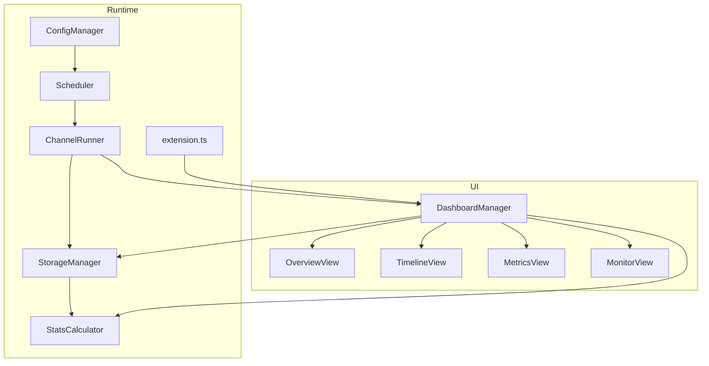
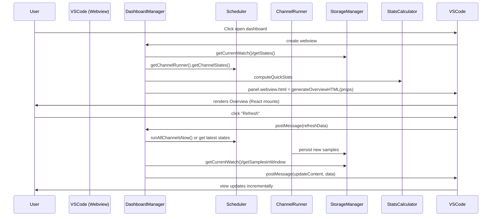
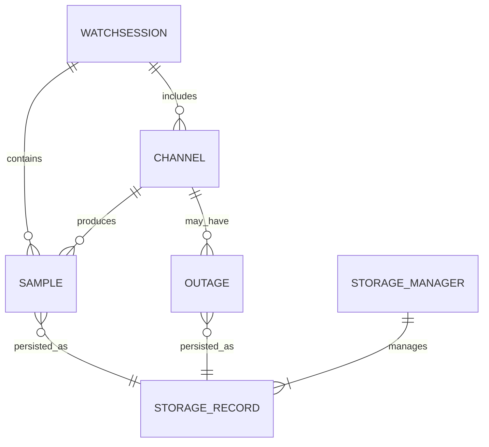
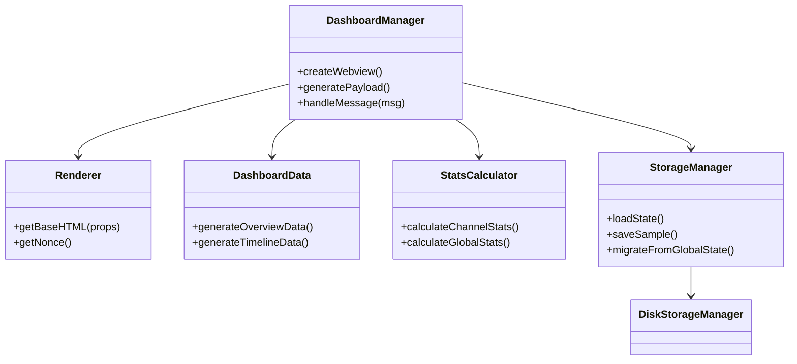
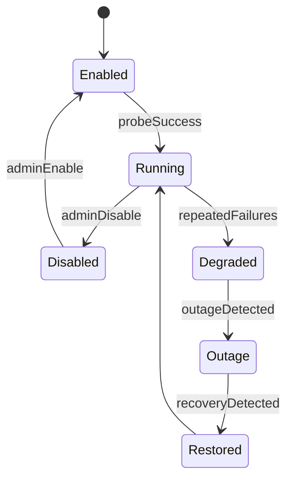
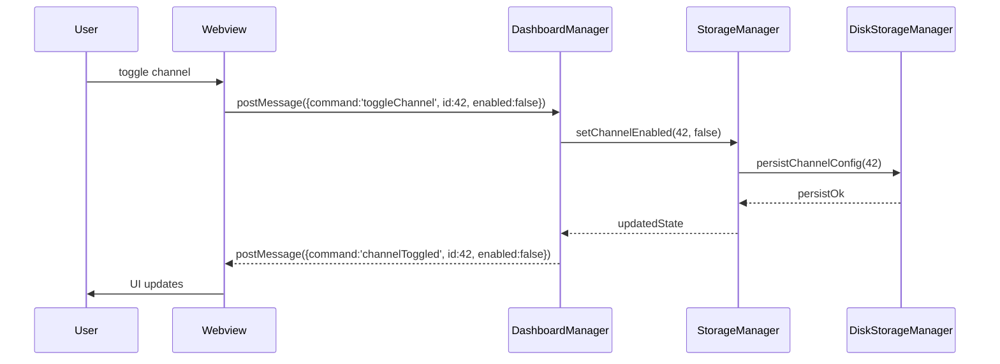

## Dashboard architecture and view relationships

This document explains how the Health Watch dashboard views are organized, how they interconnect, the main entities and data models involved, and suggested architect-level diagrams to guide the `dashboard.ts` refactor.

### Goals
- Explain how the Overview, Metrics, Timeline (swimlanes/heatmap/incidents), Live Monitor, and Live Reports views connect to the extension runtime.
- Describe data flows, entities (Channels, Samples, Outages, WatchSession), and key services (ConfigManager, StorageManager, Scheduler, StatsCalculator).
- Provide architecture diagrams at three levels: Conceptual, Component, and Sequence.
- Document recent enhancements including async initialization (v1.0.5) and live reporting capabilities.

---

## High-level components

- Extension runtime
  - `extension.ts` — activation, command registration, and entry points.
  - `Scheduler` / `ChannelRunner` — runs probes, updates channel state and samples.

- Persistence
  - `StorageManager` and `DiskStorageManager` — persist watches, channel states, outages, and custom data.

- Data & Compute
  - `dashboardData` (pure functions) — generates timeline, heatmap, metrics, recent samples payloads.
  - `StatsCalculator` — heavy compute (availability, MTTR, percentile latencies, recommendations).

- UI / Views
  - `dashboard.ts` — orchestrates webview creation, navigation, message handling and delegates rendering to view modules.
  - `views/*` — view templates and React mount points:
    - `overviewView.ts` — Overview (React mount point + CSP-safe bundle loader)
    - `metricsView.ts` — Compact metrics view
    - `timelineView.ts` — Swimlanes / Heatmap / Incidents (React mount points)
    - `monitorView.ts` — Live monitor HTML
    - **New in v1.0.5**: Live markdown reports dashboard with real-time Mermaid chart generation

---

## Core entities and models

- Channel
  - id, name, type, url, enabled, probe config
  - Source: `ConfigManager.getChannels()` (loaded from config file)

- Sample (Probe result)
  - timestamp, latencyMs, success, error, channelId
  - Source: produced by `ChannelRunner` and persisted by `StorageManager`

- Outage
  - start, end, reason, impactedChannelId, resolved
  - Maintained in `StorageManager` and surfaced to `dashboardData`

- WatchSession
  - start, end, window, isActive, configuration
  - Stored by `StorageManager`

---

## Data flow (conceptual)

1. Config is loaded via `ConfigManager`.
2. `Scheduler` and `ChannelRunner` execute probes and create `Sample` records.
3. `StorageManager` persists samples and updates channel states and outages.
4. `DashboardManager` requests data from `dashboardData` + `StatsCalculator` and assembles a UI payload.
5. Webview (per-view HTML) mounts React components (Overview, Timeline, Metrics) or uses vanilla HTML for Monitor.
6. Webview sends user events to the extension host via `postMessage`; `DashboardManager` handles events and may call `Scheduler`/`StorageManager` as needed.

---

## Component diagram (conceptual)



Notes:
- `DashboardManager` is the glue between runtime services and view modules.
- Views are mostly pure renderers (React mount points); they receive precomputed props.

---

## Sequence diagram: user opens dashboard and refreshes



---

## Architecture levels and responsibilities

- Conceptual (what):
  - Entities: Channel, Sample, Outage, WatchSession
  - Services: Scheduler, ChannelRunner, StorageManager, StatsCalculator

- Component (who):
  - `DashboardManager` — orchestrator, webview lifecycle, event handling.
  - `views/*` — render-only modules that provide HTML + React mount points.
  - `dashboardData` & `stats.ts` — data assembly and heavy computations.

- Implementation (how):
  - Keep `views/*` minimal: accept props, mount React components using `window.HealthWatch.mountX` entry points.
  - Move HTML/CSS templates and CSP nonce generation into a `Renderer` module during refactor.
  - Keep data generation pure under `dashboardData` (easy to unit test).
  - Controller/EventBinder will provide a small message contract: { command: string, payload?: any }

---

## Suggested next steps for refactor

1. Extract `Renderer` (HTML, nonce, base CSS/Scripts) from `dashboard.ts` into `src/ui/renderer/dashboardRenderer.ts`.
2. Move pure functions from `dashboard.ts` to `dashboardData` (already present) and ensure `DashboardManager` uses those pure functions exclusively for payloads.
3. Create `src/ui/controller/dashboardController.ts` to centralize message handling: map message.command → controller action.
4. Add unit tests for `dashboardData` and `StatsCalculator` before heavy refactors.

---

## Appendix: message contract (current)

- Commands sent from webview to extension host:
  - `refreshData` — request an incremental update
  - `runAllProbes` — run probes immediately
  - `runChannelProbe` — run specific channel probe
  - `startWatch` — start a watch session
  - `changeView` — change the active view
  - `changeTimeRange` — update time range for timeline
  - `filterIncidents` — apply incidents filter
  - `toggleLiveMonitor` — enable/disable live updates
  - `stateUpdate` — webview informs extension of UI state (used for sync)

---

If you want, I can:
- create the Renderer extraction branch and implement the first move-only commits, or
- further expand the README with per-view component contracts and test stubs.

---

## Additional diagrams

Below are more diagrams at different levels of detail: Entity, Class, State, Deployment, and ASCII overviews for quick reference.

### Entity Relationship Diagram



Notes: `STORAGE_RECORD` is a generic record type for files or DB rows managed by `DiskStorageManager`.

### Class / Component Interaction (mermaid)



### State Diagram for a Channel



### Deployment diagram (where things live)

```mermaid
flowchart LR
  subgraph VSCodeHost
    A[Extension Host (Node)]
    A --> B[Scheduler / ChannelRunner]
    A --> C[StorageManager (Disk)]
    A --> D[Webview (Renderer + React bundles)]
  end

  subgraph LocalFS
    C --> F[.health-watch/state.json]
    C --> G[.health-watch/samples/*.json]
  end

  B -->|writes| C
  D -->|postMessage| A
  A -->|webview html| D
```

### Sequence: user toggles channel enabled flag



### ASCII overview: minimal conceptual map

```
+-------------------------------------------------------------+
|  VSCode Extension Host (Node)                               |
|                                                             |
|  [extension.ts]  [Scheduler]  [ChannelRunner]  [Storage]    |
|       |               |             |           |            |
|       v               v             v           v            |
|  DashboardManager -> DashboardData -> StatsCalculator       |
|        |                      |                             |
|        v                      v                             |
|  Webview Renderer (HTML + React bundles)                     |
+-------------------------------------------------------------+
```

### ASCII timeline (simplified)

```
Time --->
|----|----|----|----|----|----|----|----|----|----|----|----|
  ok   ok  fail  fail  outage   recover  ok   ok   slow  ok

Channels on Y axis, time on X. Heatmap and swimlanes map these bins.
```

---

If you'd like, I can now:
- extract `Renderer` into `src/ui/renderer/dashboardRenderer.ts` and update `src/ui/dashboard.ts` to call it (small, move-only commit), or
- add unit test stubs for `dashboardData` and `StatsCalculator` and wire a test runner.

