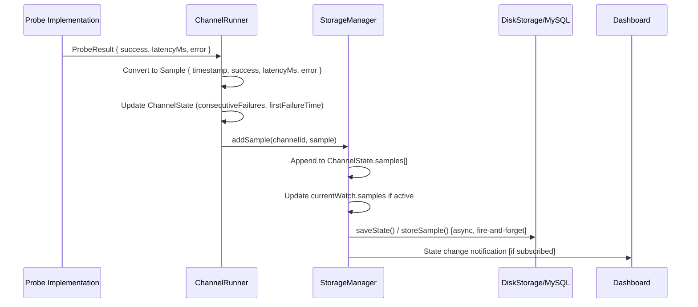
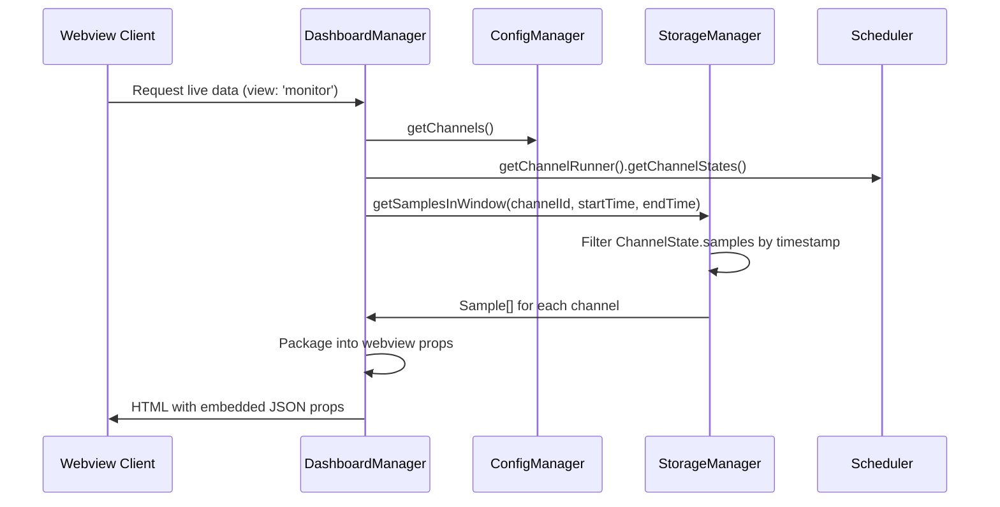
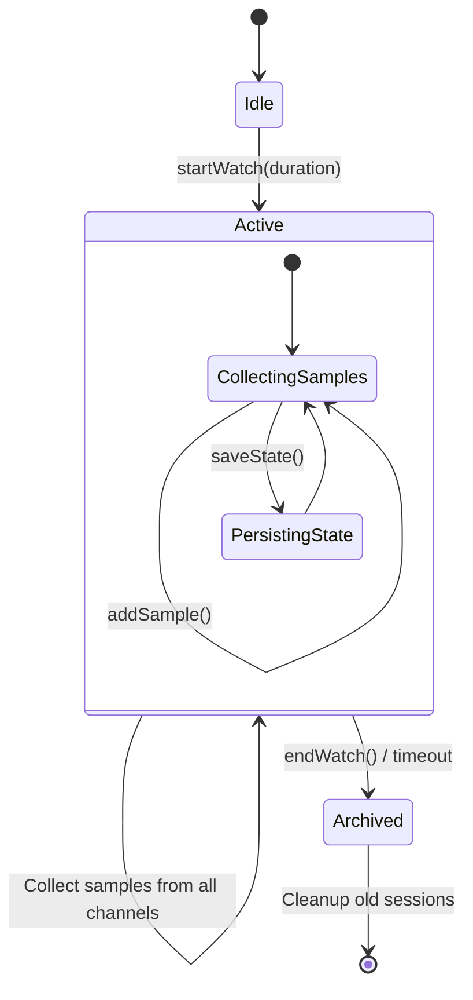
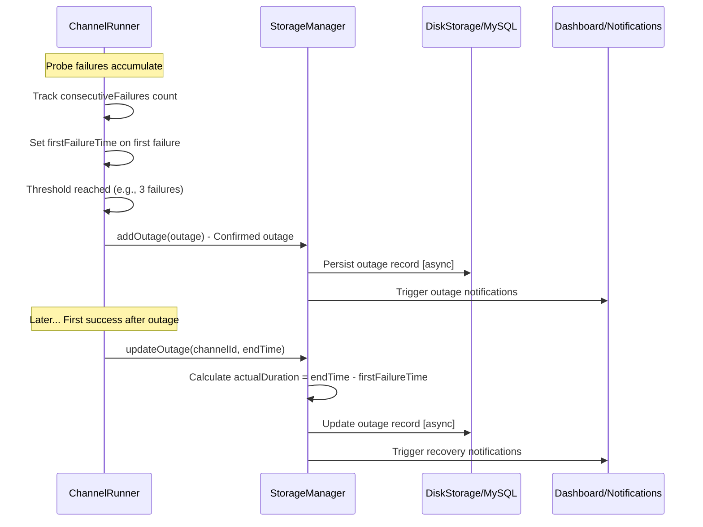

# Health Watch - Operational Data Flows

## Overview

This document details the critical operational flows within the Health Watch system, providing step-by-step breakdowns of how data moves through the system from probe execution to user interface updates.

## Flow 1: Probe Result Ingestion

### Purpose
Transform probe execution results into persisted samples with state tracking and outage detection.

### Flow Diagram


### Detailed Steps

| Step | Actor | Action | Input Data Shape | Output Data Shape | Notes |
|------|-------|--------|------------------|-------------------|-------|
| 1 | `src/probes/*` | Execute probe logic | Probe configuration | `ProbeResult { success: boolean; latencyMs: number; error?: string; details?: any }` | Different probe types (HTTPS, TCP, DNS, Script) |
| 2 | `src/runner/channelRunner.ts` | Convert probe result to sample | `ProbeResult` | `Sample { timestamp: number; success: boolean; latencyMs?: number; error?: string; details?: any }` | Adds timestamp normalization |
| 3 | `src/runner/channelRunner.ts` | Update channel state tracking | `Sample` + current `ChannelState` | Updated `ChannelState` | Manages consecutiveFailures, firstFailureTime, backoff |
| 4 | `src/storage.ts:addSample()` | Append sample to state | `channelId: string`, `Sample` | Updated in-memory state | Bounded sample array (max 1000) |
| 5 | `src/storage.ts:addSample()` | Update active watch samples | `Sample` | `WatchSession.samples` updated | Only if watch is active |
| 6 | `src/storage.ts:saveState()` | Persist state changes | In-memory state | Disk files or DB rows | Fire-and-forget async operation |

### Data Transformations

**ProbeResult → Sample**:
```typescript
// In ChannelRunner
const sample: Sample = {
    timestamp: Date.now(),
    success: probeResult.success,
    latencyMs: probeResult.latencyMs,
    error: probeResult.error,
    details: probeResult.details
};
```

**Sample → Database (MySQL)**:
```sql
INSERT INTO health_samples (
    channel_id, timestamp, is_success, latency_ms, reason, note
) VALUES (?, ?, ?, ?, ?, ?)
```

### Error Handling
- **Probe Failures**: Captured in `ProbeResult.error` and propagated to `Sample.error`
- **Storage Failures**: Currently fire-and-forget; failures may be logged but not handled
- **State Inconsistency**: Possible if disk/DB writes fail but in-memory state updates

---

## Flow 2: Live Dashboard Sample Retrieval

### Purpose
Provide real-time monitoring data to the web-based dashboard interface.

### Flow Diagram


### Detailed Steps

| Step | Actor | Action | Input Data Shape | Output Data Shape | Notes |
|------|-------|--------|------------------|-------------------|-------|
| 1 | Webview | Request dashboard data | `{ view: string; filter?: any }` | Message to extension | Via VS Code webview messaging |
| 2 | `src/ui/dashboard.ts:generateLiveReportData()` | Collect channel definitions | N/A | `ChannelDefinition[]` | From workspace configuration |
| 3 | `src/ui/dashboard.ts` | Get current channel states | N/A | `Map<string, ChannelState>` | Runtime state from scheduler |
| 4 | `src/ui/dashboard.ts` | Query recent samples | `channelId: string`, `windowStart: number`, `windowEnd: number` | `Sample[]` | 1-hour window by default |
| 5 | `src/storage.ts:getSamplesInWindow()` | Filter samples by timestamp | `ChannelState.samples`, time range | Filtered `Sample[]` | In-memory array filtering |
| 6 | `src/ui/dashboard.ts` | Serialize for webview | Channel data, samples, states | JSON props object | Convert Map to plain object |
| 7 | Webview | Render dashboard components | Props JSON | Updated UI | React components with live data |

### Data Structures in Flow

**Channel Collection**:
```typescript
const channels = this.configManager.getChannels(); // ChannelDefinition[]
const states = this.scheduler.getChannelRunner().getChannelStates(); // Map<string, ChannelState>
```

**Sample Window Query**:
```typescript
const oneHourAgo = Date.now() - (60 * 60 * 1000);
const samples = this.storageManager.getSamplesInWindow(channel.id, oneHourAgo, Date.now());
```

**Webview Serialization**:
```typescript
const reactProps = {
    channels: channels,
    states: Object.fromEntries(states), // Convert Map to object
    samples: Object.fromEntries(samplesMap) // Per-channel sample arrays
};
```

---

## Flow 3: Watch Session Lifecycle

### Purpose
Manage monitoring sessions that collect samples across multiple channels for analysis and reporting.

### Flow Diagram


### Detailed Steps

#### Session Start
| Step | Actor | Action | Input Data Shape | Output Data Shape | Notes |
|------|-------|--------|------------------|-------------------|-------|
| 1 | `src/extension.ts` | User triggers watch command | `{ duration: '1h' \| '12h' \| 'forever' }` | Command execution | Via VS Code command palette |
| 2 | `src/storage.ts:startWatch()` | Create watch session | Duration parameter | `WatchSession` object | Generates unique session ID |
| 3 | `src/storage.ts:startWatch()` | Initialize sample collection | `WatchSession` | Updated session with empty samples Map | `samples: Map<string, Sample[]>` |
| 4 | `src/storage.ts:saveState()` | Persist current watch | `WatchSession` | Disk/DB storage | Async persistence operation |

#### Sample Collection (During Active Watch)
| Step | Actor | Action | Input Data Shape | Output Data Shape | Notes |
|------|-------|--------|------------------|-------------------|-------|
| 1 | `src/storage.ts:addSample()` | Check for active watch | `Sample`, `channelId` | Boolean check | Only proceed if `currentWatch.isActive` |
| 2 | `src/storage.ts:addSample()` | Get channel sample array | `channelId` | `Sample[]` or empty array | Initialize if first sample for channel |
| 3 | `src/storage.ts:addSample()` | Append sample | `Sample` | Updated `WatchSession.samples` | No bounded limit during active watch |

#### Session End
| Step | Actor | Action | Input Data Shape | Output Data Shape | Notes |
|------|-------|--------|------------------|-------------------|-------|
| 1 | `src/storage.ts:endWatch()` | Mark session complete | Active `WatchSession` | Session with `endTime`, `isActive: false` | Calculate session duration |
| 2 | `src/storage.ts:endWatch()` | Archive to history | Completed `WatchSession` | Updated `watchHistory[]` | Bounded array (max 50 sessions) |
| 3 | `src/diskStorage.ts:addToWatchHistory()` | Persist archived session | `WatchSession` | File/DB record | Separate from current watch storage |
| 4 | `src/storage.ts:endWatch()` | Clear current watch | N/A | `currentWatch = null` | Free memory and prepare for next session |

### Data Transformations

**Session Creation**:
```typescript
const session: WatchSession = {
    id: `watch-${Date.now()}`,
    startTime: Date.now(),
    duration: duration,
    samples: new Map<string, Sample[]>(),
    isActive: true
};
```

**Sample Collection**:
```typescript
// During active watch in addSample()
if (this.currentWatch?.isActive) {
    let watchSamples = this.currentWatch.samples.get(channelId) || [];
    watchSamples.push(sample);
    this.currentWatch.samples.set(channelId, watchSamples);
}
```

**Archive Serialization** (for disk storage):
```typescript
const archiveData = {
    ...this.currentWatch,
    samples: Object.fromEntries(this.currentWatch.samples.entries())
};
```

---

## Flow 4: Outage Detection and Recovery

### Purpose
Automatically detect service outages, track impact duration, and record recovery for availability analysis.

### Flow Diagram


### Detailed Steps

#### Failure Detection Phase
| Step | Actor | Action | Input Data Shape | Output Data Shape | Notes |
|------|-------|--------|------------------|-------------------|-------|
| 1 | `src/runner/channelRunner.ts` | Process failed probe result | `ProbeResult { success: false, error: string }` | Updated failure counter | Increment `consecutiveFailures` |
| 2 | `src/runner/channelRunner.ts` | Track failure streak start | First failure in streak | `ChannelState.firstFailureTime` set | Timestamp when problems began |
| 3 | `src/runner/channelRunner.ts` | Apply backoff logic | Failure count | Updated probe schedule | Exponential backoff to reduce noise |

#### Outage Confirmation
| Step | Actor | Action | Input Data Shape | Output Data Shape | Notes |
|------|-------|--------|------------------|-------------------|-------|
| 1 | `src/runner/channelRunner.ts` | Check failure threshold | `consecutiveFailures >= threshold` | Boolean decision | Default threshold typically 3 failures |
| 2 | `src/runner/channelRunner.ts` | Create outage record | Failure context | `Outage` object | Include both legacy and new tracking fields |
| 3 | `src/storage.ts:addOutage()` | Record outage | `Outage` | Updated `outages[]` array | Bounded array (max 500 outages) |
| 4 | Storage backend | Persist outage | `Outage` | Disk/DB record | Async operation, may fail silently |

#### Recovery Detection
| Step | Actor | Action | Input Data Shape | Output Data Shape | Notes |
|------|-------|--------|------------------|-------------------|-------|
| 1 | `src/runner/channelRunner.ts` | Process successful probe | `ProbeResult { success: true }` | State transition | First success after outage |
| 2 | `src/runner/channelRunner.ts` | Calculate recovery time | `endTime - firstFailureTime` | Actual impact duration | More accurate than threshold-based duration |
| 3 | `src/storage.ts:updateOutage()` | Find open outage | `channelId`, no `endTime` | Located `Outage` record | Search recent outages by channel |
| 4 | `src/storage.ts:updateOutage()` | Update with recovery data | `endTime`, calculated durations | Completed `Outage` | Both legacy `duration` and `actualDuration` |

### Data Structures in Flow

**Outage Creation**:
```typescript
const outage: Outage = {
    id: `outage-${Date.now()}-${channelId}`,
    channelId: channelId,
    startTime: Date.now(), // Confirmation time (legacy compatibility)
    firstFailureTime: channelState.firstFailureTime, // Actual impact start
    confirmedAt: Date.now(), // When threshold crossed
    reason: lastSample.error || 'unknown',
    failureCount: channelState.consecutiveFailures
};
```

**Recovery Update**:
```typescript
// In updateOutage()
const outage = findOpenOutage(channelId);
outage.endTime = endTime;
outage.duration = endTime - outage.startTime; // Legacy field
outage.actualDuration = endTime - (outage.firstFailureTime || outage.startTime); // Real impact
```

### Impact Analysis

**Metrics Derived from Outages**:
- **MTTR (Mean Time To Recovery)**: Average of `actualDuration` across all resolved outages
- **Availability**: `(totalTime - sumOfActualDurations) / totalTime * 100`
- **Outage Frequency**: Count of outages per time period
- **Impact Severity**: Based on `actualDuration` thresholds

---

## Cross-Flow Dependencies

### State Consistency
- **Sample Ingestion** feeds **Outage Detection** via `consecutiveFailures` tracking
- **Watch Sessions** collect samples from **Sample Ingestion** in real-time
- **Dashboard Retrieval** depends on all flows for comprehensive monitoring data

### Timing Considerations
- **Probe Intervals**: Affect detection sensitivity and resource usage
- **Threshold Settings**: Balance between false positives and detection latency
- **Watch Durations**: Impact memory usage and sample collection scope

### Error Propagation
- **Storage Failures**: Can break consistency across flows
- **Network Issues**: May cause cascading probe failures
- **Memory Pressure**: Large watch sessions may impact performance

---

*Generated on: August 19, 2025*  
*Based on: Code analysis and architectural review*  
*Coverage: Complete operational flow documentation with step-by-step breakdowns*
