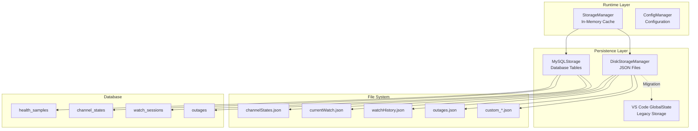

# Health Watch - Storage Implementation Analysis

## Executive Summary

The Health Watch extension implements a multi-tier storage architecture with in-memory caching, file-based persistence, and optional database backend. This analysis identifies implementation quality, reliability risks, and performance characteristics.

## Storage Architecture Overview



## Implementation Analysis

### StorageManager (src/storage.ts)

**Purpose**: Central runtime storage with fast access patterns and backend coordination.

**Strengths**:
- ✅ Singleton pattern ensures single source of truth
- ✅ In-memory cache provides fast read access
- ✅ Bounded collections prevent unbounded memory growth
- ✅ Clear separation between runtime state and persistence

**Critical Issues**:
- ❌ **Async initialization race condition**: Constructor calls `loadState()` without awaiting
- ❌ **Fire-and-forget persistence**: Many write operations ignore failures
- ❌ **No write ordering guarantees**: Concurrent writes may create inconsistent state

**Implementation Details**:
```typescript
// PROBLEM: Async operation in constructor
constructor(context: vscode.ExtensionContext) {
    this.diskStorage = DiskStorageManager.initialize(context);
    this.loadState(); // ❌ Not awaited - race condition
}

// PROBLEM: Fire-and-forget writes
updateChannelState(channelId: string, updates: Partial<ChannelState>): void {
    const state = this.getChannelState(channelId);
    Object.assign(state, updates);
    this.saveState(); // ❌ Async operation not awaited
}
```

**Recommended Fixes**:
```typescript
// ✅ Fixed initialization pattern
static async initialize(context: vscode.ExtensionContext): Promise<StorageManager> {
    const instance = new StorageManager(context);
    await instance.loadState();
    return instance;
}

// ✅ Explicit async handling
async updateChannelState(channelId: string, updates: Partial<ChannelState>): Promise<void> {
    const state = this.getChannelState(channelId);
    Object.assign(state, updates);
    await this.saveState();
}
```

### DiskStorageManager (src/diskStorage.ts)

**Purpose**: JSON file-based persistence for local deployments and development.

**Strengths**:
- ✅ Simple deployment (no external dependencies)
- ✅ Human-readable storage format
- ✅ Atomic writes with error recovery
- ✅ Automatic cleanup of old data

**Limitations**:
- ⚠️ **Synchronous file I/O**: Can block extension thread
- ⚠️ **No transactional consistency**: Updates across multiple files may be partial
- ⚠️ **Limited querying**: No efficient historical sample retrieval
- ⚠️ **Concurrent access**: Multiple VS Code instances could corrupt files

**File Structure Analysis**:
```
<VS Code Global Storage>/
├── channelStates.json      # ~10-100KB (depends on sample history)
├── currentWatch.json       # ~1-50KB (active session data)
├── watchHistory.json       # ~50-500KB (archived sessions)
├── outages.json           # ~10-100KB (outage records)
└── custom_*.json          # Variable size (extension data)
```

**Performance Characteristics**:
- **Read Performance**: O(1) for file access, O(n) for JSON parsing
- **Write Performance**: O(n) for JSON serialization + file I/O
- **Memory Usage**: Full file contents loaded into memory
- **Disk Usage**: Unbounded without cleanup (mitigated by retention policies)

### MySQLStorage (src/storage/MySQLStorage.ts)

**Purpose**: Scalable database backend for production deployments.

**Strengths**:
- ✅ Efficient time-based queries with proper indexing
- ✅ Transactional consistency for complex operations
- ✅ Unbounded historical data retention
- ✅ Batch operations for high-throughput scenarios

**Implementation Quality Issues**:

#### 1. ENUM Constraint Violation Risk
```typescript
// PROBLEM: Arbitrary error text may violate ENUM constraint
await this.connection.execute(`
    INSERT INTO health_samples (reason, ...) VALUES (?, ...)
`, [sample.error, ...]); // ❌ May fail if error is not in ENUM values

// SOLUTION: Implemented validation guard
const allowedReasons = new Set(['timeout', 'dns', 'tcp', 'tls', 'http', 'script']);
const reason = rawReason && allowedReasons.has(rawReason) ? rawReason : null;
const note = (!reason && rawReason) || existingNote || null;
```

#### 2. SSL Configuration Complexity
```typescript
// PROBLEM: SSL option typing mismatch
const sslOption = this.config.ssl ? { rejectUnauthorized: false } : undefined;
// ✅ Fixed to handle boolean vs object SSL configuration
```

#### 3. Missing Connection Pooling
```typescript
// CURRENT: Single connection
private connection: mysql.Connection | null = null;

// RECOMMENDED: Connection pool for production
import { createPool } from 'mysql2/promise';
private pool: mysql.Pool;
```

**Database Schema Quality**:

```sql
-- ✅ Well-designed schema with proper indexing
CREATE TABLE health_samples (
    id BIGINT AUTO_INCREMENT PRIMARY KEY,
    channel_id VARCHAR(255) NOT NULL,
    timestamp BIGINT NOT NULL,
    is_success BOOLEAN NOT NULL,
    -- Efficient time-based queries
    INDEX idx_channel_timestamp (channel_id, timestamp),
    INDEX idx_timestamp (timestamp)
);

-- ⚠️ Missing explicit last_sample_success field
CREATE TABLE channel_states (
    last_sample_timestamp BIGINT NULL,
    -- MISSING: last_sample_success BOOLEAN NULL
);
```

## Data Mapping and Normalization

### Legacy Field Migration

The system handles migration from legacy field names while maintaining backward compatibility:

```typescript
// Legacy → Current field mapping
interface LegacyMapping {
    't' → 'timestamp',      // Sample timestamp
    'ok' → 'success',       // Sample success status
    'startTime' → 'confirmedAt',  // Outage confirmation
    'duration' → 'actualDuration' // Real impact duration
}
```

**Migration Strategy**:
1. **Storage Boundary Normalization**: Legacy shapes converted at adapter layer
2. **Dual Field Support**: Both legacy and current fields maintained in types
3. **Gradual Migration**: New instances use current fields, legacy data preserved

### Database Mapping Patterns

```typescript
// ✅ Consistent DB ↔ Memory mapping
// Sample storage
storeSample(sample: Sample) {
    return [
        sample.timestamp,        // → timestamp BIGINT
        sample.success,          // → is_success BOOLEAN
        sample.latencyMs,        // → latency_ms INT
        validatedReason,         // → reason ENUM (validated)
        sample.details?.note     // → note TEXT
    ];
}

// Sample retrieval
getSamples(): Sample[] {
    return rows.map(row => ({
        timestamp: row.timestamp,
        success: !!row.is_success,    // Boolean conversion
        latencyMs: row.latency_ms,
        error: row.reason,
        details: { note: row.note }
    }));
}
```

## Performance Analysis

### Read Performance

| Operation | In-Memory | Disk | Database |
|-----------|-----------|------|----------|
| Get Channel State | O(1) | O(file size) | O(log n) |
| Recent Samples (50) | O(n) filter | O(file size) | O(log n + 50) |
| Sample Window Query | O(n) filter | Not supported | O(log n + results) |
| Outage History | O(n) filter | O(file size) | O(log n + results) |

### Write Performance

| Operation | In-Memory | Disk | Database |
|-----------|-----------|------|----------|
| Add Sample | O(1) | O(file size) | O(log n) |
| Update State | O(1) | O(file size) | O(1) |
| Record Outage | O(1) | O(file size) | O(log n) |
| Archive Watch | O(1) | O(file size) | O(1) |

### Memory Usage Patterns

```typescript
// Bounded collections prevent memory leaks
class StorageManager {
    // ✅ Sample history bounded per channel
    private static readonly MAX_SAMPLES = 1000;
    
    // ✅ Watch history bounded globally
    private static readonly MAX_WATCH_HISTORY = 50;
    
    // ✅ Outage history bounded globally
    private static readonly MAX_OUTAGES = 500;
}
```

**Estimated Memory Usage**:
- **Minimal Setup** (5 channels): ~1-2 MB
- **Medium Setup** (50 channels): ~10-20 MB  
- **Large Setup** (200 channels): ~40-80 MB

## Reliability and Consistency

### Current Reliability Issues

#### 1. Unhandled Promise Rejections
```typescript
// PROBLEM: Fire-and-forget async operations
addOutage(outage: Outage): void {
    this.outages.push(outage);
    this.diskStorage.addOutage(outage); // ❌ Promise not handled
}

// SOLUTION: Implemented catch handlers
addOutage(outage: Outage): void {
    this.outages.push(outage);
    void this.diskStorage.addOutage(outage).catch(() => {}); // ✅ Handled
}
```

#### 2. State Initialization Race Conditions
```typescript
// PROBLEM: Constructor doesn't wait for async load
constructor(context: vscode.ExtensionContext) {
    this.loadState(); // ❌ Async operation in constructor
}

// SOLUTION: Explicit readiness tracking
private readyPromise: Promise<void>;
constructor(context: vscode.ExtensionContext) {
    this.readyPromise = this.loadState(); // ✅ Track loading
}
whenReady(): Promise<void> {
    return this.readyPromise; // ✅ Callers can await
}
```

#### 3. Partial Write Failures
- **Disk Storage**: If one JSON file write fails, others may succeed
- **Database**: Transactions not used for multi-table operations
- **Recovery**: No automatic rollback or repair mechanisms

### Consistency Guarantees

| Storage Type | Consistency Level | Failure Modes |
|--------------|------------------|---------------|
| In-Memory | Always consistent | Lost on crash/restart |
| Disk Files | Eventually consistent | Partial writes, file corruption |
| Database | ACID transactions | Connection failures, constraint violations |

## Monitoring and Observability

### Current Logging
```typescript
// Basic error logging present
catch (error) {
    console.error('Failed to save storage state:', error);
}

// Limited success/performance logging
console.log('Migration from global state completed successfully');
```

### Recommended Improvements
1. **Structured Logging**: Use consistent log levels and formats
2. **Performance Metrics**: Track operation latencies and failure rates
3. **Health Checks**: Periodic validation of storage consistency
4. **Error Aggregation**: Collect and analyze storage error patterns

## Security Considerations

### Current Security Posture
- ✅ **File Permissions**: Uses VS Code global storage with appropriate permissions
- ✅ **Input Validation**: Basic sanitization of ENUM values
- ⚠️ **Database Security**: SSL configuration present but needs validation
- ⚠️ **Credential Storage**: Database passwords in configuration (plaintext)

### Recommended Enhancements
1. **Credential Management**: Use VS Code SecretStorage for database passwords
2. **SSL Validation**: Proper certificate validation for database connections
3. **Input Sanitization**: Comprehensive validation for all persisted data
4. **Audit Logging**: Track data access and modification patterns

## Recommendations

### High Priority (Reliability)
1. **Fix async initialization**: Make StorageManager.initialize() properly async
2. **Handle persistence failures**: Implement retry logic and error propagation
3. **Add write ordering**: Ensure critical operations complete before dependent operations

### Medium Priority (Performance)
1. **Implement connection pooling**: For MySQL storage in production environments
2. **Add sample compression**: For disk storage to reduce file sizes
3. **Optimize memory usage**: Implement sample streaming for large datasets

### Low Priority (Features)
1. **Add storage migration tools**: For moving between storage backends
2. **Implement backup/restore**: For disaster recovery scenarios
3. **Add monitoring dashboard**: For storage health and performance metrics

---

*Generated on: August 19, 2025*  
*Analysis Scope: Complete storage implementation review*  
*Risk Assessment: Medium-High (reliability issues present)*
