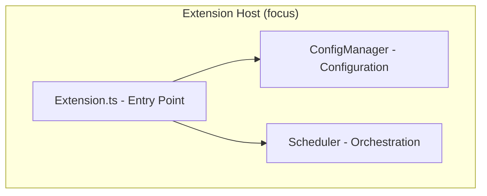
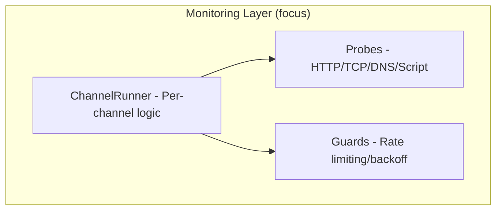
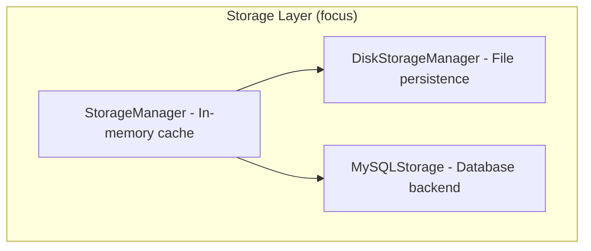
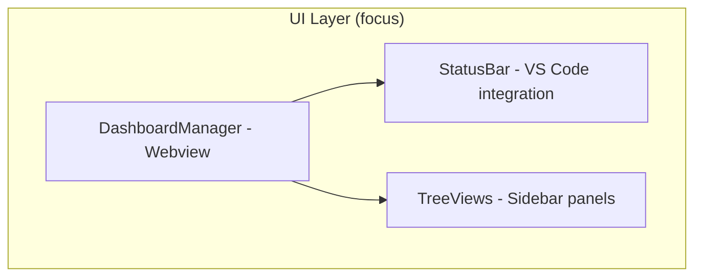
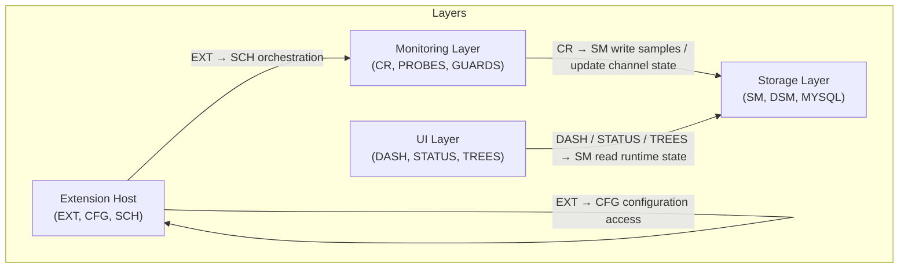

# Health Watch - System Architecture Overview

## Executive Summary

Health Watch is a TypeScript VS Code extension that provides real-time monitoring of web services, APIs, and network endpoints. The system follows a layered architecture with probe-based monitoring, centralized storage, and web-based dashboards.

## Core Architecture

### Simplified diagrams (follow-ups, each focuses on one layer)

### Interconnections (labels show how the focused diagrams link back to the big diagram)

Notes:
- The first (large) diagram is unchanged and remains authoritative.
- The four focused diagrams isolate internals of each layer without removing any components.
- The Interconnections diagram labels the cross-layer edges present in the large diagram, indicating where the simplified diagrams connect back to each other.

## Key Components

### 1. Extension Entry Point (`src/extension.ts`)
- **Purpose**: VS Code extension lifecycle management  
- **Responsibilities**: Initialize core managers, register commands, setup UI components
- **Key Dependencies**: ConfigManager, StorageManager, Scheduler
- **Recent Enhancement (v1.0.5)**: Implemented async initialization pattern for improved startup reliability and proper dependency ordering

### 2. Configuration Management (`src/config.ts`)
- **Purpose**: Centralized configuration handling
- **Responsibilities**: Load workspace config, manage VS Code settings, provide typed access
- **Data Sources**: `.healthwatch.json`, VS Code workspace settings

### 3. Monitoring Orchestration (`src/runner/scheduler.ts`)
- **Purpose**: Coordinate monitoring across all channels
- **Responsibilities**: Start/stop monitoring, manage channel runners, handle global state
- **Key Features**: Respect quiet hours, handle configuration changes

### 4. Channel Execution (`src/runner/channelRunner.ts`)
- **Purpose**: Per-channel monitoring logic
- **Responsibilities**: Execute probes, track state changes, apply backoff/guards
- **State Management**: Consecutive failures, backoff multipliers, first failure tracking

### 5. Probe Implementations (`src/probes/`)
- **Purpose**: Execute actual health checks
- **Types**: HTTPS, TCP, DNS, Script-based probes
- **Interface**: Standardized ProbeResult with success/latency/error details

## Data Flow Architecture

### Primary Data Flow
1. **Configuration Loading**: ConfigManager reads channel definitions
2. **Probe Execution**: ChannelRunner executes probes via probe implementations
3. **Result Processing**: Convert ProbeResult to Sample with timestamp normalization
4. **State Updates**: Update ChannelState with new samples, failure tracking
5. **Persistence**: StorageManager writes to disk/database backends
6. **UI Updates**: Dashboard and status components read from StorageManager

### Storage Architecture
- **In-Memory Cache**: StorageManager maintains canonical runtime state
- **File Persistence**: DiskStorageManager handles JSON-based storage
- **Database Backend**: MySQLStorage provides scalable structured storage
- **Data Normalization**: Legacy field mapping at storage boundaries

## Key Design Patterns

### 1. Singleton Pattern
- ConfigManager, StorageManager use singleton for global access
- Ensures single source of truth for configuration and state

### 2. Strategy Pattern
- Multiple probe implementations with common interface
- Pluggable storage backends (Disk vs MySQL)

### 3. Observer Pattern
- UI components observe storage state changes
- Event-driven updates for real-time monitoring

### 4. Command Pattern
- VS Code command registration with centralized handling
- Consistent error handling and user feedback

## Quality Attributes

### Reliability
- **Strengths**: Graceful error handling, backoff strategies, persistent state
- **Risks**: Fire-and-forget async operations, race conditions in initialization

### Performance
- **Strengths**: In-memory caching, efficient probe scheduling, lazy loading
- **Optimizations**: Sample window queries, bounded storage, cleanup routines

### Maintainability
- **Strengths**: Clear separation of concerns, typed interfaces, modular design
- **Areas for Improvement**: Async/await consistency, error propagation

### Extensibility
- **Strengths**: Plugin-based probe system, configurable storage backends
- **Extension Points**: New probe types, custom storage adapters, UI components

## Technology Stack

| Layer | Technologies |
|-------|-------------|
| Runtime | Node.js, TypeScript, VS Code Extension API |
| Storage | JSON files, MySQL (optional), VS Code GlobalState |
| UI | Webview API, React components,  |
| Monitoring | HTTP clients, DNS resolution, TCP sockets |
| Build | esbuild, TypeScript compiler, ESLint |

## Next Steps

1. **Reliability Improvements**: Address async initialization and error handling
2. **Performance Optimization**: Implement sample compression and efficient querying
3. **Feature Extensions**: Add new probe types, enhance dashboard capabilities
4. **Testing**: Comprehensive unit and integration test coverage

---

*Generated on: August 19, 2025*  
*Version: 1.0.4*  
*Last Updated: Architecture analysis based on current codebase*
