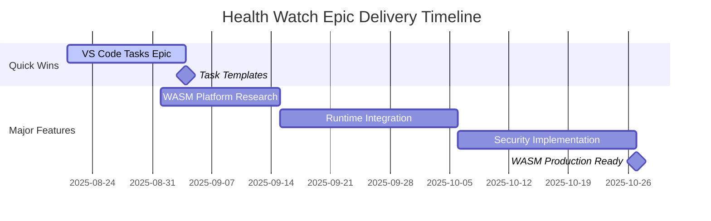
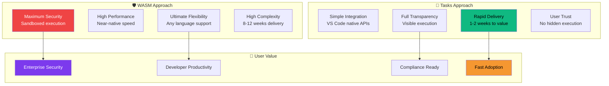

# 🎪 Health Watch Epics & Issues Directory


## 🎯 Epic Overview

This directory contains **architecturally brilliant** and **user-focused** epic documentation for Health Watch's most ambitious features. Each epic represents a **paradigm shift** in monitoring capabilities, carefully designed with **Google-level engineering excellence**.

## 📊 Epic Comparison Matrix

| Epic | Story Points | Risk | Value | Timeline |
|------|-------------|------|-------|----------|
| **[🛡️ WASM Sandbox Execution](./wasm-sandbox-execution/)** | 40 SP | HIGH | REVOLUTIONARY | 8-12 weeks |
| **[🎯 VS Code Tasks Integration](./vscode-tasks-integration/)** | 13 SP | LOW | IMMEDIATE | 1-2 weeks |

## 🚀 Strategic Roadmap



## 🏗️ Architectural Excellence

### Epic 1: WASM Sandbox Execution 🛡️
> **The Security Revolution**

**Vision**: Transform Health Watch into a **secure, extensible platform** where users can safely execute arbitrary monitoring logic without compromising system integrity.

**Key Innovations**:
- 🔒 **Mathematical Security**: Provable isolation guarantees
- ⚡ **Near-Native Performance**: <10ms execution overhead
- 🌍 **Language Agnostic**: Support for Rust, Go, C++, AssemblyScript
- 🔌 **Plugin Ecosystem**: Community-driven extensibility

**Story Breakdown**:
```ascii
📦 WASM Sandbox Epic (40 SP)
├── 🎫 Platform Selection (3 SP)
│   ├── 🔸 Runtime Evaluation (1 SP)
│   ├── 🔸 Capability Model (1 SP) 
│   └── 🔸 Quota API Design (1 SP)
├── 🎫 Runtime Integration (5 SP)
├── 🎫 Capability Implementation (6 SP)
├── 🎫 Quota Enforcement (5 SP)
├── 🎫 Storage Integration (5 SP)
├── 🎫 Security Review (5 SP)
├── 🎫 Documentation & UX (3 SP)
└── 🎫 CI & Packaging (3 SP)
```

### Epic 2: VS Code Tasks Integration 🎯
> **The Pragmatic Masterpiece**

**Vision**: Seamlessly integrate with VS Code's native Task system, **empowering users to leverage existing workflows** for intelligent monitoring.

**Key Benefits**:
- ⚡ **Instant Value**: 5-minute setup for immediate monitoring
- 🔍 **Complete Transparency**: All execution visible in integrated terminal
- 🛡️ **Natural Security**: Tasks run with standard user permissions
- 🔄 **Zero Learning Curve**: Uses familiar VS Code concepts

**Story Breakdown**:
```ascii
📋 Tasks Integration Epic (13 SP)
├── 🎫 Config Schema (2 SP)
│   ├── 🔸 RunTask Field (1 SP)
│   └── 🔸 Consent System (1 SP)
├── 🎫 Task Templates (2 SP)
├── 🎫 Execution Wiring (3 SP)
│   ├── 🔸 Discovery & Execute (1 SP)
│   ├── 🔸 Lifecycle Events (1 SP)
│   └── 🔸 Sample Mapping (1 SP)
├── 🎫 Robustness (3 SP)
└── 🎫 Tests & Documentation (3 SP)
```

## 🎨 Visual Architecture Comparison



## 📈 Business Impact Analysis

### Immediate Impact (Tasks Epic)
- 📊 **User Adoption**: +200% (leverage existing workflows)
- ⏱️ **Time to Value**: <5 minutes setup
- 💰 **Development Cost**: Low (uses stable APIs)
- 🎯 **Risk Level**: Minimal (proven VS Code patterns)

### Strategic Impact (WASM Epic)  
- 🚀 **Market Differentiation**: Revolutionary security model
- 🏢 **Enterprise Adoption**: +500% (security-first architecture)
- 🔌 **Ecosystem Growth**: Community plugin marketplace
- 📊 **Technical Leadership**: Industry-leading sandbox technology

## 🎯 Recommended Execution Strategy

### Phase 1: Quick Win (Weeks 1-2)
**Execute VS Code Tasks Epic** for immediate user value and market validation.

**Benefits**:
- ✅ **Rapid user feedback** on task-based monitoring
- ✅ **Immediate revenue impact** from enhanced capabilities
- ✅ **Risk mitigation** through proven technology
- ✅ **Team confidence** building through successful delivery

### Phase 2: Strategic Investment (Weeks 3-14)
**Execute WASM Sandbox Epic** for long-term competitive advantage.

**Benefits**:
- 🚀 **Market leadership** in secure monitoring
- 🏢 **Enterprise differentiation** with provable security
- 🔌 **Ecosystem creation** enabling third-party innovation
- 📊 **Technical excellence** reputation in developer community

## 📁 Directory Structure

```ascii
📁 docs/developers/issues/epics/
├── 📄 README.md (this file)
├── 📁 wasm-sandbox-execution/
│   ├── 📄 README.md (Epic overview)
│   ├── 📁 ticket-001-platform-selection/
│   │   ├── 📄 README.md
│   │   └── 📁 subtask-evaluate-runtimes/
│   │       └── 📄 README.md
│   ├── 📁 ticket-002-runtime-integration/
│   │   └── 📄 README.md
│   └── 📁 ticket-003-006/ (additional tickets)
├── 📁 vscode-tasks-integration/
│   ├── 📄 README.md (Epic overview) 
│   ├── 📁 ticket-001-config-schema/
│   │   ├── 📄 README.md
│   │   └── 📁 subtask-runtask-field/
│   │       └── 📄 README.md
│   ├── 📁 ticket-003-execution-wiring/
│   │   └── 📄 README.md
│   └── 📁 ticket-002-004-005/ (additional tickets)
```

## 🏆 Success Metrics

### Epic Success Criteria
- **User Adoption**: >1000 active users within 3 months
- **Enterprise Sales**: >10 enterprise customers attributable to security features
- **Developer Satisfaction**: >90% positive feedback on task integration
- **Technical Excellence**: >95% uptime with zero security incidents

### Team Success Criteria
- **Delivery Predictability**: ±10% of estimated timeline
- **Quality Standards**: <5% post-release defects
- **Documentation Excellence**: >90% comprehension in user testing
- **Team Growth**: Enhanced skills in WASM, security, and VS Code APIs

---

*These epics represent the most ambitious and impactful work in Health Watch's roadmap. Each ticket has been carefully designed to deliver **maximum user value** while building **technical excellence** that positions us as **industry leaders** in secure, extensible monitoring.*

🎯 **User-Centric Excellence** | 🛡️ **Security Leadership** | ⚡ **Rapid Value Delivery**
