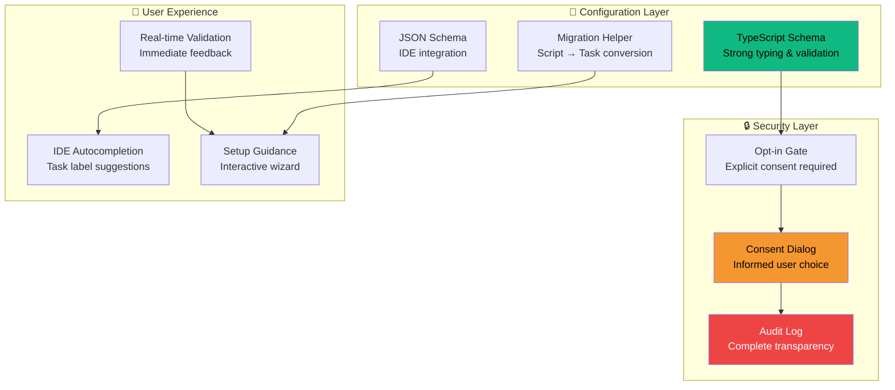
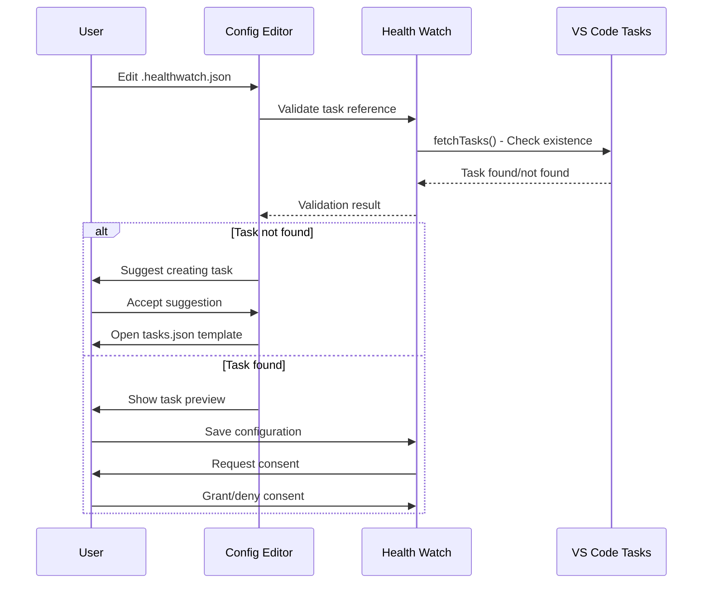

# 🎫 Ticket 001: Config Schema & Opt-in System


## 📋 Ticket Summary

**Design and implement the configuration schema for task-based channels and create a user-friendly opt-in consent system that balances security with usability.**

## 🎯 Business Value

> **User Empowerment**: Enable users to leverage their existing VS Code tasks for monitoring while maintaining explicit control and transparency over what gets executed.

### 💰 Value Proposition
- **Zero Learning Curve**: Users reference existing tasks they already understand
- **Explicit Consent**: Clear security model with granular permissions
- **Workflow Integration**: Natural extension of existing development processes
- **Audit Trail**: Full transparency in what tasks run when and why

## 🔍 Acceptance Criteria

### ✅ Configuration Schema
- [ ] **`runTask` field** added to channel configuration with TypeScript types
- [ ] **Schema validation** implemented with clear error messages
- [ ] **JSON Schema** exported for IDE autocompletion
- [ ] **Backward compatibility** maintained with existing configs
- [ ] **Migration guide** created for converting script-based channels

### ✅ Consent & Security System
- [ ] **Per-channel opt-in** required before task execution
- [ ] **Informed consent dialog** showing task details and permissions
- [ ] **Persistent consent** storage with revocation capability
- [ ] **Security warnings** for tasks with broad permissions
- [ ] **Audit logging** for all task executions and consent changes

## 🏗️ Technical Architecture



## 📊 Configuration Schema Design

### Channel Configuration Enhancement
```typescript
interface ChannelConfig {
  id: string;
  name: string;
  type: 'https' | 'tcp' | 'dns' | 'script' | 'task'; // New 'task' type
  
  // Existing fields...
  interval?: number;
  timeout?: number;
  
  // New task configuration
  runTask?: {
    enabled: boolean;           // Explicit enablement required
    label: string;             // Task label to execute
    consent: 'explicit' | 'auto'; // Consent mode
    maxDuration?: number;      // Optional timeout override
    retryPolicy?: {
      maxAttempts: number;
      backoffMs: number;
    };
  };
}
```

### Consent Management Schema
```typescript
interface TaskConsent {
  channelId: string;
  taskLabel: string;
  grantedAt: number;
  grantedBy: string;        // User identifier
  permissions: {
    networkAccess: boolean;
    filesystemAccess: boolean;
    shellExecution: boolean;
  };
  revokedAt?: number;
  auditTrail: ConsentEvent[];
}

interface ConsentEvent {
  timestamp: number;
  action: 'granted' | 'revoked' | 'executed' | 'failed';
  details: string;
  userAgent?: string;
}
```

## 🎨 User Experience Flow

### Configuration Wizard


### Consent Dialog Design
```typescript
interface ConsentDialogData {
  channelName: string;
  taskLabel: string;
  taskCommand: string;
  estimatedPermissions: {
    network: boolean;
    filesystem: boolean;
    shell: boolean;
  };
  securityLevel: 'low' | 'medium' | 'high';
  recommendedAction: 'approve' | 'review' | 'deny';
}
```

## 📁 Subtask Structure

### 🔸 [Subtask: RunTask Field Implementation](./subtask-runtask-field/)
**1 SP** - Implement TypeScript schema and validation for runTask configuration

### 🔸 [Subtask: Consent Prompt System](./subtask-consent-prompt/)
**1 SP** - Create user-friendly consent dialog and permission management

## 🎯 Definition of Done

### ✅ Schema Implementation
- [ ] **TypeScript interfaces** defined and exported
- [ ] **JSON Schema** generated for IDE support
- [ ] **Runtime validation** implemented with Zod or similar
- [ ] **Error messages** are clear and actionable
- [ ] **Unit tests** cover all validation scenarios

### ✅ Consent System
- [ ] **Consent dialog** implemented with clear permission explanations
- [ ] **Persistent storage** for consent decisions
- [ ] **Revocation mechanism** accessible from settings
- [ ] **Audit trail** captures all consent and execution events
- [ ] **Security warnings** for high-risk task patterns

### ✅ Documentation & UX
- [ ] **Configuration guide** with examples and best practices
- [ ] **Migration documentation** from script-based channels
- [ ] **Security guidelines** for safe task creation
- [ ] **Troubleshooting guide** for common configuration issues

## 🚀 Success Metrics

| Metric | Target | Measurement |
|--------|--------|-------------|
| **Configuration Clarity** | >95% valid configs | Schema validation stats |
| **Consent Understanding** | >90% informed choices | User research |
| **Setup Time** | <5 minutes | Time-to-first-execution |
| **Error Recovery** | <2 minutes | Configuration fix time |

## 🔒 Security Considerations

### Risk Assessment
- **Task Execution Scope**: Tasks run with full user permissions
- **Configuration Tampering**: Malicious task references in shared configs  
- **Consent Bypass**: Automated consent without user understanding
- **Audit Evasion**: Task modifications after consent granted

### Mitigation Strategies
- **Explicit consent** required for each channel-task pairing
- **Task fingerprinting** to detect changes after consent
- **Regular consent revalidation** for high-risk tasks
- **Clear security messaging** in all user interfaces

---

*This ticket establishes the foundational trust and usability framework that makes task-based monitoring both powerful and safe. Every UX decision here impacts user adoption and security posture.*

🎯 **User-Centric Design** | 🔒 **Security by Design** | ⚡ **Immediate Value**
