# 🔸 Subtask: Consent Prompt System


## 🎯 Subtask Objective

**Design and implement a user-friendly consent system that clearly communicates what task execution means, respects user autonomy, and maintains a comprehensive audit trail for security and compliance.**

## 🛡️ Security & Trust Framework

### Consent Philosophy
> **Informed Consent**: Users must understand exactly what will execute, with what permissions, and retain full control over their decisions.

**Core Principles**:
- 🔍 **Transparency**: Show exactly what task will run
- 🎯 **Granularity**: Per-channel, per-task consent decisions  
- 🔄 **Revocability**: Easy to change mind and revoke consent
- 📝 **Auditability**: Complete trail of who consented to what, when

## 🎨 Consent Dialog Design

### Primary Consent Dialog
```typescript
interface ConsentDialogProps {
  channelName: string;
  taskLabel: string;
  taskDefinition: {
    command: string;
    args?: string[];
    cwd?: string;
    env?: Record<string, string>;
  };
  estimatedRisk: 'low' | 'medium' | 'high';
  permissions: {
    networkAccess: boolean;
    filesystemWrite: boolean;
    shellExecution: boolean;
    environmentAccess: boolean;
  };
}
```

### Dialog Content Structure


## 🔧 Implementation Architecture

### Consent Dialog Component
```typescript
class TaskConsentDialog {
  constructor(
    private storageManager: StorageManager,
    private taskAnalyzer: TaskSecurityAnalyzer
  ) {}
  
  async requestConsent(
    channel: ChannelConfig,
    task: vscode.Task
  ): Promise<ConsentResult> {
    // Check if consent already granted and still valid
    const existingConsent = await this.getExistingConsent(
      channel.id, 
      task.name
    );
    
    if (existingConsent && this.isConsentValid(existingConsent, task)) {
      return { granted: true, consent: existingConsent };
    }
    
    // Analyze task for security implications
    const analysis = await this.taskAnalyzer.analyzeTask(task);
    
    // Show consent dialog
    return this.showConsentDialog(channel, task, analysis);
  }
  
  private async showConsentDialog(
    channel: ChannelConfig,
    task: vscode.Task,
    analysis: TaskSecurityAnalysis
  ): Promise<ConsentResult> {
    const dialogData = this.buildDialogData(channel, task, analysis);
    
    const choice = await vscode.window.showInformationMessage(
      this.formatConsentMessage(dialogData),
      {
        modal: true,
        detail: this.formatDetailedInfo(dialogData)
      },
      'Allow Task Execution',
      'Show Details',
      'Deny'
    );
    
    return this.processConsentChoice(choice, channel, task, analysis);
  }
}
```

### Security Analysis Engine
```typescript
interface TaskSecurityAnalysis {
  riskLevel: 'low' | 'medium' | 'high';
  permissions: {
    networkAccess: boolean;
    filesystemWrite: boolean;
    shellExecution: boolean;
    environmentAccess: boolean;
    privilegedCommands: string[];
  };
  concerns: SecurityConcern[];
  recommendations: string[];
}

class TaskSecurityAnalyzer {
  async analyzeTask(task: vscode.Task): Promise<TaskSecurityAnalysis> {
    const command = this.extractCommand(task);
    const args = this.extractArguments(task);
    const env = this.extractEnvironment(task);
    
    return {
      riskLevel: this.assessRiskLevel(command, args),
      permissions: this.analyzePermissions(command, args),
      concerns: this.identifySecurityConcerns(command, args, env),
      recommendations: this.generateRecommendations(command, args)
    };
  }
  
  private assessRiskLevel(command: string, args: string[]): 'low' | 'medium' | 'high' {
    // High-risk patterns
    const highRiskPatterns = [
      /rm\s+-rf/,           // Dangerous deletions
      /curl.*\|\s*sh/,      // Pipe to shell
      /wget.*\|\s*bash/,    // Download and execute
      /sudo/,               // Privileged execution
      /chmod.*\+x/,         // Make executable
    ];
    
    const fullCommand = `${command} ${args.join(' ')}`;
    
    if (highRiskPatterns.some(pattern => pattern.test(fullCommand))) {
      return 'high';
    }
    
    // Medium-risk patterns
    const mediumRiskPatterns = [
      /curl/,               // Network requests
      /wget/,               // Downloads
      /git.*clone/,         // Repository cloning
      /npm.*install/,       // Package installation
    ];
    
    if (mediumRiskPatterns.some(pattern => pattern.test(fullCommand))) {
      return 'medium';
    }
    
    return 'low';
  }
}
```

### Consent Storage & Audit
```typescript
interface ConsentRecord {
  id: string;
  channelId: string;
  taskLabel: string;
  taskFingerprint: string;        // Hash of command for change detection
  grantedAt: number;
  grantedBy: string;              // User identifier
  expiresAt?: number;             // Optional expiration
  permissions: TaskPermissions;
  riskAssessment: TaskSecurityAnalysis;
  auditTrail: ConsentAuditEvent[];
}

interface ConsentAuditEvent {
  timestamp: number;
  action: 'granted' | 'revoked' | 'executed' | 'failed' | 'expired';
  details: string;
  executionResult?: {
    exitCode: number;
    duration: number;
    success: boolean;
  };
}

class ConsentStorageManager {
  private consents = new Map<string, ConsentRecord>();
  
  async storeConsent(
    channel: ChannelConfig,
    task: vscode.Task,
    analysis: TaskSecurityAnalysis,
    userChoice: 'granted' | 'denied'
  ): Promise<ConsentRecord | null> {
    if (userChoice === 'denied') {
      await this.auditConsentDenial(channel, task, analysis);
      return null;
    }
    
    const consentId = this.generateConsentId(channel.id, task.name);
    const consent: ConsentRecord = {
      id: consentId,
      channelId: channel.id,
      taskLabel: task.name,
      taskFingerprint: this.calculateTaskFingerprint(task),
      grantedAt: Date.now(),
      grantedBy: await this.getCurrentUser(),
      permissions: analysis.permissions,
      riskAssessment: analysis,
      auditTrail: [{
        timestamp: Date.now(),
        action: 'granted',
        details: `User granted consent for task execution`
      }]
    };
    
    this.consents.set(consentId, consent);
    await this.persistConsent(consent);
    
    return consent;
  }
  
  async auditTaskExecution(
    consentId: string,
    result: TaskExecutionResult
  ): Promise<void> {
    const consent = this.consents.get(consentId);
    if (!consent) return;
    
    consent.auditTrail.push({
      timestamp: Date.now(),
      action: result.success ? 'executed' : 'failed',
      details: `Task executed with exit code ${result.exitCode}`,
      executionResult: {
        exitCode: result.exitCode,
        duration: result.duration,
        success: result.success
      }
    });
    
    await this.persistConsent(consent);
  }
}
```

## 🎨 User Experience Flows

### First-Time Consent Flow


### Consent Management Flow

```mermaid
sequenceDiagram
    participant User
    participant Settings as Settings UI
    participant Storage as Consent Storage
    
    User->>Settings: Open Health Watch settings
    Settings->>Storage: Load all consent records
    Storage-->>Settings: Active consents list
    
    Settings->>User: Show consent management panel<br/>✅ Active consents<br/>❌ Denied consents<br/>📊 Execution history
    
    alt User revokes consent
        User->>Settings: Click "Revoke" on consent
        Settings->>Storage: Revoke consent record
        Storage-->>Settings: Consent revoked
        Settings->>User: Channel monitoring disabled
    else User views audit trail
        User->>Settings: Click "View History" 
        Settings->>Storage: Load execution history
        Storage-->>Settings: Audit trail data
        Settings->>User: Timeline of executions,<br/>results, and security events
    end
```


## ✅ Implementation Checklist

### Core Consent System
- [ ] **ConsentDialog component** with clear permission explanation
- [ ] **TaskSecurityAnalyzer** for risk assessment and permission detection
- [ ] **ConsentStorageManager** for persistent consent records
- [ ] **Audit trail system** capturing all consent and execution events
- [ ] **Consent validation** checking task fingerprints for changes

### User Interface
- [ ] **Modal consent dialog** with clear, non-technical language
- [ ] **Detailed view** showing full command analysis and examples
- [ ] **Settings panel** for consent management and revocation
- [ ] **Risk indicators** with color-coded security levels
- [ ] **Execution history** showing past results and patterns

### Security Features
- [ ] **Task fingerprinting** to detect command changes after consent
- [ ] **Permission analysis** identifying potential security impacts
- [ ] **Risk assessment** with graduated warning levels
- [ ] **Automatic expiration** for high-risk consents (optional)
- [ ] **User identity tracking** for multi-user environments

## 🧪 Test Coverage

### Unit Tests
```typescript
describe('TaskSecurityAnalyzer', () => {
  it('identifies high-risk commands correctly', () => {
    const task = createMockTask({
      command: 'curl https://example.com/script.sh | bash'
    });
    
    const analysis = analyzer.analyzeTask(task);
    
    expect(analysis.riskLevel).toBe('high');
    expect(analysis.concerns).toContain('PIPE_TO_SHELL');
  });
  
  it('detects permission requirements', () => {
    const task = createMockTask({
      command: 'curl',
      args: ['-X', 'POST', 'https://api.example.com']
    });
    
    const analysis = analyzer.analyzeTask(task);
    
    expect(analysis.permissions.networkAccess).toBe(true);
    expect(analysis.permissions.filesystemWrite).toBe(false);
  });
});

describe('ConsentDialog', () => {
  it('shows appropriate risk warnings', async () => {
    const mockAnalysis = {
      riskLevel: 'high' as const,
      concerns: ['PIPE_TO_SHELL', 'REMOTE_EXECUTION']
    };
    
    const dialog = await createConsentDialog(mockChannel, mockTask, mockAnalysis);
    
    expect(dialog.content).toContain('⚠️ HIGH RISK');
    expect(dialog.content).toContain('This command downloads and executes');
  });
});
```

### Integration Tests
```typescript
describe('Consent Flow Integration', () => {
  it('grants consent and allows task execution', async () => {
    const channel = createTestChannel({ 
      runTask: { enabled: true, label: 'test-task', consent: 'explicit' }
    });
    
    // Mock user granting consent
    mockUserChoice('Allow Task Execution');
    
    const result = await taskExecutor.executeChannelTask(channel);
    
    expect(result.success).toBe(true);
    expect(consentStorage.hasConsent(channel.id, 'test-task')).toBe(true);
  });
  
  it('denies consent and prevents execution', async () => {
    const channel = createTestChannel({
      runTask: { enabled: true, label: 'dangerous-task', consent: 'explicit' }
    });
    
    // Mock user denying consent
    mockUserChoice('Deny');
    
    const result = await taskExecutor.executeChannelTask(channel);
    
    expect(result.success).toBe(false);
    expect(result.error).toContain('User denied consent');
  });
});
```

## 📊 Success Metrics

| Metric | Target | Measurement |
|--------|--------|-------------|
| **Consent Comprehension** | >90% | User testing surveys |
| **Security Awareness** | >85% | Post-consent questionnaire |
| **Consent Abandonment** | <20% | Dialog analytics |
| **Revocation Usage** | <5% | Settings panel metrics |

## 🚀 User Research Validation

### Consent Message Testing
Test with 20+ users to validate:
- **Message clarity**: Do users understand what they're consenting to?
- **Risk communication**: Are security implications clear?
- **Decision confidence**: Do users feel informed enough to decide?
- **Action understanding**: Is it clear what happens after consent?

### Example Consent Messages

#### Low-Risk Task
```
✅ Allow Health Watch to run "npm test"?

This task will:
• Run your project's test suite
• Read package.json and test files
• Output results to terminal

Risk Level: LOW - Standard development task
Permissions: Read-only file access

[Allow Task Execution] [Show Details] [Deny]
```

#### High-Risk Task  
```
⚠️ SECURITY WARNING: High-risk task detected

Task "download-and-install" wants to:
• Download files from the internet (curl)
• Execute downloaded scripts (pipe to bash)  
• Modify system files (may require sudo)

Risk Level: HIGH - Could install malware or damage system
Permissions: Network access, file system write, shell execution

This task could potentially harm your system or compromise security.
Only allow if you trust the source and understand the risks.

[I Understand the Risks, Allow] [Show Full Analysis] [Deny]
```

---

*This subtask creates the trust foundation that makes task-based monitoring both powerful and safe. Every UX decision here directly impacts user adoption and security posture.*

🛡️ **Security Through Transparency** | 👥 **User-Centric Design** | 📝 **Complete Auditability**
