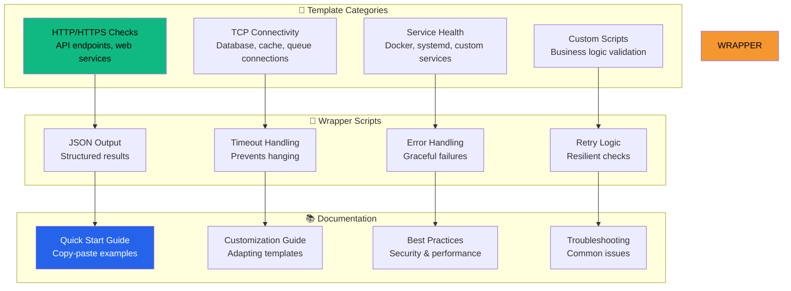

# 🎫 Ticket 002: Task Templates & Repository Samples


## 📋 Ticket Summary

**Create comprehensive task templates, wrapper scripts, and documentation that enable users to quickly set up reliable, structured monitoring tasks with minimal effort and maximum safety.**

## 🎯 Business Value

> **Instant Productivity**: Transform the complex task of creating monitoring tasks into a simple, copy-paste experience that delivers professional results immediately.

### 💰 Value Proposition
- ⚡ **Zero Setup Friction**: Users can monitor services in under 2 minutes
- 🛡️ **Built-in Best Practices**: Templates include timeouts, error handling, and structured output
- 🎓 **Educational Value**: Users learn proper task patterns through examples
- 🔄 **Consistency**: Standardized patterns across teams and projects

## 🏗️ Template Architecture



## 📦 Template Collection

### HTTP/HTTPS Health Check Templates

#### Basic HTTP Check
```json
{
  "version": "2.0.0",
  "tasks": [
    {
      "label": "healthwatch:check-api",
      "type": "shell",
      "command": "${workspaceFolder}/scripts/check-http.sh",
      "args": [
        "--url", "${config:healthwatch.apiUrl}",
        "--timeout", "30",
        "--expected-status", "200",
        "--output-json"
      ],
      "group": "test",
      "presentation": {
        "echo": false,
        "reveal": "silent",
        "focus": false,
        "panel": "shared",
        "showReuseMessage": false,
        "clear": true
      },
      "problemMatcher": []
    }
  ]
}
```

#### Advanced HTTP Check with Headers
```json
{
  "label": "healthwatch:check-api-auth",
  "type": "shell", 
  "command": "${workspaceFolder}/scripts/check-http.sh",
  "args": [
    "--url", "${config:healthwatch.apiUrl}/health",
    "--method", "GET",
    "--header", "Authorization: Bearer ${config:healthwatch.apiToken}",
    "--header", "Content-Type: application/json",
    "--timeout", "30",
    "--expected-status", "200",
    "--follow-redirects",
    "--verify-ssl",
    "--output-json"
  ],
  "options": {
    "env": {
      "HEALTH_CHECK_USER_AGENT": "HealthWatch/2.0 Monitoring"
    }
  }
}
```

### Database Connection Templates

#### PostgreSQL Connection Check
```json
{
  "label": "healthwatch:check-postgres",
  "type": "shell",
  "command": "${workspaceFolder}/scripts/check-database.sh",
  "args": [
    "--type", "postgres",
    "--host", "${config:healthwatch.db.host}",
    "--port", "${config:healthwatch.db.port}",
    "--database", "${config:healthwatch.db.name}",
    "--timeout", "10",
    "--output-json"
  ],
  "options": {
    "env": {
      "PGUSER": "${config:healthwatch.db.user}",
      "PGPASSWORD": "${config:healthwatch.db.password}"
    }
  }
}
```

#### Redis Connection Check
```json
{
  "label": "healthwatch:check-redis",
  "type": "shell",
  "command": "${workspaceFolder}/scripts/check-redis.sh",
  "args": [
    "--host", "${config:healthwatch.redis.host}",
    "--port", "${config:healthwatch.redis.port}",
    "--timeout", "5",
    "--test-key", "healthwatch:ping",
    "--output-json"
  ]
}
```

### Service Health Templates

#### Docker Container Health
```json
{
  "label": "healthwatch:check-docker-service",
  "type": "shell", 
  "command": "${workspaceFolder}/scripts/check-docker.sh",
  "args": [
    "--container", "${config:healthwatch.docker.containerName}",
    "--check-running",
    "--check-healthy",
    "--timeout", "15",
    "--output-json"
  ]
}
```

#### Systemd Service Check
```json
{
  "label": "healthwatch:check-systemd-service",
  "type": "shell",
  "command": "${workspaceFolder}/scripts/check-systemd.sh", 
  "args": [
    "--service", "${config:healthwatch.service.name}",
    "--check-status",
    "--check-recent-failures",
    "--timeout", "10",
    "--output-json"
  ]
}
```

## 🔧 Wrapper Script Collection

### Universal HTTP Check Script
```bash
#!/bin/bash
# scripts/check-http.sh - Robust HTTP health check with structured output

set -euo pipefail

# Default values
URL=""
METHOD="GET"
TIMEOUT=30
EXPECTED_STATUS=200
OUTPUT_JSON=false
FOLLOW_REDIRECTS=false
VERIFY_SSL=true
HEADERS=()
USER_AGENT="HealthWatch/2.0"

# Parse arguments
while [[ $# -gt 0 ]]; do
  case $1 in
    --url)
      URL="$2"
      shift 2
      ;;
    --method)
      METHOD="$2"
      shift 2
      ;;
    --timeout)
      TIMEOUT="$2"
      shift 2
      ;;
    --expected-status)
      EXPECTED_STATUS="$2"
      shift 2
      ;;
    --header)
      HEADERS+=("$2")
      shift 2
      ;;
    --output-json)
      OUTPUT_JSON=true
      shift
      ;;
    --follow-redirects)
      FOLLOW_REDIRECTS=true
      shift
      ;;
    --no-verify-ssl)
      VERIFY_SSL=false
      shift
      ;;
    *)
      echo "Unknown option: $1"
      exit 1
      ;;
  esac
done

# Validate required parameters
if [[ -z "$URL" ]]; then
  echo "Error: --url is required"
  exit 1
fi

# Build curl command
CURL_CMD=(curl)
CURL_CMD+=(--silent)
CURL_CMD+=(--show-error)
CURL_CMD+=(--write-out "HTTPSTATUS:%{http_code};TOTAL_TIME:%{time_total};SIZE:%{size_download}")
CURL_CMD+=(--max-time "$TIMEOUT")
CURL_CMD+=(--user-agent "$USER_AGENT")

if [[ "$FOLLOW_REDIRECTS" == true ]]; then
  CURL_CMD+=(--location)
fi

if [[ "$VERIFY_SSL" == false ]]; then
  CURL_CMD+=(--insecure)
fi

for header in "${HEADERS[@]}"; do
  CURL_CMD+=(--header "$header")
done

CURL_CMD+=(--request "$METHOD")
CURL_CMD+=("$URL")

# Execute check with timing
START_TIME=$(date +%s%3N)
RESPONSE=$(timeout $((TIMEOUT + 5)) "${CURL_CMD[@]}" 2>&1) || CURL_EXIT=$?
END_TIME=$(date +%s%3N)
DURATION=$((END_TIME - START_TIME))

# Parse curl output
HTTP_STATUS=$(echo "$RESPONSE" | grep -o "HTTPSTATUS:[0-9]*" | cut -d: -f2 || echo "0")
CURL_TIME=$(echo "$RESPONSE" | grep -o "TOTAL_TIME:[0-9.]*" | cut -d: -f2 || echo "0")
RESPONSE_SIZE=$(echo "$RESPONSE" | grep -o "SIZE:[0-9]*" | cut -d: -f2 || echo "0")

# Determine success
SUCCESS=true
ERROR_MESSAGE=""

if [[ ${CURL_EXIT:-0} -ne 0 ]]; then
  SUCCESS=false
  ERROR_MESSAGE="HTTP request failed (curl exit code: ${CURL_EXIT:-0})"
elif [[ "$HTTP_STATUS" != "$EXPECTED_STATUS" ]]; then
  SUCCESS=false
  ERROR_MESSAGE="Unexpected HTTP status: $HTTP_STATUS (expected: $EXPECTED_STATUS)"
fi

# Output results
if [[ "$OUTPUT_JSON" == true ]]; then
  # Structured JSON output for Health Watch
  cat > "/tmp/healthwatch-$(basename "$0" .sh).json" << EOF
{
  "success": $SUCCESS,
  "latencyMs": $DURATION,
  "timestamp": $(date +%s)000,
  "details": {
    "httpStatus": $HTTP_STATUS,
    "expectedStatus": $EXPECTED_STATUS,
    "curlTime": $CURL_TIME,
    "responseSize": $RESPONSE_SIZE,
    "method": "$METHOD",
    "url": "$URL"
  }$(if [[ "$SUCCESS" == false ]]; then echo ',
  "error": "'"$ERROR_MESSAGE"'"'; fi)
}
EOF
else
  # Human-readable output
  if [[ "$SUCCESS" == true ]]; then
    echo "✅ HTTP check successful: $URL returned $HTTP_STATUS in ${DURATION}ms"
  else
    echo "❌ HTTP check failed: $ERROR_MESSAGE"
  fi
fi

# Exit with appropriate code
if [[ "$SUCCESS" == true ]]; then
  exit 0
else
  exit 1
fi
```

### Database Connection Script
```bash
#!/bin/bash
# scripts/check-database.sh - Multi-database connection health check

set -euo pipefail

DB_TYPE=""
HOST="localhost"
PORT=""
DATABASE=""
USERNAME=""
PASSWORD=""
TIMEOUT=10
OUTPUT_JSON=false

# Parse arguments (similar pattern to HTTP script)
# ... argument parsing ...

# Database-specific logic
case "$DB_TYPE" in
  postgres)
    PORT=${PORT:-5432}
    check_postgres
    ;;
  mysql)
    PORT=${PORT:-3306}
    check_mysql
    ;;
  redis)
    PORT=${PORT:-6379}
    check_redis
    ;;
  *)
    echo "Unsupported database type: $DB_TYPE"
    exit 1
    ;;
esac

check_postgres() {
  # PostgreSQL connection check with timeout and structured output
  START_TIME=$(date +%s%3N)
  
  if timeout "$TIMEOUT" psql "postgresql://$USERNAME:$PASSWORD@$HOST:$PORT/$DATABASE" -c "SELECT 1;" >/dev/null 2>&1; then
    END_TIME=$(date +%s%3N)
    output_result true $((END_TIME - START_TIME))
  else
    END_TIME=$(date +%s%3N)
    output_result false $((END_TIME - START_TIME)) "PostgreSQL connection failed"
  fi
}

output_result() {
  local success=$1
  local duration=$2
  local error_msg=${3:-""}
  
  if [[ "$OUTPUT_JSON" == true ]]; then
    cat > "/tmp/healthwatch-database-check.json" << EOF
{
  "success": $success,
  "latencyMs": $duration,
  "timestamp": $(date +%s)000,
  "details": {
    "dbType": "$DB_TYPE",
    "host": "$HOST",
    "port": $PORT,
    "database": "$DATABASE"
  }$(if [[ "$success" == false ]]; then echo ',
  "error": "'"$error_msg"'"'; fi)
}
EOF
  fi
  
  exit $(if [[ "$success" == true ]]; then echo 0; else echo 1; fi)
}
```

## 📁 Subtask Structure

### 🔸 [Subtask: Templates & Samples](./subtask-templates-samples/)
**1 SP** - Create comprehensive task template library

### 🔸 [Subtask: Documentation & Examples](./subtask-docs-examples/)
**1 SP** - Write setup guides and best practices documentation

## 📚 Documentation Framework

### Quick Start Guide
```markdown
# Health Watch Task Templates - Quick Start

## 5-Minute Setup

1. **Copy Template Files**
   ```bash
   mkdir -p .vscode scripts
   cp node_modules/health-watch/templates/tasks.json .vscode/
   cp node_modules/health-watch/scripts/* scripts/
   chmod +x scripts/*.sh
   ```

2. **Configure Your Service**
   ```json
   // .vscode/settings.json
   {
     "healthwatch.apiUrl": "https://your-api.com",
     "healthwatch.db.host": "localhost",
     "healthwatch.db.port": "5432"
   }
   ```

3. **Add Health Watch Channel**
   ```json
   // .healthwatch.json
   {
     "channels": [
       {
         "id": "api-health",
         "name": "API Health Check",
         "type": "task",
         "runTask": {
           "enabled": true,
           "label": "healthwatch:check-api",
           "consent": "explicit"
         },
         "interval": 60
       }
     ]
   }
   ```

4. **Grant Consent & Monitor**
   - Health Watch will prompt for consent
   - Grant permission to execute the task
   - Watch your service health in real-time!
```

### Template Customization Guide
```markdown
# Customizing Health Watch Task Templates

## Common Customizations

### Adding Authentication
```json
{
  "args": [
    "--header", "Authorization: Bearer ${config:myapp.apiToken}",
    "--header", "X-API-Key: ${config:myapp.apiKey}"
  ]
}
```

### Custom Validation
```bash
# In your wrapper script
if [[ "$HTTP_STATUS" == "200" ]]; then
  # Additional validation
  if echo "$RESPONSE_BODY" | jq -e '.status == "healthy"' >/dev/null; then
    SUCCESS=true
  else
    SUCCESS=false
    ERROR_MESSAGE="API returned 200 but status is not healthy"
  fi
fi
```

### Environment-Specific Configuration
```json
{
  "options": {
    "env": {
      "NODE_ENV": "${config:healthwatch.environment}",
      "LOG_LEVEL": "info"
    }
  }
}
```
```

## 🧪 Template Testing Framework

### Automated Template Validation
```typescript
describe('Task Templates', () => {
  const templateDir = path.join(__dirname, '../templates');
  
  it('all templates have valid JSON syntax', () => {
    const templates = fs.readdirSync(templateDir)
      .filter(f => f.endsWith('.json'));
    
    templates.forEach(template => {
      const content = fs.readFileSync(
        path.join(templateDir, template), 
        'utf8'
      );
      
      expect(() => JSON.parse(content)).not.toThrow();
    });
  });
  
  it('all wrapper scripts are executable', () => {
    const scripts = fs.readdirSync(path.join(__dirname, '../scripts'))
      .filter(f => f.endsWith('.sh'));
    
    scripts.forEach(script => {
      const scriptPath = path.join(__dirname, '../scripts', script);
      const stats = fs.statSync(scriptPath);
      
      expect(stats.mode & parseInt('111', 8)).toBeTruthy();
    });
  });
});
```

### Template Integration Tests
```typescript
describe('Template Integration', () => {
  it('HTTP template produces valid Health Watch samples', async () => {
    const tempDir = await createTempWorkspace({
      tasks: httpTemplate,
      scripts: ['check-http.sh']
    });
    
    const result = await executeTask('healthwatch:check-api', {
      'healthwatch.apiUrl': 'https://httpbin.org/status/200'
    });
    
    expect(result.exitCode).toBe(0);
    
    const outputFile = path.join(tempDir, 'tmp/healthwatch-check-http.json');
    const sample = JSON.parse(fs.readFileSync(outputFile, 'utf8'));
    
    expect(sample).toMatchObject({
      success: true,
      latencyMs: expect.any(Number),
      timestamp: expect.any(Number),
      details: expect.objectContaining({
        httpStatus: 200
      })
    });
  });
});
```

## 📋 Deliverables

### Template Library
- [ ] **HTTP/HTTPS check templates** (basic, authenticated, custom headers)
- [ ] **Database connection templates** (PostgreSQL, MySQL, Redis, MongoDB)
- [ ] **Service health templates** (Docker, systemd, custom processes)
- [ ] **Custom script templates** (business logic validation patterns)

### Wrapper Scripts
- [ ] **check-http.sh** - Comprehensive HTTP health checking
- [ ] **check-database.sh** - Multi-database connection testing
- [ ] **check-docker.sh** - Docker container health validation
- [ ] **check-systemd.sh** - Systemd service status checking

### Documentation
- [ ] **Quick Start Guide** - 5-minute setup walkthrough
- [ ] **Template Reference** - Complete parameter documentation
- [ ] **Customization Guide** - How to adapt templates
- [ ] **Best Practices** - Security and performance recommendations
- [ ] **Troubleshooting Guide** - Common issues and solutions

### Testing & Validation
- [ ] **Template validation tests** - JSON syntax and structure
- [ ] **Script execution tests** - Verify all scripts work correctly
- [ ] **Integration tests** - End-to-end template usage
- [ ] **Cross-platform testing** - Windows/macOS/Linux compatibility

---

*This ticket delivers the foundational templates and documentation that make task-based monitoring accessible to every user. Professional templates with built-in best practices eliminate setup friction and ensure reliable results.*

📦 **Professional Templates** | 📚 **Comprehensive Documentation** | 🛡️ **Built-in Best Practices**
