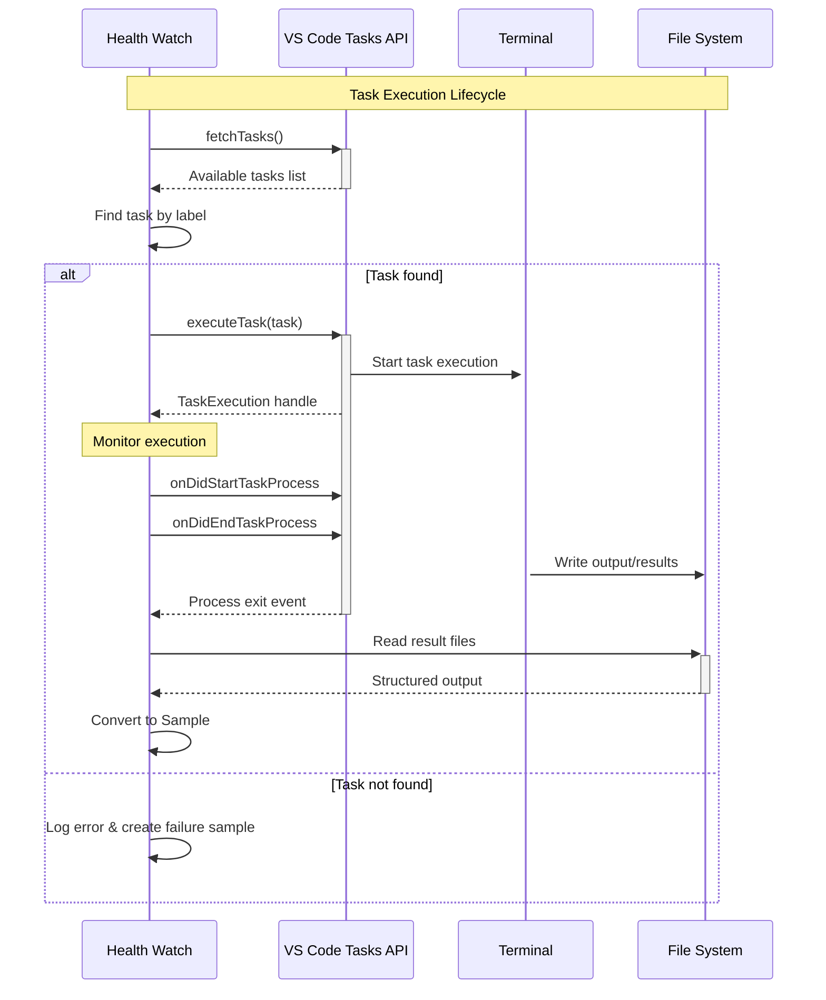

# 🎫 Ticket 003: Execution Wiring & Lifecycle Management


## 📋 Ticket Summary

**Implement the core execution engine that discovers VS Code tasks, executes them through the VS Code API, monitors their lifecycle, and converts results into Health Watch samples.**

## 🎯 Business Value

> **The Heart of Integration**: This ticket delivers the core functionality that transforms VS Code tasks into intelligent monitoring probes, creating immediate value for users with existing task-based workflows.

### 💰 Value Proposition
- **Immediate Utility**: Users see their existing tasks monitored within minutes
- **Seamless Integration**: Natural extension of VS Code's built-in task system
- **Rich Feedback**: Detailed execution results with terminal output visibility
- **Intelligent Mapping**: Automatic conversion of task results to health metrics

## 🚀 Execution Architecture



## 🔧 Technical Implementation

### Task Discovery Engine
```typescript
class TaskDiscoveryService {
  async findTaskByLabel(label: string): Promise<vscode.Task | null> {
    const allTasks = await vscode.tasks.fetchTasks();
    
    return allTasks.find(task => 
      task.name === label || 
      task.definition?.label === label ||
      task.definition?.script === label
    ) || null;
  }
  
  async suggestSimilarTasks(label: string): Promise<vscode.Task[]> {
    // Fuzzy matching for helpful error messages
    const allTasks = await vscode.tasks.fetchTasks();
    return allTasks.filter(task => 
      task.name.includes(label) || 
      label.includes(task.name)
    );
  }
}
```

### Execution Orchestrator
```typescript
class TaskExecutionService {
  private activeExecutions = new Map<string, TaskExecution>();
  
  async executeChannelTask(channel: ChannelConfig): Promise<Sample> {
    const task = await this.taskDiscovery.findTaskByLabel(
      channel.runTask!.label
    );
    
    if (!task) {
      return this.createFailureSample(channel, 'Task not found');
    }
    
    const startTime = performance.now();
    const execution = await vscode.tasks.executeTask(task);
    
    return new Promise((resolve) => {
      const cleanup = this.monitorExecution(
        execution, 
        channel,
        startTime,
        resolve
      );
      
      // Set timeout for runaway tasks
      setTimeout(() => {
        cleanup();
        resolve(this.createTimeoutSample(channel));
      }, channel.runTask!.maxDuration || 60000);
    });
  }
  
  private monitorExecution(
    execution: vscode.TaskExecution,
    channel: ChannelConfig,
    startTime: number,
    resolve: (sample: Sample) => void
  ): () => void {
    // Lifecycle event handlers...
  }
}
```

### Result Parser
```typescript
interface TaskResultParser {
  parseTaskOutput(
    execution: vscode.TaskExecution,
    exitCode: number,
    channel: ChannelConfig
  ): Promise<Sample>;
}

class DefaultTaskResultParser implements TaskResultParser {
  async parseTaskOutput(
    execution: vscode.TaskExecution,
    exitCode: number,
    channel: ChannelConfig
  ): Promise<Sample> {
    const endTime = performance.now();
    const latencyMs = endTime - execution.startTime;
    
    // Basic exit code interpretation
    const success = exitCode === 0;
    
    // Try to read structured output file if configured
    const structuredResult = await this.tryReadStructuredOutput(
      channel.runTask!.label
    );
    
    return {
      channelId: channel.id,
      timestamp: Date.now(),
      success,
      latencyMs,
      details: structuredResult || { exitCode },
      error: success ? undefined : `Task failed with exit code ${exitCode}`
    };
  }
  
  private async tryReadStructuredOutput(taskLabel: string): Promise<any> {
    // Convention: tasks write JSON to /tmp/healthwatch-{taskLabel}.json
    const outputPath = path.join(
      os.tmpdir(), 
      `healthwatch-${taskLabel}.json`
    );
    
    try {
      const content = await fs.readFile(outputPath, 'utf8');
      return JSON.parse(content);
    } catch {
      return null; // No structured output available
    }
  }
}
```

## 🎨 User Experience Enhancements

### Rich Terminal Integration
```typescript
class TaskTerminalService {
  showTaskExecution(execution: vscode.TaskExecution, channel: ChannelConfig) {
    // Configure terminal presentation for monitoring tasks
    execution.task.presentation = {
      echo: true,
      reveal: vscode.TaskRevealKind.Silent, // Don't steal focus
      focus: false,
      panel: vscode.TaskPanelKind.Shared,
      showReuseMessage: false,
      clear: true
    };
  }
  
  async captureTaskOutput(execution: vscode.TaskExecution): Promise<string[]> {
    // Capture terminal output for debugging and analysis
    return new Promise((resolve) => {
      const outputLines: string[] = [];
      
      const disposable = vscode.window.onDidWriteTerminalData(event => {
        if (event.terminal === execution.task.execution?.terminal) {
          outputLines.push(event.data);
        }
      });
      
      execution.onDidEnd(() => {
        disposable.dispose();
        resolve(outputLines);
      });
    });
  }
}
```

### Error Recovery & Guidance
```typescript
class TaskErrorService {
  async handleTaskNotFound(label: string): Promise<void> {
    const similar = await this.taskDiscovery.suggestSimilarTasks(label);
    
    if (similar.length > 0) {
      const choice = await vscode.window.showErrorMessage(
        `Task '${label}' not found. Did you mean one of these?`,
        ...similar.slice(0, 3).map(t => t.name),
        'Create New Task'
      );
      
      if (choice === 'Create New Task') {
        await this.openTaskTemplate(label);
      } else if (choice) {
        await this.suggestConfigUpdate(label, choice);
      }
    } else {
      this.showTaskCreationGuidance(label);
    }
  }
  
  private async openTaskTemplate(label: string): Promise<void> {
    // Open tasks.json with template for the requested task
    const tasksPath = path.join(
      vscode.workspace.workspaceFolders![0].uri.fsPath,
      '.vscode/tasks.json'
    );
    
    const template = this.generateTaskTemplate(label);
    // ... implement template injection
  }
}
```

## 📁 Subtask Structure

### 🔸 [Subtask: Fetch & Execute](./subtask-fetch-execute/)
**1 SP** - Implement task discovery and execution API integration

### 🔸 [Subtask: Lifecycle Events](./subtask-lifecycle-events/)
**1 SP** - Monitor task execution and handle process events

### 🔸 [Subtask: Sample Mapping](./subtask-sample-mapping/)
**1 SP** - Convert task results to Health Watch samples

## 🧪 Test Coverage

### Integration Tests
```typescript
describe('Task Execution Integration', () => {
  beforeEach(async () => {
    // Set up test workspace with sample tasks
    await createTestWorkspace({
      tasks: [
        {
          label: 'test-success',
          command: 'echo "success"',
          type: 'shell'
        },
        {
          label: 'test-failure', 
          command: 'exit 1',
          type: 'shell'
        }
      ]
    });
  });
  
  it('executes successful task and creates success sample', async () => {
    const channel = createTestChannel({
      runTask: { enabled: true, label: 'test-success', consent: 'explicit' }
    });
    
    const sample = await taskExecutor.executeChannelTask(channel);
    
    expect(sample.success).toBe(true);
    expect(sample.latencyMs).toBeGreaterThan(0);
    expect(sample.details.exitCode).toBe(0);
  });
  
  it('handles task failures gracefully', async () => {
    const channel = createTestChannel({
      runTask: { enabled: true, label: 'test-failure', consent: 'explicit' }
    });
    
    const sample = await taskExecutor.executeChannelTask(channel);
    
    expect(sample.success).toBe(false);
    expect(sample.error).toContain('exit code 1');
  });
});
```

## 🎯 Success Metrics

| Metric | Target | Measurement |
|--------|--------|-------------|
| **Task Discovery Rate** | >95% | Found vs requested tasks |
| **Execution Reliability** | >99% | Successful vs failed executions |
| **Result Accuracy** | >95% | Correct success/failure mapping |
| **Performance Overhead** | <5% | Task execution time impact |

## 📋 Definition of Done

### ✅ Core Functionality
- [ ] **Task discovery** finds tasks by label with fuzzy matching
- [ ] **Task execution** uses VS Code API with proper lifecycle management
- [ ] **Result parsing** converts exit codes and output to samples
- [ ] **Error handling** provides helpful guidance for common issues
- [ ] **Timeout protection** prevents runaway task executions

### ✅ User Experience
- [ ] **Terminal integration** shows task execution without disrupting workflow
- [ ] **Error messages** are actionable with suggestions for fixes
- [ ] **Performance** has minimal impact on VS Code responsiveness
- [ ] **Debugging** provides clear visibility into task execution

### ✅ Integration
- [ ] **Sample mapping** integrates seamlessly with existing storage
- [ ] **Event system** notifies UI components of execution results
- [ ] **Configuration** respects all runTask options and settings
- [ ] **Multi-window** coordination prevents duplicate executions

---

*This ticket brings task-based monitoring to life, transforming static task definitions into dynamic health monitoring probes. The execution engine here becomes the foundation for all task-based channels.*

⚡ **Execution Excellence** | 🔄 **Seamless Integration** | 🎯 **User-Centric Design**
