# 🛡️ Ticket 004: Robustness & Error Handling


## 📋 Ticket Summary

**Build comprehensive robustness mechanisms that handle task failures gracefully, detect hanging processes, implement intelligent retry strategies, and maintain system stability under adverse conditions.**

## 🎯 Business Value

> **Unshakeable Reliability**: Transform Health Watch from a monitoring tool into a mission-critical system that never fails to deliver accurate health insights, even when everything else is breaking.

### 💰 Value Proposition
- 🛡️ **Zero False Positives**: Intelligent failure detection prevents alert fatigue
- 🔄 **Self-Healing System**: Automatic recovery from transient failures
- 📊 **Accurate Metrics**: Reliable data even during system stress
- 🚨 **Early Warning System**: Detect problems before they impact users

## 🏗️ Robustness Architecture

```mermaid
graph TB
    subgraph "🔍 Detection Layer"
        TIMEOUT[Timeout Detection<br/>Process hanging detection]
        HEALTH[Health Monitoring<br/>Task runner health checks]
        RESOURCE[Resource Monitoring<br/>Memory & CPU usage]
    end
    
    subgraph "🛡️ Protection Layer"
        CIRCUIT[Circuit Breaker<br/>Stop cascading failures]
        BACKOFF[Exponential Backoff<br/>Adaptive retry timing]
        ISOLATION[Process Isolation<br/>Task sandboxing]
    end
    
    subgraph "🔄 Recovery Layer"
        RETRY[Intelligent Retry<br/>Context-aware retry logic]
        FALLBACK[Graceful Fallback<br/>Degraded mode operation]
        HEAL[Self-Healing<br/>Automatic problem resolution]
    end
    
    subgraph "📊 Observability Layer"
        METRICS[Error Metrics<br/>Failure rate tracking]
        ALERTS[Smart Alerts<br/>Contextual notifications]
        LOGS[Structured Logging<br/>Debugging information]
    end
    
    TIMEOUT --> CIRCUIT
    HEALTH --> BACKOFF
    RESOURCE --> ISOLATION
    
    CIRCUIT --> RETRY
    BACKOFF --> FALLBACK
    ISOLATION --> HEAL
    
    RETRY --> METRICS
    FALLBACK --> ALERTS
    HEAL --> LOGS
    
    style TIMEOUT fill:#ef4444,color:#ffffff
    style HEALTH fill:#f97316,color:#ffffff
    style RETRY fill:#10b981,color:#ffffff
    style METRICS fill:#3b82f6,color:#ffffff
```



## 🔧 Robustness Components

### 1. Timeout Detection & Process Management

#### Advanced Timeout Handling
```typescript
// src/runner/taskTimeout.ts
export class TaskTimeoutManager {
  private activeTasks = new Map<string, TaskExecution>();
  private timeoutTimers = new Map<string, NodeJS.Timeout>();
  
  async executeWithTimeout<T>(
    taskId: string,
    operation: () => Promise<T>,
    timeoutMs: number,
    killSignal: 'SIGTERM' | 'SIGKILL' = 'SIGTERM'
  ): Promise<TaskExecutionResult<T>> {
    
    const execution: TaskExecution = {
      taskId,
      startTime: Date.now(),
      timeoutMs,
      status: 'running'
    };
    
    this.activeTasks.set(taskId, execution);
    
    try {
      // Set up timeout with escalating signals
      const timeoutPromise = this.createEscalatingTimeout(taskId, timeoutMs, killSignal);
      
      // Race between task completion and timeout
      const result = await Promise.race([
        operation(),
        timeoutPromise
      ]);
      
      execution.status = 'completed';
      execution.endTime = Date.now();
      
      return {
        success: true,
        result,
        execution
      };
      
    } catch (error) {
      execution.status = 'failed';
      execution.endTime = Date.now();
      execution.error = error;
      
      if (error instanceof TimeoutError) {
        return this.handleTimeoutFailure(execution, error);
      }
      
      return {
        success: false,
        error,
        execution
      };
      
    } finally {
      this.cleanup(taskId);
    }
  }
  
  private async createEscalatingTimeout(
    taskId: string, 
    timeoutMs: number, 
    finalSignal: string
  ): Promise<never> {
    
    // Stage 1: Soft timeout (75% of total timeout)
    const softTimeoutMs = timeoutMs * 0.75;
    setTimeout(() => {
      this.sendSoftTermination(taskId);
    }, softTimeoutMs);
    
    // Stage 2: Hard timeout (100% of total timeout)
    const hardTimeoutPromise = new Promise<never>((_, reject) => {
      const timer = setTimeout(() => {
        this.sendHardTermination(taskId, finalSignal);
        reject(new TimeoutError(`Task ${taskId} timed out after ${timeoutMs}ms`));
      }, timeoutMs);
      
      this.timeoutTimers.set(taskId, timer);
    });
    
    return hardTimeoutPromise;
  }
  
  private sendSoftTermination(taskId: string): void {
    const execution = this.activeTasks.get(taskId);
    if (!execution?.process) return;
    
    // Send SIGTERM for graceful shutdown
    try {
      execution.process.kill('SIGTERM');
      execution.softTerminationSent = true;
      
      logger.warn('Soft termination sent to task', {
        taskId,
        pid: execution.process.pid,
        runningTime: Date.now() - execution.startTime
      });
    } catch (error) {
      logger.error('Failed to send soft termination', { taskId, error });
    }
  }
  
  private sendHardTermination(taskId: string, signal: string): void {
    const execution = this.activeTasks.get(taskId);
    if (!execution?.process) return;
    
    try {
      execution.process.kill(signal);
      execution.hardTerminationSent = true;
      
      logger.error('Hard termination sent to task', {
        taskId,
        pid: execution.process.pid,
        signal,
        runningTime: Date.now() - execution.startTime
      });
    } catch (error) {
      logger.error('Failed to send hard termination', { taskId, signal, error });
    }
  }
  
  private handleTimeoutFailure(
    execution: TaskExecution, 
    error: TimeoutError
  ): TaskExecutionResult<never> {
    
    const runningTime = execution.endTime! - execution.startTime;
    const wasGraceful = execution.softTerminationSent && !execution.hardTerminationSent;
    
    return {
      success: false,
      error: new EnhancedTimeoutError(error.message, {
        taskId: execution.taskId,
        timeoutMs: execution.timeoutMs,
        runningTime,
        wasGraceful,
        processKilled: !!execution.process
      }),
      execution
    };
  }
}

interface TaskExecution {
  taskId: string;
  startTime: number;
  endTime?: number;
  timeoutMs: number;
  status: 'running' | 'completed' | 'failed';
  process?: ChildProcess;
  softTerminationSent?: boolean;
  hardTerminationSent?: boolean;
  error?: Error;
}

class TimeoutError extends Error {
  constructor(message: string) {
    super(message);
    this.name = 'TimeoutError';
  }
}

class EnhancedTimeoutError extends TimeoutError {
  constructor(message: string, public readonly details: {
    taskId: string;
    timeoutMs: number;
    runningTime: number;
    wasGraceful: boolean;
    processKilled: boolean;
  }) {
    super(message);
    this.name = 'EnhancedTimeoutError';
  }
}
```

#### Process Health Monitoring
```typescript
// src/runner/processHealth.ts
export class ProcessHealthMonitor {
  private healthChecks = new Map<string, HealthCheckState>();
  private monitoringInterval: NodeJS.Timeout | null = null;
  
  startMonitoring(intervalMs: number = 5000): void {
    this.monitoringInterval = setInterval(() => {
      this.performHealthChecks();
    }, intervalMs);
  }
  
  stopMonitoring(): void {
    if (this.monitoringInterval) {
      clearInterval(this.monitoringInterval);
      this.monitoringInterval = null;
    }
  }
  
  registerTask(taskId: string, process: ChildProcess): void {
    this.healthChecks.set(taskId, {
      taskId,
      process,
      registeredAt: Date.now(),
      lastHealthCheck: Date.now(),
      status: 'healthy',
      memoryUsage: [],
      cpuUsage: []
    });
  }
  
  private async performHealthChecks(): Promise<void> {
    for (const [taskId, state] of this.healthChecks) {
      try {
        await this.checkProcessHealth(state);
      } catch (error) {
        logger.error('Health check failed', { taskId, error });
        this.markUnhealthy(state, error as Error);
      }
    }
  }
  
  private async checkProcessHealth(state: HealthCheckState): Promise<void> {
    const { process } = state;
    
    // Check if process is still running
    if (process.killed || process.exitCode !== null) {
      this.handleProcessExit(state);
      return;
    }
    
    // Check resource usage
    if (process.pid) {
      const usage = await this.getProcessUsage(process.pid);
      this.updateResourceMetrics(state, usage);
      
      // Check for resource limits
      if (this.isResourceUsageExcessive(usage)) {
        this.handleExcessiveResourceUsage(state, usage);
      }
    }
    
    // Check for zombie processes
    if (this.isZombieProcess(state)) {
      this.handleZombieProcess(state);
    }
    
    state.lastHealthCheck = Date.now();
    state.status = 'healthy';
  }
  
  private async getProcessUsage(pid: number): Promise<ProcessUsage> {
    try {
      // Use platform-specific process monitoring
      if (process.platform === 'win32') {
        return this.getWindowsProcessUsage(pid);
      } else {
        return this.getUnixProcessUsage(pid);
      }
    } catch (error) {
      throw new Error(`Failed to get process usage for PID ${pid}: ${error}`);
    }
  }
  
  private async getUnixProcessUsage(pid: number): Promise<ProcessUsage> {
    try {
      const { execFile } = require('child_process');
      const { promisify } = require('util');
      const execFileAsync = promisify(execFile);
      
      // Get memory and CPU usage from ps
      const { stdout } = await execFileAsync('ps', [
        '-p', pid.toString(),
        '-o', 'pid,rss,pcpu,etime',
        '--no-headers'
      ]);
      
      const parts = stdout.trim().split(/\s+/);
      
      return {
        pid,
        memoryKB: parseInt(parts[1]) || 0,
        cpuPercent: parseFloat(parts[2]) || 0,
        elapsedTime: parts[3] || '0:00'
      };
    } catch (error) {
      // Process might have exited
      return { pid, memoryKB: 0, cpuPercent: 0, elapsedTime: '0:00' };
    }
  }
  
  private isResourceUsageExcessive(usage: ProcessUsage): boolean {
    const maxMemoryMB = 500; // 500MB limit
    const maxCpuPercent = 90; // 90% CPU limit
    
    const memoryMB = usage.memoryKB / 1024;
    
    return memoryMB > maxMemoryMB || usage.cpuPercent > maxCpuPercent;
  }
  
  private handleExcessiveResourceUsage(
    state: HealthCheckState, 
    usage: ProcessUsage
  ): void {
    logger.warn('Excessive resource usage detected', {
      taskId: state.taskId,
      pid: usage.pid,
      memoryMB: Math.round(usage.memoryKB / 1024),
      cpuPercent: usage.cpuPercent
    });
    
    // Emit warning event
    this.emit('resourceWarning', {
      taskId: state.taskId,
      usage,
      timestamp: Date.now()
    });
  }
  
  private isZombieProcess(state: HealthCheckState): boolean {
    const maxIdleTime = 30000; // 30 seconds
    const timeSinceLastCheck = Date.now() - state.lastHealthCheck;
    
    return timeSinceLastCheck > maxIdleTime && 
           state.process.pid && 
           !state.process.killed;
  }
}

interface HealthCheckState {
  taskId: string;
  process: ChildProcess;
  registeredAt: number;
  lastHealthCheck: number;
  status: 'healthy' | 'warning' | 'unhealthy';
  memoryUsage: number[];
  cpuUsage: number[];
}

interface ProcessUsage {
  pid: number;
  memoryKB: number;
  cpuPercent: number;
  elapsedTime: string;
}
```

### 2. Circuit Breaker & Backoff Strategies

#### Intelligent Circuit Breaker
```typescript
// src/runner/circuitBreaker.ts
export class TaskCircuitBreaker {
  private circuits = new Map<string, CircuitState>();
  
  async execute<T>(
    circuitId: string,
    operation: () => Promise<T>,
    options: CircuitBreakerOptions = {}
  ): Promise<T> {
    
    const circuit = this.getOrCreateCircuit(circuitId, options);
    
    // Check circuit state
    switch (circuit.state) {
      case 'closed':
        return this.executeClosed(circuit, operation);
      
      case 'open':
        return this.executeOpen(circuit, operation);
      
      case 'half-open':
        return this.executeHalfOpen(circuit, operation);
      
      default:
        throw new Error(`Unknown circuit state: ${circuit.state}`);
    }
  }
  
  private async executeClosed<T>(
    circuit: CircuitState,
    operation: () => Promise<T>
  ): Promise<T> {
    try {
      const result = await operation();
      this.onSuccess(circuit);
      return result;
    } catch (error) {
      this.onFailure(circuit, error as Error);
      throw error;
    }
  }
  
  private async executeOpen<T>(
    circuit: CircuitState,
    operation: () => Promise<T>
  ): Promise<T> {
    const now = Date.now();
    
    if (now - circuit.lastFailureTime < circuit.options.openDurationMs) {
      // Circuit is still open, fail fast
      throw new CircuitBreakerError(
        `Circuit breaker is OPEN for ${circuit.circuitId}`,
        circuit
      );
    }
    
    // Transition to half-open
    circuit.state = 'half-open';
    circuit.halfOpenAttempts = 0;
    
    return this.executeHalfOpen(circuit, operation);
  }
  
  private async executeHalfOpen<T>(
    circuit: CircuitState,
    operation: () => Promise<T>
  ): Promise<T> {
    try {
      const result = await operation();
      
      circuit.halfOpenAttempts++;
      
      if (circuit.halfOpenAttempts >= circuit.options.halfOpenMaxAttempts) {
        // Enough successful attempts, close the circuit
        this.closeCircuit(circuit);
      }
      
      return result;
    } catch (error) {
      // Failure in half-open state, reopen circuit
      this.openCircuit(circuit, error as Error);
      throw error;
    }
  }
  
  private onSuccess(circuit: CircuitState): void {
    circuit.consecutiveFailures = 0;
    circuit.lastSuccessTime = Date.now();
    
    // Reset failure window
    if (circuit.failureWindow.length > 0) {
      circuit.failureWindow = [];
    }
  }
  
  private onFailure(circuit: CircuitState, error: Error): void {
    const now = Date.now();
    
    circuit.consecutiveFailures++;
    circuit.lastFailureTime = now;
    circuit.totalFailures++;
    
    // Add to failure window
    circuit.failureWindow.push({
      timestamp: now,
      error: error.message
    });
    
    // Clean old failures from window
    const windowStart = now - circuit.options.failureWindowMs;
    circuit.failureWindow = circuit.failureWindow.filter(
      f => f.timestamp > windowStart
    );
    
    // Check if circuit should open
    if (this.shouldOpenCircuit(circuit)) {
      this.openCircuit(circuit, error);
    }
  }
  
  private shouldOpenCircuit(circuit: CircuitState): boolean {
    const { failureThreshold, failureWindowMs } = circuit.options;
    
    // Check consecutive failures
    if (circuit.consecutiveFailures >= failureThreshold) {
      return true;
    }
    
    // Check failure rate in window
    const now = Date.now();
    const windowStart = now - failureWindowMs;
    const recentFailures = circuit.failureWindow.filter(
      f => f.timestamp > windowStart
    ).length;
    
    return recentFailures >= failureThreshold;
  }
  
  private openCircuit(circuit: CircuitState, error: Error): void {
    circuit.state = 'open';
    circuit.lastFailureTime = Date.now();
    
    logger.warn('Circuit breaker opened', {
      circuitId: circuit.circuitId,
      consecutiveFailures: circuit.consecutiveFailures,
      totalFailures: circuit.totalFailures,
      lastError: error.message
    });
    
    this.emit('circuitOpened', {
      circuitId: circuit.circuitId,
      error,
      timestamp: Date.now()
    });
  }
  
  private closeCircuit(circuit: CircuitState): void {
    circuit.state = 'closed';
    circuit.consecutiveFailures = 0;
    circuit.halfOpenAttempts = 0;
    
    logger.info('Circuit breaker closed', {
      circuitId: circuit.circuitId,
      totalFailures: circuit.totalFailures
    });
    
    this.emit('circuitClosed', {
      circuitId: circuit.circuitId,
      timestamp: Date.now()
    });
  }
}

interface CircuitState {
  circuitId: string;
  state: 'closed' | 'open' | half-open';
  options: CircuitBreakerOptions;
  consecutiveFailures: number;
  totalFailures: number;
  lastFailureTime: number;
  lastSuccessTime: number;
  halfOpenAttempts: number;
  failureWindow: Array<{
    timestamp: number;
    error: string;
  }>;
}

interface CircuitBreakerOptions {
  failureThreshold: number;      // Number of failures to open circuit
  openDurationMs: number;        // How long to keep circuit open
  failureWindowMs: number;       // Window for failure rate calculation
  halfOpenMaxAttempts: number;   // Attempts before closing from half-open
}

class CircuitBreakerError extends Error {
  constructor(message: string, public readonly circuit: CircuitState) {
    super(message);
    this.name = 'CircuitBreakerError';
  }
}
```

#### Adaptive Backoff Strategy
```typescript
// src/runner/backoffStrategy.ts
export class AdaptiveBackoffManager {
  private backoffStates = new Map<string, BackoffState>();
  
  async executeWithBackoff<T>(
    operationId: string,
    operation: () => Promise<T>,
    options: BackoffOptions = {}
  ): Promise<T> {
    
    const state = this.getOrCreateBackoffState(operationId, options);
    
    try {
      const result = await operation();
      this.onSuccess(state);
      return result;
    } catch (error) {
      return this.handleFailureWithBackoff(state, operation, error as Error);
    }
  }
  
  private async handleFailureWithBackoff<T>(
    state: BackoffState,
    operation: () => Promise<T>,
    error: Error
  ): Promise<T> {
    
    state.attemptCount++;
    state.lastFailureTime = Date.now();
    
    // Check if we should retry
    if (!this.shouldRetry(state, error)) {
      throw new MaxRetriesExceededError(
        `Max retries exceeded for ${state.operationId}`,
        state,
        error
      );
    }
    
    // Calculate backoff delay
    const delay = this.calculateBackoffDelay(state, error);
    
    logger.info('Retrying with backoff', {
      operationId: state.operationId,
      attemptCount: state.attemptCount,
      delayMs: delay,
      error: error.message
    });
    
    // Wait for backoff delay
    await this.sleep(delay);
    
    // Recursive retry
    return this.executeWithBackoff(state.operationId, operation, state.options);
  }
  
  private shouldRetry(state: BackoffState, error: Error): boolean {
    // Check max attempts
    if (state.attemptCount >= state.options.maxAttempts) {
      return false;
    }
    
    // Check total elapsed time
    const totalElapsed = Date.now() - state.startTime;
    if (totalElapsed >= state.options.maxTotalTimeMs) {
      return false;
    }
    
    // Check if error is retryable
    if (!this.isRetryableError(error)) {
      return false;
    }
    
    return true;
  }
  
  private calculateBackoffDelay(state: BackoffState, error: Error): number {
    const { strategy, baseDelayMs, maxDelayMs, multiplier } = state.options;
    
    switch (strategy) {
      case 'exponential':
        return this.calculateExponentialBackoff(state, baseDelayMs, maxDelayMs, multiplier);
      
      case 'linear':
        return this.calculateLinearBackoff(state, baseDelayMs, maxDelayMs);
      
      case 'adaptive':
        return this.calculateAdaptiveBackoff(state, error, baseDelayMs, maxDelayMs);
      
      default:
        return baseDelayMs;
    }
  }
  
  private calculateExponentialBackoff(
    state: BackoffState,
    baseDelayMs: number,
    maxDelayMs: number,
    multiplier: number
  ): number {
    const exponentialDelay = baseDelayMs * Math.pow(multiplier, state.attemptCount - 1);
    const jitteredDelay = this.addJitter(exponentialDelay);
    
    return Math.min(jitteredDelay, maxDelayMs);
  }
  
  private calculateAdaptiveBackoff(
    state: BackoffState,
    error: Error,
    baseDelayMs: number,
    maxDelayMs: number
  ): number {
    let delay = baseDelayMs;
    
    // Adjust based on error type
    if (error.name === 'TimeoutError') {
      delay *= 2; // Longer backoff for timeouts
    } else if (error.message.includes('503') || error.message.includes('429')) {
      delay *= 3; // Much longer for server overload
    } else if (error.message.includes('DNS') || error.message.includes('ENOTFOUND')) {
      delay *= 1.5; // Moderate backoff for network issues
    }
    
    // Adjust based on failure frequency
    const recentFailures = this.getRecentFailureCount(state);
    if (recentFailures > 5) {
      delay *= 1.5; // Increase delay for frequent failures
    }
    
    // Add jitter and cap at maximum
    const jitteredDelay = this.addJitter(delay);
    return Math.min(jitteredDelay, maxDelayMs);
  }
  
  private addJitter(delay: number, jitterPercent: number = 0.2): number {
    const jitter = delay * jitterPercent * (Math.random() - 0.5);
    return Math.max(0, delay + jitter);
  }
  
  private isRetryableError(error: Error): boolean {
    const retryablePatterns = [
      /timeout/i,
      /ECONNREFUSED/i,
      /ENOTFOUND/i,
      /503/,
      /429/,
      /502/,
      /504/
    ];
    
    const nonRetryablePatterns = [
      /401/,  // Unauthorized
      /403/,  // Forbidden
      /404/,  // Not Found
      /400/   // Bad Request
    ];
    
    // Check non-retryable first
    if (nonRetryablePatterns.some(pattern => pattern.test(error.message))) {
      return false;
    }
    
    // Check retryable patterns
    return retryablePatterns.some(pattern => pattern.test(error.message));
  }
}

interface BackoffState {
  operationId: string;
  startTime: number;
  attemptCount: number;
  lastFailureTime: number;
  options: BackoffOptions;
  failures: Array<{
    timestamp: number;
    error: string;
  }>;
}

interface BackoffOptions {
  strategy: 'exponential' | 'linear' | 'adaptive';
  baseDelayMs: number;
  maxDelayMs: number;
  maxAttempts: number;
  maxTotalTimeMs: number;
  multiplier: number;
}
```

## 📁 Subtask Structure

### 🔸 [Subtask: Timeout Detection & Process Management](./subtask-timeout-detection/)
**1 SP** - Advanced timeout handling with process lifecycle management

### 🔸 [Subtask: Retry Logic & Backoff Strategies](./subtask-retry-backoff/)
**1 SP** - Intelligent retry mechanisms with adaptive backoff

### 🔸 [Subtask: Graceful Degradation & Leader Behavior](./subtask-graceful-degradation/)
**1 SP** - System resilience and fallback mechanisms

## 📊 Error Detection Patterns

### Timeout Detection
```typescript
// Multi-level timeout detection
const timeoutLevels = {
  warning: timeoutMs * 0.75,    // 75% - soft warning
  critical: timeoutMs * 0.90,   // 90% - prepare termination
  fatal: timeoutMs             // 100% - force termination
};
```

### Resource Monitoring
```typescript
// Resource usage thresholds
const resourceLimits = {
  memory: {
    warning: 100 * 1024 * 1024,  // 100MB
    critical: 250 * 1024 * 1024, // 250MB
    fatal: 500 * 1024 * 1024     // 500MB
  },
  cpu: {
    warning: 50,   // 50% CPU
    critical: 80,  // 80% CPU
    fatal: 95      // 95% CPU
  }
};
```

### Failure Classification
```typescript
// Intelligent error classification
const errorClassification = {
  transient: [
    'ECONNREFUSED', 'ETIMEDOUT', 'ENOTFOUND',
    '503', '429', '502', '504'
  ],
  permanent: [
    '401', '403', '404', '400'
  ],
  retryable: [
    'TimeoutError', 'NetworkError', 'TemporaryError'
  ]
};
```

## 🧪 Robustness Testing Framework

### Chaos Engineering Tests
```typescript
describe('Robustness Under Stress', () => {
  it('handles process termination gracefully', async () => {
    const task = createTestTask();
    const execution = taskRunner.executeTask(task);
    
    // Simulate external process termination
    setTimeout(() => {
      process.kill(task.process.pid, 'SIGKILL');
    }, 1000);
    
    const result = await execution;
    
    expect(result.success).toBe(false);
    expect(result.error).toBeInstanceOf(ProcessTerminationError);
  });
  
  it('recovers from network partitions', async () => {
    // Simulate network failure
    mockNetwork.simulatePartition(2000);
    
    const results = await Promise.allSettled([
      taskRunner.executeTask(httpTask1),
      taskRunner.executeTask(httpTask2),
      taskRunner.executeTask(httpTask3)
    ]);
    
    // Should have fallback mechanisms
    const successfulTasks = results.filter(r => r.status === 'fulfilled');
    expect(successfulTasks.length).toBeGreaterThan(0);
  });
});
```

### Load Testing
```typescript
describe('Performance Under Load', () => {
  it('maintains stability with 100 concurrent tasks', async () => {
    const tasks = Array.from({ length: 100 }, () => createTestTask());
    const startTime = Date.now();
    
    const results = await Promise.allSettled(
      tasks.map(task => taskRunner.executeTask(task))
    );
    
    const duration = Date.now() - startTime;
    const successRate = results.filter(r => r.status === 'fulfilled').length / 100;
    
    expect(successRate).toBeGreaterThan(0.95); // 95% success rate
    expect(duration).toBeLessThan(30000);      // Complete within 30 seconds
  });
});
```

## 📋 Deliverables

### Core Robustness Components
- [ ] **TaskTimeoutManager** - Advanced timeout handling with escalating signals
- [ ] **ProcessHealthMonitor** - Resource usage monitoring and zombie detection
- [ ] **TaskCircuitBreaker** - Intelligent failure isolation and recovery
- [ ] **AdaptiveBackoffManager** - Context-aware retry strategies

### Error Handling Systems
- [ ] **Error Classification Engine** - Categorize errors for appropriate responses
- [ ] **Failure Pattern Detection** - Identify systematic vs. transient issues
- [ ] **Recovery Strategy Selector** - Choose optimal recovery approach
- [ ] **Degradation Controller** - Graceful fallback mechanisms

### Monitoring & Observability
- [ ] **Robustness Metrics** - Track system resilience indicators
- [ ] **Failure Analysis Tools** - Diagnose and understand failure patterns
- [ ] **Performance Monitoring** - Resource usage and bottleneck detection
- [ ] **Alert Generation** - Intelligent notifications for operational issues

### Testing & Validation
- [ ] **Chaos Engineering Suite** - Simulate failure scenarios
- [ ] **Load Testing Framework** - Validate performance under stress
- [ ] **Recovery Testing** - Verify fallback and self-healing mechanisms
- [ ] **Robustness Benchmarks** - Quantify system resilience

---

*This ticket transforms Health Watch from a simple monitoring tool into a battle-tested, enterprise-grade system that maintains reliability even under the most challenging conditions. Advanced robustness mechanisms ensure accurate monitoring data and system stability.*

🛡️ **Unbreakable Reliability** | 🔄 **Self-Healing Systems** | 📊 **Intelligent Recovery**
