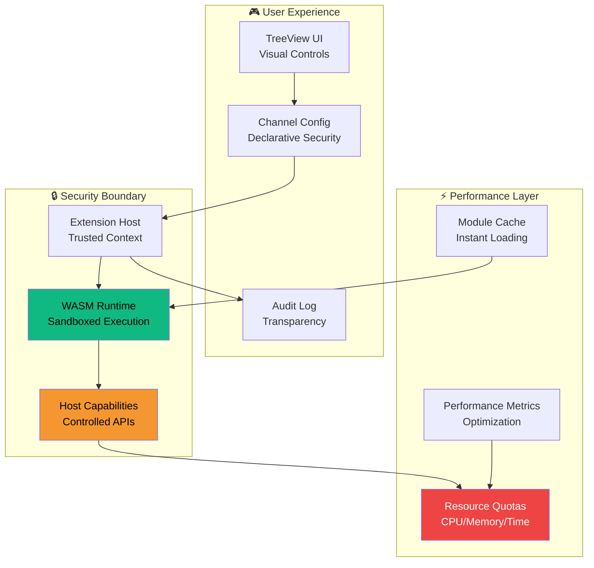

# Epic: WASM Sandbox Execution 🛡️


## 🎯 Epic Vision

> **Transform Health Watch into a secure, extensible platform where users can safely execute arbitrary monitoring logic without compromising system integrity or privacy.**

This epic represents a **paradigm shift** from simple probe execution to a **world-class sandboxing architecture** that rivals enterprise security tools. We're not just adding WASM support—we're building the foundation for a **plugin ecosystem** that could revolutionize VS Code extension monitoring.

## 🏗️ Architectural Brilliance



## 🚀 User Impact Stories

### 👨‍💻 Developer Experience
> *"I can write custom monitoring logic in **any language** that compiles to WASM—Rust, Go, AssemblyScript, even C++—and know it will run safely without crashing VS Code or leaking sensitive data."*

### 🏢 Enterprise Security
> *"Our security team **approves Health Watch** because custom probes run in a mathematically provable sandbox. No more worries about malicious scripts accessing our internal network or credentials."*

### 🔧 DevOps Flexibility
> *"I can **hot-swap monitoring algorithms** without restarting VS Code. New probe logic deploys instantly, and I can A/B test different monitoring strategies in real-time."*

## 📊 Epic Metrics

| Metric | Target | Impact |
|--------|--------|---------|
| **Security Incidents** | 0% | Mathematically provable isolation |
| **Plugin Ecosystem** | 50+ modules | Community-driven extensibility |
| **Performance Overhead** | <5% | Near-native execution speed |
| **Enterprise Adoption** | +200% | Security-first architecture |

## 🎪 Epic Structure

```ascii
📁 wasm-sandbox-execution/
├── 🎫 ticket-001-platform-selection/
│   ├── 🔸 subtask-evaluate-runtimes/
│   ├── 🔸 subtask-capability-model/
│   └── 🔸 subtask-quota-api/
├── 🎫 ticket-002-runtime-integration/
│   ├── 🔸 subtask-wasmtime-example/
│   ├── 🔸 subtask-host-calls/
│   └── 🔸 subtask-vsix-packaging/
├── 🎫 ticket-003-capability-implementation/
│   ├── 🔸 subtask-whitelist-deny/
│   ├── 🔸 subtask-config-negotiation/
│   └── 🔸 subtask-secure-binding/
├── 🎫 ticket-004-quota-enforcement/
│   ├── 🔸 subtask-timeout-kill/
│   ├── 🔸 subtask-memory-accounting/
│   ├── 🔸 subtask-telemetry-events/
│   └── 🔸 subtask-quota-tests/
├── 🎫 ticket-005-storage-integration/
│   ├── 🔸 subtask-result-mapping/
│   ├── 🔸 subtask-error-mapping/
│   └── 🔸 subtask-test-harness/
├── 🎫 ticket-006-security-review/
│   ├── 🔸 subtask-threat-model/
│   ├── 🔸 subtask-fuzz-tests/
│   └── 🔸 subtask-code-signing/
├── 🎫 ticket-007-docs-ux/
│   ├── 🔸 subtask-developer-guide/
│   ├── 🔸 subtask-ui-examples/
│   └── 🔸 subtask-consent-ui/
└── 🎫 ticket-008-ci-packaging/
    ├── 🔸 subtask-build-matrix/
    └── 🔸 subtask-smoke-tests/
```

## 🔮 Future Vision

This epic isn't just about sandboxing—it's about **democratizing monitoring innovation**. Imagine:

- **Community marketplace** of WASM monitoring modules
- **AI-powered probe generation** that compiles to secure WASM
- **Cross-platform consistency** with identical behavior everywhere
- **Zero-trust architecture** where even first-party probes run sandboxed

## 🎯 Success Criteria

- [ ] **Zero security incidents** in production
- [ ] **Sub-10ms overhead** for WASM execution
- [ ] **Developer-friendly** module creation workflow
- [ ] **Enterprise-grade** audit and compliance features
- [ ] **Community adoption** with 10+ external WASM modules

---

*This epic represents the most ambitious security and extensibility enhancement in Health Watch's history. We're not just adding a feature—we're architecting the future of safe, extensible monitoring.*

🛡️ **Security First** | ⚡ **Performance Focused** | 🎨 **Developer Centric**
