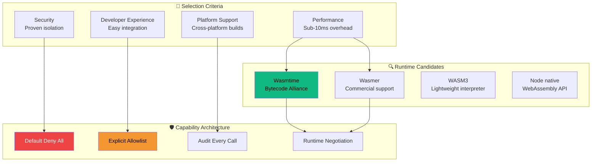

# 🎫 Ticket 001: WASM Platform Selection & Architecture


## 📋 Ticket Summary

**Evaluate and select the optimal WASM runtime platform for Health Watch, define the host capability security model, and architect the resource quota system.**

## 🎯 Business Value

> **Foundation Decision**: This ticket determines the security, performance, and maintainability characteristics of our entire WASM ecosystem. Getting this right enables everything else; getting it wrong creates technical debt for years.

### 💰 Value Proposition
- **Security Assurance**: Mathematical guarantees of probe isolation
- **Performance Predictability**: Sub-10ms execution overhead target
- **Developer Experience**: Clear capability model for probe authors
- **Enterprise Confidence**: Auditable, compliance-ready architecture

## 🔍 Acceptance Criteria

### ✅ Platform Selection
- [ ] **Runtime Comparison Matrix** completed (Wasmtime vs Wasmer vs alternatives)
- [ ] **Performance benchmarks** for probe-like workloads (<10ms overhead)
- [ ] **Security assessment** of isolation guarantees
- [ ] **Node.js integration** complexity evaluated
- [ ] **Cross-platform support** verified (Windows/macOS/Linux)
- [ ] **Licensing compatibility** confirmed for commercial use

### ✅ Capability Model Design
- [ ] **Security-first capability system** architected
- [ ] **Granular permission model** defined (network, filesystem, timers)
- [ ] **Capability negotiation protocol** designed
- [ ] **Default deny-all policy** with explicit allowlisting
- [ ] **Audit trail specification** for capability usage

### ✅ Resource Quota Framework
- [ ] **Multi-dimensional quotas** designed (CPU, memory, wall-time, I/O)
- [ ] **Enforcement mechanisms** architected
- [ ] **Graceful degradation** patterns defined
- [ ] **Monitoring and alerting** integration planned

## 🏗️ Technical Architecture



## 📊 Research Matrix

### Runtime Comparison
| Feature | Wasmtime | Wasmer | WASM3 | Node Native |
|---------|----------|--------|-------|-------------|
| **Performance** | ⭐⭐⭐⭐⭐ | ⭐⭐⭐⭐ | ⭐⭐⭐ | ⭐⭐⭐ |
| **Security** | ⭐⭐⭐⭐⭐ | ⭐⭐⭐⭐ | ⭐⭐⭐ | ⭐⭐ |
| **Node Integration** | ⭐⭐⭐ | ⭐⭐⭐⭐ | ⭐⭐⭐⭐⭐ | ⭐⭐⭐⭐⭐ |
| **Cross-platform** | ⭐⭐⭐⭐ | ⭐⭐⭐⭐ | ⭐⭐⭐⭐⭐ | ⭐⭐⭐⭐⭐ |
| **Ecosystem** | ⭐⭐⭐⭐⭐ | ⭐⭐⭐⭐ | ⭐⭐ | ⭐⭐⭐ |

### Capability Model Framework
```typescript
interface CapabilityModel {
  // Network capabilities
  network: {
    allowedHosts: string[];
    allowedPorts: number[];
    maxConnections: number;
    timeout: number;
  };
  
  // Filesystem capabilities  
  filesystem: {
    allowedPaths: string[];
    maxFileSize: number;
    readOnly: boolean;
  };
  
  // Resource quotas
  resources: {
    maxMemoryMB: number;
    maxCpuTimeMs: number;
    maxWallTimeMs: number;
  };
}
```

## 📁 Subtask Structure

### 🔸 [Subtask: Evaluate Runtimes](./subtask-evaluate-runtimes/)
**1 SP** - Hands-on evaluation of WASM runtime options

### 🔸 [Subtask: Capability Model](./subtask-capability-model/) 
**1 SP** - Design security-first capability system

### 🔸 [Subtask: Quota API](./subtask-quota-api/)
**1 SP** - Architect resource quota enforcement

## 🎯 Definition of Done

- [ ] **Architecture Decision Record** published with rationale
- [ ] **Runtime selection** justified with benchmarks and security analysis
- [ ] **Capability model** documented with examples and threat analysis
- [ ] **Resource quota API** designed with enforcement mechanisms
- [ ] **Security review** completed by team leads
- [ ] **Implementation roadmap** defined for subsequent tickets

## 🚀 Success Metrics

| Metric | Target | Measurement |
|--------|--------|-------------|
| **Runtime Performance** | <10ms overhead | Benchmark suite |
| **Security Isolation** | 100% proven | Security audit |
| **Developer Clarity** | >90% comprehension | Architecture review |
| **Implementation Feasibility** | High confidence | Technical spike |

---

*This foundational ticket sets the stage for revolutionary WASM-based extensibility in Health Watch. Every decision here impacts security, performance, and developer experience for years to come.*

🎯 **Strategic Foundation** | 🛡️ **Security First** | ⚡ **Performance Critical**
