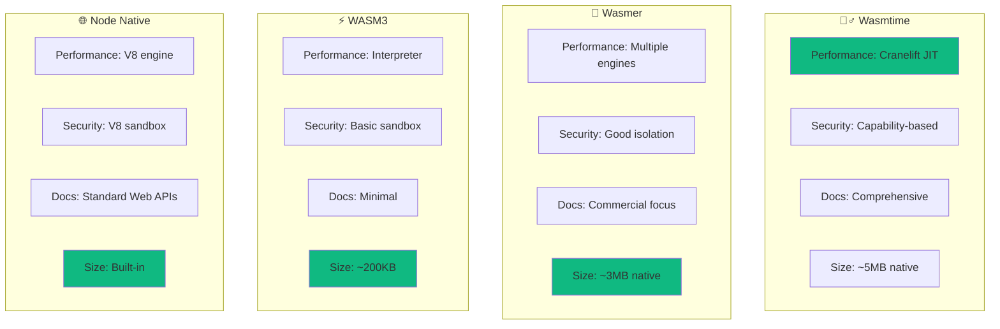

# 🔸 Subtask: Evaluate WASM Runtimes


## 🎯 Subtask Objective

**Conduct hands-on evaluation of WASM runtime candidates through prototyping, benchmarking, and integration testing to make an informed platform selection.**

## 🔬 Research Methodology

### Phase 1: Quick Prototypes (2 hours each)
Create minimal "Hello World" integrations for each runtime to assess:
- **Setup complexity** and documentation quality
- **Node.js binding** ergonomics and stability  
- **Basic execution** and error handling
- **Bundle size impact** on VS Code extension

### Phase 2: Probe Simulation (4 hours total)
Build realistic probe simulations that:
- **Make HTTP requests** with timeout handling
- **Process JSON responses** and extract metrics
- **Handle errors gracefully** with structured output
- **Measure execution time** and memory usage

### Phase 3: Integration Assessment (2 hours total)
Evaluate each runtime's fit with Health Watch:
- **Extension host compatibility** and resource usage
- **VS Code API integration** patterns
- **Error reporting** and debugging experience
- **Cross-platform build** complexity

## 📊 Evaluation Matrix



## 🧪 Benchmark Protocol

### Performance Test Suite
```typescript
// Probe simulation benchmark
interface BenchmarkResult {
  runtime: string;
  setupTimeMs: number;
  executionTimeMs: number;
  memoryUsageMB: number;
  compilationTimeMs: number;
  teardownTimeMs: number;
}

// Test scenarios
const scenarios = [
  'simple-http-check',
  'json-parsing-heavy',
  'regex-processing',
  'concurrent-requests',
  'error-handling'
];
```

### Security Assessment Checklist
- [ ] **Memory isolation** - No access to extension host memory
- [ ] **Filesystem isolation** - Controlled file access only
- [ ] **Network isolation** - Capability-based network access
- [ ] **CPU quotas** - Enforceable execution limits
- [ ] **Error boundaries** - Crashes don't affect extension

## 📈 Success Criteria

### Quantitative Metrics
| Metric | Target | Wasmtime | Wasmer | WASM3 | Node |
|--------|--------|----------|--------|-------|------|
| **Cold Start** | <50ms | _TBD_ | _TBD_ | _TBD_ | _TBD_ |
| **Execution** | <10ms | _TBD_ | _TBD_ | _TBD_ | _TBD_ |
| **Memory** | <50MB | _TBD_ | _TBD_ | _TBD_ | _TBD_ |
| **Bundle Impact** | <10MB | _TBD_ | _TBD_ | _TBD_ | _TBD_ |

### Qualitative Assessment
- **Documentation Quality**: How easy is it to get started?
- **Error Messages**: How helpful are runtime errors?
- **Debugging Support**: Can we debug WASM modules effectively?
- **Community Ecosystem**: How active and helpful is the community?

## 🔬 Testing Methodology

### 1. Runtime Installation & Setup
```bash
# Document exact steps for each runtime
npm install @bytecodealliance/wasmtime
npm install @wasmerio/wasi
npm install wasm3
# Node native - built-in WebAssembly API
```

### 2. Probe Template Creation
Create identical probe logic in multiple formats:
- **AssemblyScript** (TypeScript-like)
- **Rust** (systems language)
- **C** (minimal overhead)
- **WAT** (WebAssembly Text, for debugging)

### 3. Integration Pattern Testing
```typescript
// Standard integration pattern for each runtime
interface WasmProbe {
  load(wasmBytes: Uint8Array): Promise<void>;
  execute(config: ProbeConfig): Promise<ProbeResult>;
  dispose(): Promise<void>;
}
```

## 📋 Deliverables

### Research Report
- **Executive Summary** with clear recommendation
- **Detailed comparison** across all evaluation criteria
- **Performance benchmarks** with charts and analysis
- **Security assessment** with threat model implications
- **Integration complexity** analysis

### Code Artifacts
- **Working prototypes** for each evaluated runtime
- **Benchmark test suite** with automated execution
- **Example probe modules** demonstrating capabilities
- **Integration mockups** showing VS Code integration

### Decision Documentation
- **Architecture Decision Record** with full rationale
- **Risk assessment** for selected platform
- **Migration strategy** from current script execution
- **Rollback plan** if issues are discovered

---

*This subtask represents the critical research foundation that will determine the technical direction of our WASM integration. Thorough evaluation here prevents costly pivots later.*

🔬 **Research Excellence** | 📊 **Data-Driven Decision** | 🎯 **Strategic Impact**
