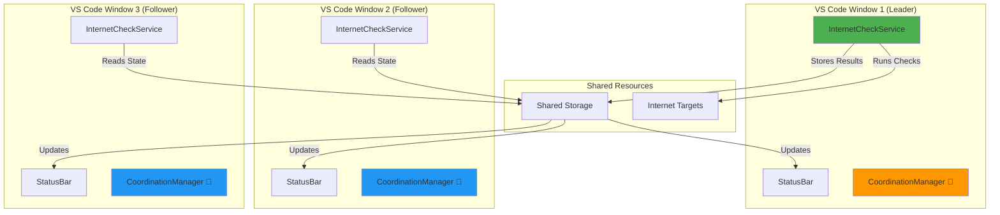
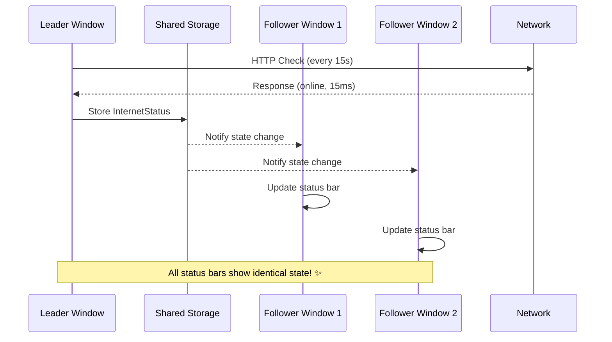
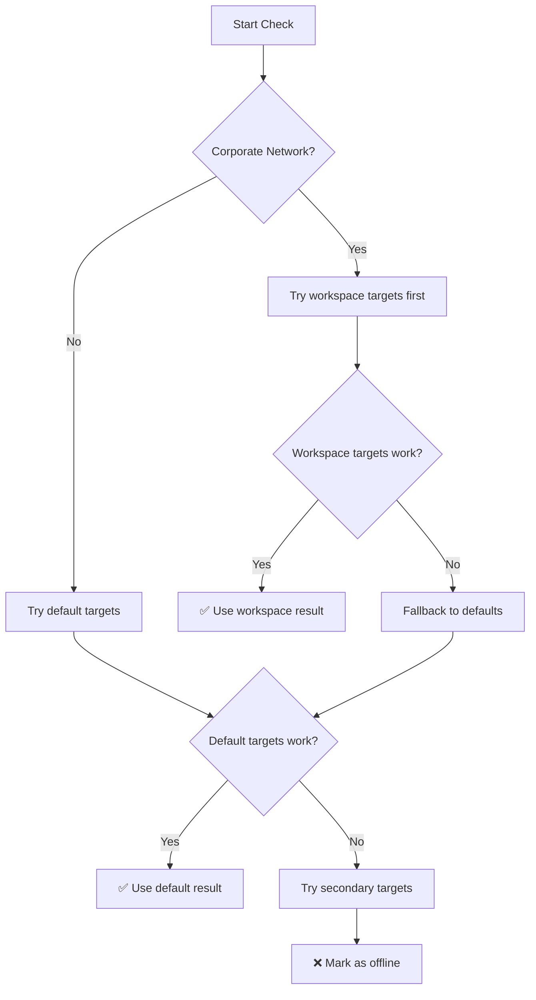
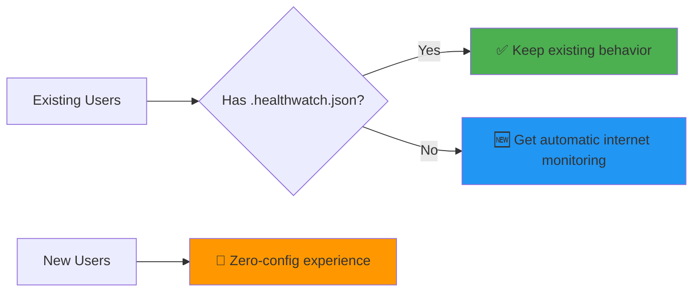

# Internet Status & Status Bar — Implementation Plan v2 🚀

**Date:** 2025-08-22  
**Author:** Health Watch Development Team  
**Version:** 2.0 (Multi-Window Coordination Edition)  
**Status:** 📋 Ready for Implementation

---

## 🎯 Executive Summary

> **TL;DR**: We're building a **zero-config internet connectivity indicator** that Just Works™ across multiple VS Code windows, leverages our existing coordination system, and provides instant feedback on network status. Think of it as the "network signal bars" for your development environment.

**The Vision**: Developer installs extension → immediately sees internet status → never thinks about it again unless there's an issue.

---

## 🏗️ Architecture Overview



**🔥 Why This Architecture Rocks:**
- **Single Source of Truth**: Only leader runs network checks
- **Resource Efficient**: 3 windows ≠ 3x network calls
- **Bulletproof Failover**: Leader dies? New leader elected automatically
- **Consistent UX**: All status bars show identical state

---

## 🆚 Current vs. Planned: The Great Upgrade

| Aspect | 😭 **Current System** | 🎉 **Planned System** |
|--------|---------------------|---------------------|
| **First Install** | "Internet: Not configured" | 🟢 Shows internet status immediately |
| **Configuration** | Must create `.healthwatch.json` | Zero config needed |
| **Multi-Window** | Each window independent | Coordinated single worker |
| **Resource Usage** | N windows = N checks | N windows = 1 check |
| **User Experience** | Power-user focused | Beginner-friendly with power-user options |

---

## 🎨 User Experience Design

### 🌟 The "Golden Path" (Default Experience)

```
📦 Install Extension
    ↓
🚀 Extension Activates
    ↓ (< 2 seconds)
🟢 Status Bar: Online (15ms)
    ↓
😌 Developer continues coding happily
```

### 📊 Status Bar States

| State | Icon | Text | Tooltip | Color |
|-------|------|------|---------|-------|
| `online` | `$(check)` | `15ms` | ✅ Internet: Connected (15ms)<br/>Last check: 2s ago | 🟢 Green |
| `offline` | `$(error)` | `Offline` | ❌ Internet: Disconnected<br/>Failed 3 consecutive checks | 🔴 Red |
| `captive` | `$(shield)` | `Sign-in` | ⚠️ Internet: Captive Portal<br/>Click to open browser | 🟡 Yellow |
| `unknown` | `$(question)` | `Unknown` | ❓ Internet: Status unknown<br/>Checking... | ⚪ Gray |

### 🖱️ Interaction Model

```
👆 Click Status Bar
    ├─ 📊 Quick popup with last 3 results
    ├─ 🔄 "Run Check Now" button
    └─ ⚙️ "Open Settings" link

👆 Right-click Status Bar
    ├─ 🔄 Run Internet Check Now
    ├─ 📋 Show Debug Info
    └─ ⚙️ Configure Internet Settings
```

---

## ⚙️ Configuration Architecture

### 📁 Configuration Hierarchy (Precedence Order)

```
1️⃣ User VS Code Settings (Global)
    ↓ (overrides)
2️⃣ Workspace .healthwatch.json
    ↓ (fallback)
3️⃣ Built-in Defaults
```

### 🔧 VS Code Settings Schema

```json
{
  "healthWatch.internet.enabled": {
    "type": "boolean",
    "default": true,
    "description": "🌐 Enable automatic internet connectivity monitoring"
  },
  "healthWatch.internet.targets": {
    "type": "array",
    "default": [
      "https://clients3.google.com/generate_204",
      "https://cloudflare.com/cdn-cgi/trace"
    ],
    "description": "🎯 Internet connectivity check endpoints"
  },
  "healthWatch.internet.intervalSec": {
    "type": "number",
    "default": 15,
    "minimum": 5,
    "description": "⏱️ Check interval in seconds (fast feedback)"
  },
  "healthWatch.internet.timeoutMs": {
    "type": "number", 
    "default": 3000,
    "description": "⏰ Request timeout in milliseconds"
  },
  "healthWatch.internet.failureThreshold": {
    "type": "number",
    "default": 2,
    "description": "🚨 Failures needed before marking offline"
  }
}
```

### 📋 Workspace Override Example

```json
{
  "guards": {
    "internet": {
      "type": "internet",
      "targets": ["https://internal-gateway.company.local/health"],
      "intervalSec": 30,
      "timeoutMs": 5000,
      "note": "🏢 Corporate network optimized settings"
    }
  }
}
```

---

## 🧩 Multi-Window Coordination Design

### 👑 Leadership Election

```typescript
class InternetCheckService extends EventEmitter {
    private role: 'leader' | 'follower' = 'follower';
    private networkTimer?: NodeJS.Timeout;
    
    constructor(
        private coordinationManager: MultiWindowCoordinationManager,
        private storageManager: StorageManager
    ) {
        super();
        
        // 🎭 Role changes trigger behavior switch
        this.coordinationManager.on('roleChanged', ({ newRole }) => {
            this.role = newRole;
            if (newRole === 'leader') {
                this.becomeNetworkLeader(); // 🚀 Start doing actual work
            } else {
                this.becomeStateFollower(); // 👀 Just watch and display
            }
        });
    }
    
    private becomeNetworkLeader() {
        console.log('🌐 InternetCheckService: Became network leader');
        this.startNetworkChecks();
    }
    
    private becomeStateFollower() {
        console.log('👥 InternetCheckService: Following shared state');
        this.stopNetworkChecks();
        this.watchSharedState();
    }
}
```

### 💾 Shared State Management

```typescript
interface InternetStatus {
    status: 'online' | 'offline' | 'captive' | 'unknown';
    timestamp: number;
    latencyMs?: number;
    target: string;
    checkCount: number;
    consecutiveFailures: number;
}

// 🗄️ Stored in shared location accessible by all windows
const INTERNET_STATE_KEY = 'healthWatch.internet.currentStatus';
```

### 🔄 State Synchronization Flow



---

## 🚀 Implementation Plan

### 📋 Task Breakdown

| Task | Effort | Priority | Dependencies |
|------|---------|----------|--------------|
| 🏗️ **InternetCheckService Core** | 2 days | 🔴 Critical | - |
| ⚙️ **VS Code Settings Schema** | 0.5 days | 🔴 Critical | - |
| 🤝 **Coordination Integration** | 1 day | 🔴 Critical | Existing coordination system |
| 📱 **StatusBar Integration** | 1 day | 🟡 High | InternetCheckService |
| 🧪 **Unit + Integration Tests** | 1.5 days | 🟡 High | Core implementation |
| 🎨 **First-run UX Polish** | 1 day | 🟢 Medium | All above |
| 📚 **Documentation Updates** | 0.5 days | 🟢 Low | Feature complete |

**🎯 Total Estimated Effort:** 7.5 days  
**🚀 MVP Ready:** 5 days (without first-run UX)

### 🎭 Implementation Phases

#### **Phase 1: Foundation** (Days 1-2)
```typescript
// 🏗️ Create the service backbone
class InternetCheckService extends EventEmitter {
    // Core network checking logic
    // State management
    // Event emission
}
```

#### **Phase 2: Coordination** (Day 3)  
```typescript
// 🤝 Integrate with existing coordination
// Leader/follower behavior
// Shared state synchronization
```

#### **Phase 3: UI Integration** (Day 4)
```typescript
// 📱 StatusBar updates
// Click handlers
// Tooltip management
```

#### **Phase 4: Polish & Testing** (Days 5-7)
```typescript
// 🧪 Comprehensive tests
// 🎨 UX improvements
// 📚 Documentation
```

---

## 🧪 Testing Strategy

### 🔬 Unit Tests
```typescript
describe('InternetCheckService', () => {
    it('🎯 detects online state from 204 response', async () => {
        // Mock successful network call
        // Verify state transition to 'online'
    });
    
    it('🚨 requires multiple failures before offline', async () => {
        // Mock consecutive failures
        // Verify threshold behavior
    });
    
    it('🏢 detects captive portal from HTML response', async () => {
        // Mock captive portal response
        // Verify 'captive' state detection
    });
});
```

### 🎭 Integration Tests
```typescript
describe('Multi-Window Coordination', () => {
    it('👑 only leader runs network checks', async () => {
        // Create multiple service instances
        // Verify only leader makes network calls
    });
    
    it('🔄 followers update when shared state changes', async () => {
        // Leader updates state
        // Verify follower status bars update
    });
});
```

### ✅ Manual QA Checklist
- [ ] 🆕 Fresh VS Code install shows internet status immediately
- [ ] 🪟 Multiple windows show identical status
- [ ] 🔌 Disconnect network → all windows show offline within 45s  
- [ ] 🌐 Reconnect network → all windows show online within 15s
- [ ] 🏢 Corporate proxy/captive portal detected correctly
- [ ] ⚡ Performance: No noticeable VS Code slowdown

---

## 🎨 Visual Design Specifications

### 📊 Status Bar Component Anatomy

```
┌─────────────────────────────┐
│ $(check) 15ms              │  ← Online state
├─────────────────────────────┤
│ $(error) Offline           │  ← Offline state  
├─────────────────────────────┤
│ $(shield) Sign-in          │  ← Captive portal
├─────────────────────────────┤
│ $(question) Unknown        │  ← Unknown/starting
└─────────────────────────────┘
```

### 🎯 Target Selection Logic



---

## 🚨 Edge Cases & Risk Mitigation

### 🌊 Network Flapping
**Problem:** Unstable network causes rapid online/offline switching  
**Solution:** Implement hysteresis with different thresholds for up/down transitions

```typescript
// 📈 Harder to go offline (3 failures) than online (1 success)
const OFFLINE_THRESHOLD = 3;
const ONLINE_THRESHOLD = 1;
```

### 🏢 Corporate Proxies
**Problem:** HTTPS requests blocked by corporate firewall  
**Solution:** Graceful degradation with fallback targets

```typescript
const DEFAULT_TARGETS = [
    'https://clients3.google.com/generate_204',  // Google's connectivity check
    'https://cloudflare.com/cdn-cgi/trace',      // Cloudflare fallback
    'http://captive.apple.com/hotspot-detect.html' // HTTP fallback for proxies
];
```

### 🔄 Leadership Transitions
**Problem:** New leader might have different state than previous leader  
**Solution:** Graceful state inheritance with immediate validation check

```typescript
private async becomeNetworkLeader() {
    // 📋 Inherit previous state
    const lastState = await this.storageManager.getInternetStatus();
    
    // 🔍 But verify it immediately
    const currentState = await this.runImmediateCheck();
    
    if (this.statesSignificantlyDifferent(lastState, currentState)) {
        this.updateState(currentState);
    }
}
```

---

## 📈 Success Metrics

### 🎯 Key Performance Indicators

| Metric | Target | Measurement |
|--------|--------|-------------|
| **Time to First Status** | < 3 seconds | Extension activation → first status bar update |
| **Network Efficiency** | 1 check per interval across all windows | Monitor duplicate requests |
| **State Consistency** | 100% | All windows show identical state |
| **False Positive Rate** | < 5% | Incorrectly marking online as offline |
| **Recovery Time** | < 30 seconds | Network restoration → status bar update |

### 📊 User Experience Metrics
- **Zero-config success rate**: % of users who see internet status without configuration
- **Support ticket reduction**: Decrease in "extension not working" tickets
- **Feature discoverability**: % of users who interact with status bar

---

## 🎉 Migration & Rollout Strategy

### 🔄 Backward Compatibility



### 📋 Release Notes Template

```markdown
## 🌐 New: Automatic Internet Status Monitoring

Health Watch now provides **zero-config internet connectivity monitoring**! 

### ✨ What's New
- 🎯 **Instant Status**: See internet connectivity in status bar immediately
- ⚡ **15-second Updates**: Fast detection of network changes  
- 🪟 **Multi-Window Smart**: Coordinates across VS Code windows efficiently
- 🔧 **Zero Config**: Works immediately, customize if needed

### 🎛️ Customization
- **Settings**: Search "healthWatch.internet" in VS Code settings
- **Disable**: Set `healthWatch.internet.enabled` to `false`
- **Corporate Networks**: Override targets in `.healthwatch.json`

Existing configurations are unchanged! 🎉
```

---

## 🎯 Next Steps

### 🚀 Ready to Rock?

1. **📋 Review this plan** with the team
2. **🎯 Assign implementation tasks** from the breakdown above
3. **🏗️ Start with InternetCheckService core** (highest impact)
4. **🧪 Test early and often** with multiple VS Code windows
5. **🎨 Polish the UX** until it feels magical

### 🤔 Open Questions for Team Discussion

- **🎨 Visual Design**: Should we use colors in status bar or just icons?
- **⚙️ Configuration**: Start with just user settings or include workspace overrides from day 1?
- **🔔 Notifications**: Show toast notifications on network state changes?
- **📊 Telemetry**: Any metrics we want to collect (locally) for debugging?

---

## 🎪 Conclusion: Why This Will Be Awesome

This isn't just another feature—it's the foundation for a **delightful developer experience**. We're solving the fundamental "is my computer online?" question that every developer has, in a way that:

- **Just Works™** out of the box
- **Scales efficiently** across multiple windows  
- **Respects user preferences** while providing sensible defaults
- **Integrates seamlessly** with existing architecture

**The best internet monitoring is the one you never have to think about.** 🎯

---

*Plan v2 prepared with ❤️ by the Health Watch Development Team*  
*"Making network monitoring as smooth as your morning coffee ☕"*