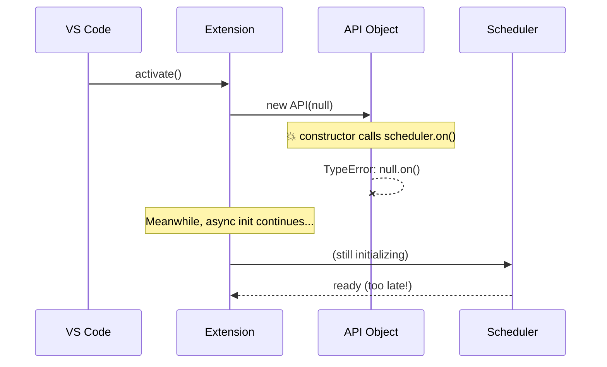
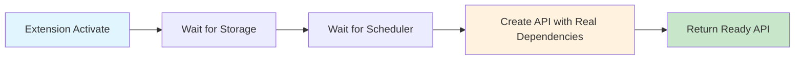

# The "Works on My Machine" Bug: A Visual Guide

*TL;DR: Why your extension crashes on other PCs but not yours (with diagrams)*

## 🚨 The Problem in 30 Seconds

Your VS Code extension works perfectly locally, then crashes on other machines with:
```
TypeError: Cannot read properties of null (reading 'on')
```

**Root cause**: You created an API object with a `null` dependency before async initialization finished.

## 📊 The Race Condition Visualized



## 🏃‍♂️ Why It Only Failed on Other Machines

```
┌─────────────────┬──────────────────┬─────────────────┐
│   Your Machine  │   Other Machine  │     Result      │
├─────────────────┼──────────────────┼─────────────────┤
│ Fast SSD        │ Slow HDD        │ Timing differs  │
│ Warm cache      │ Cold start      │ Init takes time │
│ Dev environment │ Fresh install   │ No cached state │
│ Rich context    │ Minimal setup   │ Race exposed    │
└─────────────────┴──────────────────┴─────────────────┘
```

**Timing diagram:**
```
Your Machine:    [init]─┐
                        ├─ constructor (scheduler ready ✅)
                 [API]──┘

Other Machine:   [init]────────────┐
                 [API]──┘          ├─ constructor (scheduler = null ❌)
                                   └─ scheduler ready (too late)
```

## 🛡️ The Fix: 3 Layers of Defense

### Layer 1: Null Guards (Quick Fix)
```
┌─────────────┐    ┌──────────────┐    ┌─────────────┐
│ Constructor │───▶│ Guard Check  │───▶│ Safe Setup  │
│             │    │ if(scheduler)│    │ or Skip     │
└─────────────┘    └──────────────┘    └─────────────┘
```

### Layer 2: Defensive Methods
```
API Method Called
       │
       ▼
   ┌─────────┐     ┌─────────────┐     ┌──────────────┐
   │ Check   │────▶│ Scheduler   │────▶│ Execute      │
   │ Ready?  │     │ Available?  │     │ Safely       │
   └─────────┘     └─────────────┘     └──────────────┘
       │                   │
       ▼                   ▼
   ┌─────────┐     ┌─────────────┐
   │ Return  │     │ Throw       │
   │ Empty   │     │ "Still      │
   │ Array   │     │ Loading"    │
   └─────────┘     └─────────────┘
```

### Layer 3: Proper Async Pattern


## 🎯 Better Patterns (Choose One)

### Pattern A: True Async Activation
```
activate() {
  ┌─────────────┐
  │ await ALL   │ ← Wait for everything
  │ async deps  │
  └─────────────┘
          │
          ▼
  ┌─────────────┐
  │ new API     │ ← Now safe to create
  │ (realDeps)  │
  └─────────────┘
}
```

### Pattern B: Factory with Initialize
```
API Lifecycle:
┌─────────┐   ┌─────────────┐   ┌─────────────┐
│ new API │──▶│ initialize  │──▶│ use methods │
│ ()      │   │ (deps)      │   │ safely      │
└─────────┘   └─────────────┘   └─────────────┘
```

### Pattern C: Lazy Initialization
```
API Method Called
       │
       ▼
┌─────────────┐    ┌─────────────┐    ┌─────────────┐
│ await       │───▶│ get real    │───▶│ execute     │
│ scheduler   │    │ scheduler   │    │ method      │
│ promise     │    │ instance    │    │             │
└─────────────┘    └─────────────┘    └─────────────┘
```

## 🧪 Testing Strategy

```
Development     Production      Test Strategy
┌─────────┐    ┌─────────┐    ┌─────────────────┐
│ Fast    │    │ Slow    │    │ Add artificial  │
│ Warm    │ vs │ Cold    │ => │ delays to       │
│ Cached  │    │ Fresh   │    │ simulate slow   │
└─────────┘    └─────────┘    └─────────────────┘
```

**Quick repro steps:**
```bash
# 1. Add delay to async init
await new Promise(r => setTimeout(r, 2000));

# 2. Test fresh profile  
code --user-data-dir ./tmp --install-extension ./ext.vsix

# 3. Watch for crash during activation
```

## 📋 Prevention Checklist

```
Code Review Questions:
┌─────────────────────────────────────┐
│ ✓ Any null/undefined dependencies? │
│ ✓ Constructor side effects?        │  
│ ✓ Timing-dependent logic?          │
│ ✓ Error handling for race?         │
│ ✓ Tested on clean environment?     │
└─────────────────────────────────────┘
```

## 🎓 Key Lessons (Visual Summary)

```
❌ AVOID                    ✅ PREFER
┌─────────────────┐        ┌─────────────────┐
│ new API(null)   │   =>   │ await deps      │
│ patch later     │        │ new API(deps)   │
└─────────────────┘        └─────────────────┘

┌─────────────────┐        ┌─────────────────┐
│ Constructor     │   =>   │ Explicit        │
│ side effects    │        │ init() method   │
└─────────────────┘        └─────────────────┘

┌─────────────────┐        ┌─────────────────┐
│ "Works on my    │   =>   │ Test on clean   │
│ machine" = OK   │        │ environments    │
└─────────────────┘        └─────────────────┘
```

## 🚀 The Bottom Line

**If your code depends on timing to work, it doesn't work.**

```
Fragile Pattern:           Robust Pattern:
     ┌─────┐                    ┌─────┐
     │ A   │                    │ A   │
     └──┬──┘                    └──┬──┘
        │ maybe                    │ await
     ┌──▼──┐                    ┌──▼──┐
     │ B   │                    │ B   │ ← guaranteed ready
     └─────┘                    └─────┘
```

**Remember**: Modern dev tools hide timing bugs. Always test cold starts and slow environments.

---

*Want the full technical deep-dive? Check out the [complete article](./ASYNC-RACE-CONDITION-TUTORIAL.md) with code examples and implementation details.*
